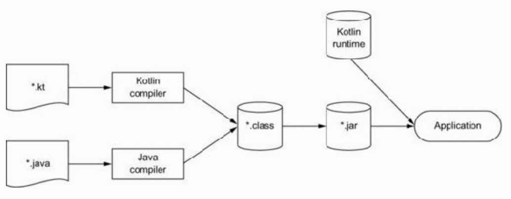

# Chapter 1. Kotlin: what and why

## 1.1. A TASTE OF KOTLIN

## 1.2. KOTLIN'S PRIMARY TRAITS

### 1.2.1. Target platforms: server-side, Android, anywhere Java runs

* The most common areas to use Kotlin are:
  * Building server-side code (typically, backends of web applications)
  * Building mobile applications that run on Android devices

### 1.2.2. Statically typed

* Just like Java, Kotlin is a **statically typed** programming language. This means the type of every expression in a program is known at compile time, and the compiler can validate that the methods and fields you’re trying to access exist on the objects you’re using.

* The ability of the compiler to determine types from context is called **type inference**.

* Following are some of the benefits of static typing:
  * **Performance** — Calling methods is faster because there’s no need to figure out at runtime which method needs to be called.
  * **Reliability** — The compiler verifies the correctness of the program, so there are fewer chances for crashes at runtime. 
  * **Maintainability** — Working with unfamiliar code is easier because you can see what kind of objects the code is working with. 
  * **Tool support** — Static typing enables reliable refactorings, precise code completion, and other IDE features.

### 1.2.3. Functional and object-oriented

* The key concepts of functional programming are as follows:
  * **First-class functions** — You work with functions (pieces of behavior) as values. You can store them in variables, pass them as parameters, or return them from other functions. 
  * **Immutability** — You work with immutable objects, which guarantees that their state can’t change after their creation. 
  * **No side effects** — You use pure functions that return the same result given the same inputs and don’t modify the state of other objects or interact with the outside world.

* What benefits can you gain from writing code in the functional style? 
  1. First, **conciseness**. Functional code can be more elegant and succinct compared to its imperative counterpart, because working with functions as values gives you much more power of abstraction, which lets you avoid duplication in your code.
  2. The second benefit of functional code is **safe multithreading**. One of the biggest sources of errors in multithreaded programs is modification of the same data from multiple threads without proper synchronization. If you use immutable data structures and pure functions, you can be sure that such unsafe modifications won’t happen, and you don’t need to come up with complicated synchronization schemes.
  3. Finally, functional programming means **easier testing**. Functions without side effects can be tested in isolation without requiring a lot of setup code to construct the entire environment that they depend on.

* Kotlin has a rich set of features to support functional programming from the get-go. These include the following:
  * **Function types**, allowing functions to receive other functions as parameters or return other functions 
  * **Lambda expressions**, letting you pass around blocks of code with minimum boilerplate 
  * **Data classes**, providing a concise syntax for creating immutable value objects 
  * **A rich set of APIs** in the standard library for working with objects and collections in the functional style


### 1.2.4. Free and open source

## 1.3. KOTLIN APPLICATIONS

### 1.3.1. Kotlin on the server side

### 1.3.2. Kotlin on Android

## 1.4. THE PHILOSOPHY OF KOTLIN

### 1.4.1. Pragmatic

### 1.4.2. Concise

### 1.4.3. Safe

* With Kotlin, we’ve attempted to achieve a higher level of safety than in Java, with a smaller overall cost. Running on the JVM already provides a lot of safety guarantees: for example, memory safety, preventing buffer overflows, and other problems caused by incorrect use of dynamically allocated memory. As a statically typed language on the JVM, Kotlin also ensures the type safety of your applications. **This comes at a smaller cost than with Java**: you don’t have to specify all the type declarations, because in many cases the compiler infers the types automatically.

### 1.4.4. Interoperable

## 1.5. USING THE KOTLIN TOOLS

### 1.5.1. Compiling Kotlin code

* Kotlin source code is normally stored in files with the extension .kt. The Kotlin compiler analyzes the source code and generates .class files, just like the Java compiler does. The generated .class files are then packaged and executed using the standard procedure for the type of application you’re working on. In the simplest case, you can use the kotlinc command to compile your code from the command line and use the java command to execute your code:

```
kotlinc <source file or directory> -include-runtime -d <jar name>
java -jar <jar name>
```


> Figure 1.1. Kotlin build process

* In most real-life cases, you’ll be using a build system such as Maven, Gradle, or Ant to compile your code. Kotlin is compatible with all those build systems, and we’ll discuss the details in appendix A. All of those build systems also support mixed-language projects that combine Kotlin and Java in the same codebase. In addition, Maven and Gradle take care of including the Kotlin runtime library as a dependency of your application.

### 1.5.2. Plug-in for IntelliJ IDEA and Android Studio

### 1.5.3. Interactive shell

### 1.5.4. Eclipse plug-in

### 1.5.5. Online playground

### 1.5.6. Java-to-Kotlin converter

## 1.6. SUMMARY

* Kotlin is statically typed and supports type inference, allowing it to maintain correctness and performance while keeping the source code concise.
* Kotlin supports both object-oriented and functional programming styles, enabling higher-level abstractions through first-class functions and simplifying testing and multithreaded development through the support of immutable values. 
* It works well for server-side applications, fully supporting all existing Java frameworks and providing new tools for common tasks such as HTML generation and persistence. 
* It works for Android as well, thanks to a compact runtime, special compiler support for Android APIs, and a rich library providing Kotlin-friendly functions for common Android development tasks. 
* It’s free and open source, with full support for the major IDEs and build systems. 
* Kotlin is pragmatic, safe, concise, and interoperable, meaning it focuses on using proven solutions for common tasks, preventing common errors such as NullPointerExceptions, supporting compact and easy-to-read code, and providing unrestricted integration with Java.