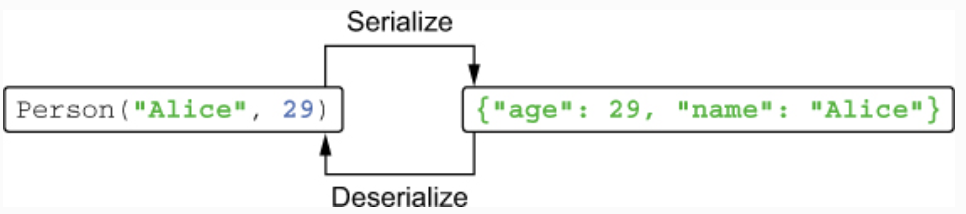
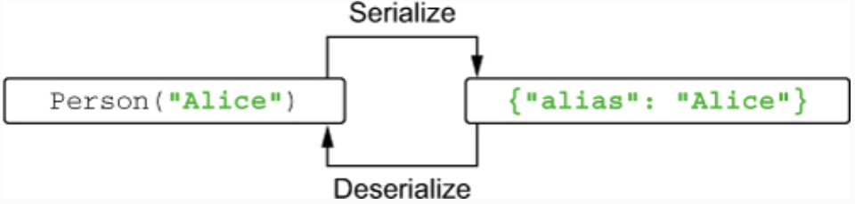
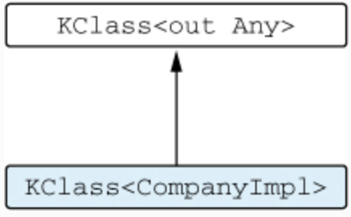
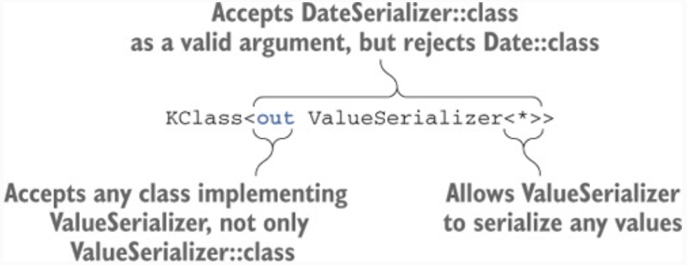
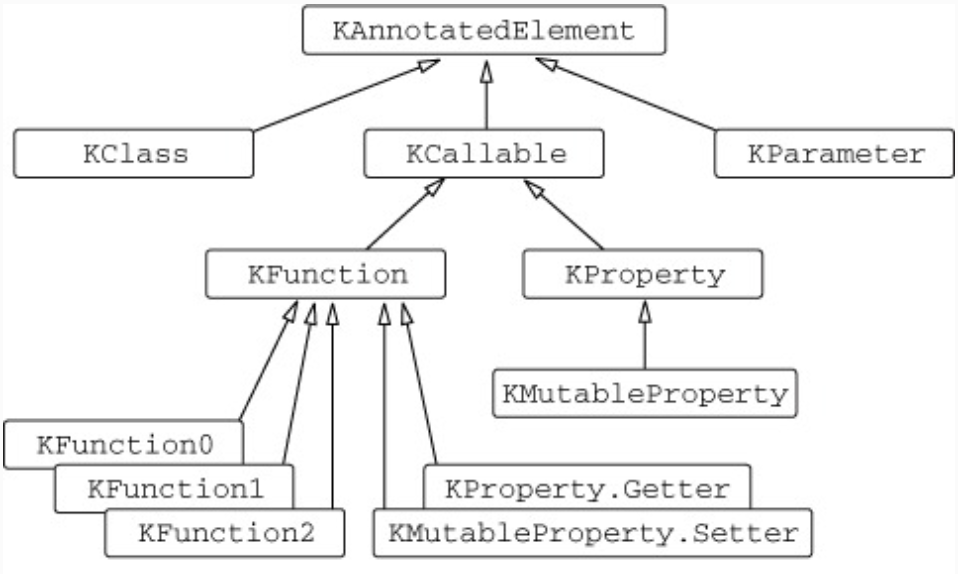
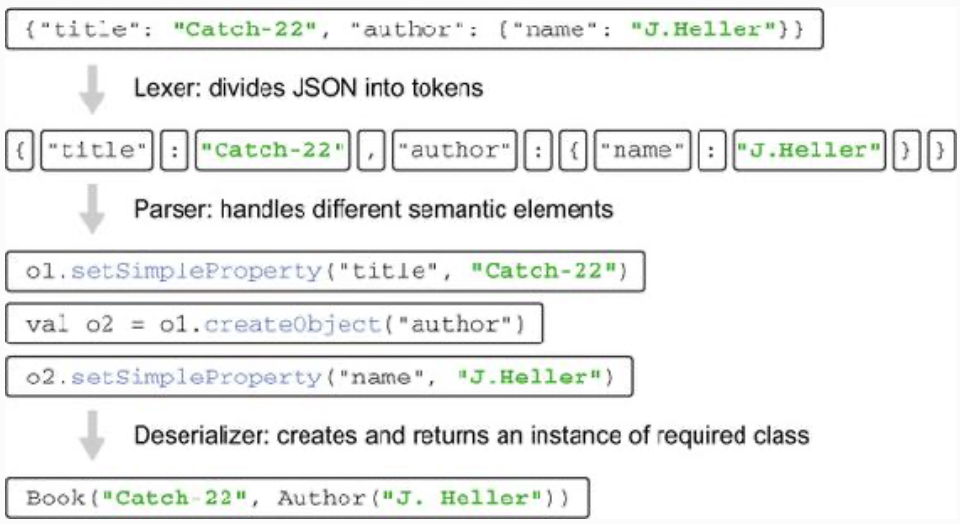

# Chapter 10. Annotations and reflection

* This chapter covers 
  * Applying and defining annotations 
  * Using reflection to introspect classes at runtime 
  * A real example of a Kotlin project

* **Annotations and reflection** give you the power to write code that deals with arbitrary classes that aren’t known 
in advance. You can use annotations to assign library-specific semantics to those classes; and reflection allows you to 
analyze the structure of the classes at runtime.

---

## 10.1. Declaring and applying annotations

* An annotation allows you to associate additional metadata with a declaration. The metadata can then be accessed by 
tools that work with source code, with compiled class files, or at runtime, depending on how the annotation is 
configured.

### 10.1.1. Applying annotations

* You use annotations in Kotlin in the same way as in Java. To apply an annotation, you put its name, prefixed with 
the `@` character, in the beginning of the declaration you’re annotating. You can annotate different code elements, 
such as functions and classes.

* For instance, if you’re using the JUnit framework, you can mark a test method with the `@Test` annotation:

```kotlin
import org.junit.*

class MyTest {
    @Test fun testTrue() { // The @Test annotation instructs the JUnit framework to invoke this method as a test.
        Assert.assertTrue(true)
    }
}
```

* As a more interesting example, let’s look at the `@Deprecated` annotation. Its meaning in Kotlin is the same as in 
Java, but Kotlin enhances it with the `replaceWith` parameter, which lets you provide a replacement pattern to support 
a smooth transition to a new version of the API.

```kotlin
@Deprecated("Use removeAt(index) instead,", ReplaceWith("removeAt(index)"))
fun remove(index: Int) { ... }
```

* The arguments are passed in parentheses, just as in a regular function call. With this declaration, if someone uses 
the function `remove`, IntelliJ IDEA will not only show what function should be used instead (`removeAt` in this case) 
but also offer a quick fix to replace it automatically.

* Annotations can have parameters of the following types only: primitive types, strings, enums, class references, other 
annotation classes, and arrays thereof. The syntax for specifying annotation arguments is slightly different from 
Java’s:
  * **To specify a class as an annotation argument**, put `::class` after the class name: 
  `@MyAnnotation(MyClass::class)`. 
  * **To specify another annotation as an argument**, don’t put the `@` character before the annotation name. For 
  instance, `ReplaceWith` in the previous example is an annotation, but you don’t use `@` when you specify it as an 
  argument of the `Deprecated` annotation. 
  * **To specify an array as an argument**, use the `arrayOf` function: 
  `@RequestMapping(path = arrayOf("/foo", "/bar"))`. If the annotation class is declared in Java, the parameter named 
  `value` is automatically converted to a `vararg` parameter if necessary, so the arguments can be provided without 
  using the `arrayOf` function.

* Annotation arguments need to be known at compile time, so you can’t refer to arbitrary properties as arguments. To 
use a property as an annotation argument, you need to mark it with a `const` modifier, which tells the compiler that 
the property is a **compile-time constant**. Here’s an example of JUnit’s `@Test` annotation that specifies the timeout 
for the test, in milliseconds, using the timeout parameter:

```kotlin
const val TEST_TIMEOUT = 100L

@Test(timeout = TEST_TIMEOUT) fun testMethod() { ... }
```

### 10.1.2. Annotation targets

* In many cases, a single declaration in the Kotlin source code corresponds to multiple Java declarations, and each of 
them can carry annotations. For example, a Kotlin property corresponds to a Java field, a getter, and possibly a setter 
and its parameter. A property declared in the primary constructor has one more corresponding element: the constructor 
parameter. Therefore, it may be necessary to specify which of these elements needs to be annotated.

* You specify the element to be annotated with a **use-site target** declaration. The use-site target is placed between 
the `@` sign and the annotation name and is separated from the name with a colon. The word `get` causes the annotation 
`@Rule` to be applied to the property getter:


> Figure 10.1. The syntax for specifying use-site targets.

* To specify a rule, in Java you declare a `public` field or method annotated with `@Rule`. But if you just annotate 
the property `folder` in your Kotlin test class with `@Rule`, you’ll get a JUnit exception: “The `@Rule` ‘folder’ must 
be public.” It happens because `@Rule` is applied to the field, which is private by default. To apply it to the getter, 
you need to write that explicitly, `@get:Rule`, as follows:

```kotlin
class HasTempFolder {
    @get:Rule // The getter is annotated, not the property
    val folder = TemporaryFolder()
    
    @Test
    fun testUsingTempFolder() {
        val createdFile = folder.newFile("myfile.text")
        val createdFolder = folder.newFolder("subfolder")
        // ...
    }
}
```

* The full list of supported use-site targets is as follows:
  * `property` — Java annotations can’t be applied with this use-site target. 
  * `field` — Field generated for the property. 
  * `get` — Property getter. 
  * `set` — Property setter. 
  * `receiver` — Receiver parameter of an extension function or property. 
  * `param` — Constructor parameter. 
  * `setparam` — Property setter parameter. 
  * `delegate` — Field storing the delegate instance for a delegated property. 
  * `file` — Class containing top-level functions and properties declared in the file.

* Any annotation with the `file` target needs to be placed at the top level of the file, before the `package` 
directive. One of the annotations commonly applied to files is `@JvmName`, which changes the name of the corresponding 
class: `@file:JvmName("StringFunctions")`.

* Note that unlike Java, Kotlin allows you to apply annotations to arbitrary expressions, not only to class and 
function declarations or types. The most common example is the `@Suppress` annotation, which you can use to suppress a 
specific compiler warning in the context of the annotated expression.

```kotlin
fun test(list: List<*>) {
    @Suppress("UNCHECKED_CAST")
    val strings = list as List<String>
    // ...
}
```

* Kotlin provides a variety of annotations to control how declarations written in Kotlin are compiled to Java bytecode 
and exposed to Java callers. Some of those annotations replace the corresponding keywords of the Java language: for 
example, the `@Volatile` and `@Strictfp` annotations serve as direct replacements for Java’s `volatile` and `strictfp` 
keywords. Others are used to change how Kotlin’s declarations are visible to Java callers:
  * `@JvmName` changes the name of a Java method or field generated from a Kotlin declaration.
  * `@JvmStatic` can be applied to methods of an object declaration or a companion object to expose them as static Java 
  methods. 
  * `@JvmOverloads` instructs the Kotlin compiler to generate overloads for a function that has default parameter 
  values. 
  * `@JvmField` can be applied to a property to expose that property as a public Java field with no getters or setters.

### 10.1.3. Using annotations to customize JSON serialization

* One of the classic use cases for annotations is customizing object serialization. **Serialization** is a process of 
converting an object to a binary or text representation that can be then stored or sent over the network. The reverse 
process, **deserialization**, converts such a representation back to an object. One of the most common formats used for 
serialization is JSON.

* Over the course of this chapter, we’ll discuss the implementation of a pure Kotlin library for this purpose, called 
JKid. The full implementation is available as part of the book’s source code, as well as online at 
https://manning.com/books/kotlin-in-action and http://github.com/yole/jkid.

* Let’s start with the simplest example to test the library: serializing and deserializing an instance of the Person 
class.

```kotlin
data class Person(val name: String, val age: Int)

val person = Person("Alice", 29)
println(serialize(person))
// {"age": 29, "name": "Alice"}
```

```kotlin
val json = """{"name": "Alice", "age": 29}"""
println(deserialize<Person>(json))
// Person(name=Alice, age=29)
```

* The equivalence between an object and its JSON representation. Note that the serialized class can contain not only 
values of primitive types or strings, as shown on the figure, but also collections and instances of other value object
classes.


> Figure 10.2. Serialization and deserialization of the Person instance.

* You can use annotations to customize the way objects are serialized and deserialized:
  * The `@JsonExclude` annotation is used to mark a property that should be excluded from serialization and 
  deserialization. 
  * The `@JsonName` annotation lets you specify that the key in the key/value pair representing the property should be 
  the given string, not the name of the property.

```kotlin
data class Person(
    @JsonName("alias") val firstName: String,
    @JsonExclude val age: Int? = null
)
```

* Note that you must specify the default value of the property `age`. Otherwise, you wouldn’t be able to create a new 
instance of `Person` during deserialization.


> Figure 10.3. Serialization and deserialization of the `Person` instance with annotations applied.

### 10.1.4. Declaring annotations

* The `@JsonExclude` annotation has the simplest form, because it doesn’t have any parameters:

```kotlin
annotation class JsonExclude
```

* The syntax looks like a regular class declaration, with the added `annotation` modifier before the `class` keyword. 
Because annotation classes are only used to define the structure of metadata associated with declarations and 
expressions, they can’t contain any code. Therefore, the compiler prohibits specifying a body for an annotation class.

* For annotations that have parameters, the parameters are declared in the primary constructor of the class:

```kotlin
annotation class JsonName(val name: String)
```

* You use the regular primary constructor declaration syntax. The `val` keyword is mandatory for all parameters of an 
annotation class.

* For comparison, here’s how you’d declare the same annotation in Java:

```java
/* Java */
public @interface JsonName {
    String value();
}
```

* Note how the Java annotation has a method called `value`, whereas the Kotlin annotation has a `name` property. The 
`value` method is special in Java: when you apply an annotation, you need to provide explicit names for all attributes 
you’re specifying except `value`.

* If you need to apply an annotation declared in Java to a Kotlin element, however, you’re required to use the 
named-argument syntax for all arguments except `value`, which Kotlin also recognizes as special.

### 10.1.5. Meta-annotations: controlling how an annotation is processed

* Just as in Java, a Kotlin annotation class can itself be annotated. The annotations that can be applied to annotation 
classes are called **meta-annotations**. The standard library defines several of them, and they control how the 
compiler processes annotations.

```kotlin
@Target(AnnotationTarget.PROPERTY)
annotation class JsonExclude
```

* The `@Target` meta-annotation specifies the types of elements to which the annotation can be applied. If you don’t 
use it, the annotation will be applicable to all declarations.

* The list of values of the `AnnotationTarget` enum gives the full range of possible targets for an annotation. It 
includes classes, files, functions, properties, property accessors, types, all expressions, and so on. You can declare 
multiple targets if you need to: `@Target(AnnotationTarget.CLASS, AnnotationTarget.METHOD)`.

* To declare your own meta-annotation, use `ANNOTATION_CLASS` as its target:

```kotlin
@Target(AnnotationTarget.ANNOTATION_CLASS)
annotation class BindingAnnotation

@BindingAnnotation
annotation class MyBinding
```

* Note that you can’t use annotations with a `property` target from Java code; to make such an annotation usable from 
Java, you can add the second target `AnnotationTarget.FIELD`. In this case, the annotation will be applied to 
properties in Kotlin and to fields in Java.

* In Java, you’ve probably seen another important meta-annotation, `@Retention`. You can use it to specify whether the 
annotation you declare will be stored in the .class file and whether it will be accessible at runtime through 
reflection. Java by default retains annotations in .class files but doesn’t make them accessible at runtime. Most 
annotations do need to be present at runtime, so in Kotlin the default is different: annotations have `RUNTIME` 
retention.

### 10.1.6. Classes as annotation parameters

* Sometimes you need the ability to refer to a **class** as declaration metadata. You can do so by declaring an 
annotation class that has a class reference as a parameter. In the JKid library, this comes up in the 
`@DeserializeInterface` annotation, which allows you to control the deserialization of properties that have an 
interface type. You can’t create an instance of an interface directly, so you need to specify which class is used as 
the implementation created during deserialization.

```kotlin
interface Company {
    val name: String
}

data class CompanyImpl(override val name: String) : Company

data class Person(
    val name: String,
    @DeserializeInterface(CompanyImpl::class) val company: Company
)
```

* Whenever JKid reads a nested company object for a `Person` instance, it creates and deserializes an instance of 
`CompanyImpl` and stores it in the company property. To specify this, you use `CompanyImpl::class` as an argument of 
the `@DeserializeInterface` annotation. In general, to refer to a class, you use its name followed by the `::class` 
keyword.

* Now let’s see how the annotation is declared. Its single argument is a class reference, as in 
`@DeserializeInterface(CompanyImpl::class)`:

```kotlin
annotation class DeserializeInterface(val targetClass: KClass<out Any>)
```

* The `KClass` type is Kotlin’s counterpart to Java’s `java.lang.Class` type. It’s used to hold references to Kotlin 
classes.

* The type parameter of `KClass` specifies which Kotlin classes can be referred to by this reference. For instance, 
`CompanyImpl::class` has a type `KClass<CompanyImpl>`, which is a subtype of the annotation parameter type.


> Figure 10.4. The type of the annotation argument `CompanyImpl::class (KClass<CompanyImpl>)` is a subtype of the annotation parameter type (`KClass<out Any>`).

* If you wrote `KClass<Any>` without the out modifier, you wouldn’t be able to pass `CompanyImpl::class` as an 
argument.

### 10.1.7. Generic classes as annotation parameters

* By default, JKid serializes properties of nonprimitive types as nested objects. But you can change this behavior and 
provide your own serialization logic for some values.

* The `@CustomSerializer` annotation takes a reference to a custom serializer class as an argument. The serializer 
class should implement the `ValueSerializer` interface:

```kotlin
interface ValueSerializer<T> {
    fun toJsonValue(value: T): Any?
    fun fromJsonValue(jsonValue: Any?): T
}
```

* Suppose you need to support serialization of dates, and you’ve created your own `DateSerializer` class for that, 
implementing the `ValueSerializer<Date>` interface.

```kotlin
data class Person(
    val name: String,
    @CustomSerializer(DateSerializer::class) val birthDate: Date
)
```

* Now let’s see how the `@CustomSerializer` annotation is declared. The `ValueSerializer` class is generic and defines 
a type parameter, so you need to provide a type argument value whenever you refer to the type. Because you know nothing 
about the types of properties with which this annotation will be used, you can use a **star projection** as the 
argument:

```kotlin
annotation class CustomSerializer(
    val serializerClass: KClass<out ValueSerializer<*>>
)
```


> Figure 10.5. The type of the `serializerClass` annotation parameter. Only class references to classes that extend `ValueSerializer` will be valid annotation arguments.

* The next step is to find out how to access the data stored in the annotations. For this, you need to use 
**reflection**.

---

## 10.2. Reflection: introspecting Kotlin objects at runtime

* Reflection is, simply put, a way to access properties and methods of objects **dynamically** at runtime, without 
knowing in advance what those properties are.

* Normally, when you access a method or a property of an object, the source code of your program references a specific 
declaration, and the compiler **statically** resolves the reference and ensures that the declaration exists. But 
sometimes you need to write code that can work with objects of any type, or where the names of methods and properties 
to be accessed are only known at runtime. The JSON serialization library is a great example of such code: it needs to 
be able to serialize any object to JSON, so it can’t reference specific classes and properties. This is where 
reflection comes into play.

* When working with reflection in Kotlin, you deal with two different reflection APIs. The first is the standard Java 
reflection, defined in the `java.lang.reflect` package. Because Kotlin classes are compiled to regular Java bytecode, 
the Java reflection API is fully compatible with Kotlin code.

* The second is the Kotlin reflection API, defined in the `kotlin.reflect` package. It gives you access to concepts 
that don’t exist in the Java world, such as properties and nullable types. But at this time it doesn’t provide a 
comprehensive replacement for the Java reflection API, and, as you’ll see later, there are cases where you need to fall 
back to Java reflection. An important note is that the Kotlin reflection API isn’t restricted to Kotlin classes: you 
can use the same API to access classes written in any JVM language.

* If you’re using the Kotlin reflection API, you need to make sure the library is added as a dependency: 
`org.jetbrains.kotlin:kotlin-reflect`.

### 10.2.1. The Kotlin reflection API: KClass, KCallable, KFunction, and KProperty

* The main entry point of the Kotlin reflection API is `KClass`, which represents a class. `KClass` is the counterpart 
of `java.lang.Class`, and you can use it to enumerate and access all the declarations contained in the class, its 
superclasses, and so on. You get an instance of `KClass` by writing `MyClass::class`. To get the class of an object at 
runtime, first you obtain its Java class using the `javaClass` property, which is a direct equivalent to Java’s 
`java.lang.Object.getClass()`. Then you access the `.kotlin` extension property to move from Java to Kotlin reflection 
API:

```kotlin
class Person(val name: String, val age: Int)

val person = Person("Alice", 29)
val kClass = person.javaClass.kotlin // Returns an instance of KClass<Person>
println(kClass.simpleName)
// Person
kClass.memberProperties.forEach { println(it.name) }
// age
// name
```

* If you browse the declaration of `KClass`, you’ll see that it contains a bunch of useful methods for accessing the 
contents of the class:

```kotlin
interface KClass<T : Any> {
    val simpleName: String?
    val qualifiedName: String?
    val members: Collection<KCallable<*>>
    val constructors: Collection<KFunction<T>>
    val nestedClasses: Collection<KClass<*>>
    // ...
}
```

* You may have noticed that the list of all members of a class is a collection of `KCallable` instances. `KCallable` is 
a superinterface for functions and properties. It declares the `call` method, which allows you to call the 
corresponding function or the getter of the property:

```kotlin
interface KCallable<out R> {
    fun call(vararg args: Any?): R
    // ...
}
```

* You provide the function arguments in a `vararg` list. The following code demonstrates how you can use `call` to call 
a function through reflection:

```kotlin
fun foo(x: Int) = println(x)
val kFunction = ::foo
kFunction.call(42)
// 42
```

* The type of the `::foo` expression is `KFunction1<Int, Unit>`, which contains information about parameter and return 
types. The 1 denotes that this function takes one parameter. To call the function through this interface, you use the 
`invoke` method. It accepts a fixed number of arguments (1 in this case), and their types correspond to the type 
parameters of the `KFunction1` interface. You can also call `kFunction` directly.

```kotlin
import kotlin.reflect.KFunction2

fun sum(x: Int, y: Int) = x + y
val kFunction: KFunction2<Int, Int, Int> = ::sum
println(kFunction.invoke(1, 2) + kFunction(3, 4))
// 10
kFunction(1)
// ERROR: No value passed for parameter p2
```

* Now you can’t call the `invoke` method on `kFunction` with an incorrect number of arguments: it won’t compile. 
Therefore, if you have a `KFunction` of a specific type, with known parameters and return type, it’s preferable to use 
its `invoke` method. The `call` method is a generic approach that works for all types of functions but doesn’t provide 
type safety.

* Types such as `KFunction1` represent functions with different numbers of parameters. Each type extends `KFunction` 
and adds one additional member invoke with the appropriate number of parameters.

* These function types are **synthetic compiler-generated types**, and you won’t find their declarations in the 
`kotlin.reflect` package.

* You can invoke the `call` method on a `KProperty` instance as well, and it will call the getter of the property. But 
the property interface gives you a better way to obtain the property value: the `get` method.

```kotlin
var counter = 0
val kProperty = ::counter
kProperty.setter.call(21) // Calls a setter through reflection, passing 21 as an argument
println(kProperty.get()) // Obtains a property value by calling "get"
```

* A **member property** is represented by an instance of `KProperty1`, which has a one-argument `get` method. To access 
its value, you must provide the object instance for which you need the value. The following example stores a reference 
to the property in a `memberProperty` variable; then you call `memberProperty.get(person)` to obtain the value of this 
property for the specific `person` instance. So if a `memberProperty` refers to the `age` property of the `Person` 
class, `memberProperty.get(person)` is a way to dynamically get the value of `person.age`:

```kotlin
class Person(val name: String, val age: Int)

val person = Person("Alice", 29)
val memberProperty = Person::age
println(memberProperty.get(person))
// 29
```

* Note that `KProperty1` is a generic class. The `memberProperty` variable has the type `KProperty<Person, Int>`, where 
the first type parameter denotes the type of the receiver and the second type parameter stands for the property type. 
Thus you can call its `get` method only with a receiver of the right type; the call `memberProperty.get("Alice")` won’t 
compile.

* Also note that you can only use reflection to access properties defined at the top level or in a class, but not local 
variables of a function. If you define a local variable `x` and try to get a reference to it using `::x`, you’ll get a 
compilation error saying that “References to variables aren’t supported yet”.

* Because all declarations can be annotated, the interfaces that represent declaration at runtime, such as `KClass`, 
`KFunction`, and `KParameter`, all extend `KAnnotatedElement`. `KClass` is used to represent both classes and objects. 
`KProperty` can represent any property, whereas its subclass, `KMutableProperty`, represents a mutable property, which 
you declare with `var`. You can use the special interfaces `Getter` and `Setter` declared in `Property` and 
`KMutableProperty` to work with property accessors as functions — for example, if you need to retrieve their 
annotations. Both interfaces for accessors extend `KFunction`. For simplicity, we’ve omitted the specific interfaces 
for properties like `KProperty0` in the figure.


> Figure 10.6. Hierarchy of interfaces in the Kotlin reflection API.

### 10.2.2. Implementing object serialization using reflection

* This function takes an object and returns its JSON representation as a string. It’ll build up the resulting JSON in a 
`StringBuilder` instance. As it serializes object properties and their values, it’ll append them to this 
`StringBuilder` object. To make the append calls more concise, let’s put the implementation in an extension function to 
`StringBuilder`.

```kotlin
private fun StringBuilder.serializeObject(x: Any) {
    append(...)
}
```

* Consequently, the `serialize` function delegates all the work to `serializeObject`:

```kotlin
fun serialize(obj: Any): String = buildString { serializeObject(obj) }
```

* Now let’s discuss the behavior of the serialization function. By default, it will serialize all properties of the 
object. Primitive types and strings will be serialized as JSON number, boolean, and string values, as appropriate. 
Collections will be serialized as JSON arrays. Properties of other types will be serialized as nested objects. As we 
discussed in the previous section, this behavior can be customized through annotations.

```kotlin
private fun StringBuilder.serializeObject(obj: Any) {
    val kClass = obj.javaClass.kotlin // Gets the KClass for the object
    val properties = kClass.memberProperties // Gets all properties of the class

    properties.joinToStringBuilder(this, prefix = "{", postfix = "}") { prop ->
        serializeString(prop.name) // Gets the property name
        append(": ")
        serializePropertyValue(prop.get(obj)) // Gets the property value
    }
}
```

* The implementation of this function should be clear: you serialize each property of the class, one after another. The 
resulting JSON will look like this: `{ prop1: value1, prop2: value2 }`. The `joinToStringBuilder` function ensures that 
properties are separated with commas. The `serializeString` function escapes special characters as required by the JSON 
format. The `serializePropertyValue` function checks whether a value is a primitive value, string, collection, or 
nested object, and serializes its content accordingly.

### 10.2.3. Customizing serialization with annotations

* Earlier in this chapter, you saw the definitions of annotations that let you customize the process of JSON 
serialization. In particular, we discussed the `@JsonExclude`, `@JsonName`, and `@CustomSerializer` annotations. Now 
it’s time to see how these annotations can be handled by the `serializeObject` function.

* We’ll start with `@JsonExclude`. This annotation allows you to exclude some properties from serialization. Let’s 
investigate how you should change the implementation of the `serializeObject` function to support that.

* The `KAnnotatedElement` interface defines the property `annotations`, a collection of instances of all annotations 
(with runtime retention) applied to the element in the source code. Because `KProperty` extends `KAnnotatedElement`, 
you can access all annotations for a property by saying `property.annotations`.

* But here the filtering doesn’t use all annotations; it needs to find a specific one. The helper function 
`findAnnotation` does the job:

```kotlin
inline fun <reified T> KAnnotatedElement.findAnnotation(): T?
        = annotations.filterIsInstance<T>().firstOrNull()
```

* The `findAnnotation` function returns an annotation of a type specified as an argument if such an annotation is 
present. It uses the pattern that makes the type parameter `reified` in order to pass the annotation class as the type 
argument.

```kotlin
val properties = kClass.memberProperties
        .filter { it.findAnnotation<JsonExclude>() == null }
```

* The next annotation is `@JsonName`.

```kotlin
val jsonNameAnn = prop.findAnnotation<JsonName>() // Gets an instance of the @JsonName annotation if it exists
val propName = jsonNameAnn?.name ?: prop.name // Gets its "name" argument or uses "prop.name" as a fallback 
```

* If a property isn’t annotated with `@JsonName`, then `jsonNameAnn` is `null`, and you still use `prop.name` as the 
name for the property in `JSON`.

* Let’s combine the changes discussed so far and look at the resulting implementation of the serialization logic.

```kotlin
private fun StringBuilder.serializeObject(obj: Any) {
    obj.javaClass.kotlin.memberProperties
      .filter { it.findAnnotation<JsonExclude>() == null }
      .joinToStringBuilder(this, prefix = "{", postfix = "}") { 
        serializeProperty(it, obj)
      }
}
```

```kotlin
private fun StringBuilder.serializeProperty(
        prop: KProperty1<Any, *>, obj: Any
) {
    val jsonNameAnn = prop.findAnnotation<JsonName>()
    val propName = jsonNameAnn?.name ?: prop.name
    serializeString(propName)
    append(": ")

    serializePropertyValue(prop.get(obj))
}
```

* Next, let’s implement the remaining annotation, `@CustomSerializer`. The implementation is based on the function 
`getSerializer`, which returns the `ValueSerializer` instance registered via the `@CustomSerializer` annotation. Here’s 
how the `getSerializer` function is implemented.

```kotlin
fun KProperty<*>.getSerializer(): ValueSerializer<Any?>? {
    val customSerializerAnn = findAnnotation<CustomSerializer>() ?: return null
    val serializerClass = customSerializerAnn.serializerClass

    val valueSerializer = serializerClass.objectInstance
            ?: serializerClass.createInstance()
    @Suppress("UNCHECKED_CAST")
    return valueSerializer as ValueSerializer<Any?>
}
```

* It’s an extension function to `KProperty`, because the property is the primary object handled by the method. It calls 
the `findAnnotation` function to get an instance of the `@CustomSerializer` annotation if it exists. Its argument, 
`serializerClass`, specifies the class for which you need to obtain an instance.

* The most interesting part here is the way you handle both classes and objects (Kotlin’s singletons) as values of the 
`@CustomSerializer` annotation. They’re both represented by the `KClass` class. The difference is that objects have a 
non-`null` value of the `objectInstance` property, which can be used to access the singleton instance created for the 
`object`. For example, `DateSerializer` is declared as an `object`, so its `objectInstance` property stores the 
singleton `DateSerializer` instance. You’ll use that instance to serialize all objects, and `createInstance` won’t be 
called.

* If the `KClass` represents a regular class, you create a new instance by calling `createInstance`. This function is 
similar to `java.lang.Class.newInstance`.

* Finally, you can use `getSerializer` in the implementation of `serializeProperty`. Here’s the final version of the 
function.

```kotlin
private fun StringBuilder.serializeProperty(
        prop: KProperty1<Any, *>, obj: Any
) {
    val jsonNameAnn = prop.findAnnotation<JsonName>()
    val propName = jsonNameAnn?.name ?: prop.name
    serializeString(propName)
    append(": ")

    val value = prop.get(obj)
    val jsonValue = 
        prop.getSerializer()?.toJsonValue(value) // Uses a custom serializer for the property if it exists
          ?: value // Otherwise uses the property value as before
    serializePropertyValue(jsonValue)
}
```

* `serializeProperty` uses the serializer to convert the property value to a JSON-compatible format by calling 
`toJsonValue`. If the property doesn’t have a custom serializer, it uses the property value.

### 10.2.4. JSON parsing and object deserialization

* Let’s start with the second part of the story: implementing the deserialization logic. First, recall that the API, 
like that used for serialization, consists of a single function:

```kotlin
inline fun <reified T: Any> deserialize(json: String): T
```

* Here’s an example of its use:

```kotlin
data class Author(val name: String)
data class Book(val title: String, val author: Author)

val json = """{"title": "Catch-22", "author": {"name": "J. Heller"}}"""
val book = deserialize<Book>(json)
println(book)
// Book(title=Catch-22, author=Author(name=J. Heller))
```

* You pass the type of object to be deserialized as a reified type parameter to the `deserialize` function and get back 
a new object instance.

* Deserializing JSON is a more difficult task than serializing, because it involves parsing the JSON string input in 
addition to using reflection to access object internals. The JSON deserializer in JKid is implemented in a fairly 
conventional way and consists of three main stages: a lexical analyzer, usually referred to as a **lexer**; a syntax 
analyzer, or **parser**; and the deserialization component itself.

* The lexical analysis splits an input string consisting of characters into a list of tokens. There are two kinds of 
tokens: **character tokens**, which represent characters with special meanings in the JSON syntax (comma, colon, 
braces, and brackets); and **value tokens**, which correspond to string, number, Boolean, and `null` constants. A left 
brace (`{`), a string value (`"Catch-22"`), and an integer value (`42`) are examples of different tokens.

* The parser is generally responsible for converting a plain list of tokens into a structured representation. Its task 
in JKid is to understand the higher-level structure of JSON and to convert individual tokens into semantic elements 
supported in JSON: key-value pairs, objects, and arrays.

* The `JsonObject` interface keeps track of the object or array currently being deserialized. The parser calls the 
corresponding methods when it discovers new properties of the current object (simple values, composite properties, or 
arrays).

```kotlin
interface JsonObject {
    fun setSimpleProperty(propertyName: String, value: Any?)

    fun createObject(propertyName: String): JsonObject

    fun createArray(propertyName: String): JsonObject
}
```


> Figure 10.7. JSON parsing: lexer, parser, and deserializer.

* The deserializer then provides an implementation for `JsonObject` that gradually builds a new instance of the 
corresponding type. It needs to find the correspondence between class properties and JSON keys (`title`, `author`, and 
`name`) and build nested object values (an instance of `Author`); only after that it can create a new instance of the 
required class (`Book`).

* The requirement to save the components before creating the object looks similar to the traditional Builder pattern, 
with the difference that builders are generally tailored to creating a specific kind of object, and the solution needs 
to be completely generic. To avoid being boring, we use the term **seed** for the implementation. In JSON, you need to 
build different types of composite structures: objects, collections, and maps. The classes `ObjectSeed`, 
`ObjectListSeed`, and `ValueListSeed` are responsible for building objects and lists of composite objects or simple 
values appropriately.

* The basic `Seed` interface extends `JsonObject` and provides an additional `spawn` method to get the resulting 
instance after the building process is finished. It also declares the `createCompositeProperty` method that’s used to 
create both nested objects and nested lists.

```kotlin
interface Seed: JsonObject {
    fun spawn(): Any?

    fun createCompositeProperty(
        propertyName: String,
        isList: Boolean
    ): JsonObject
    override fun createObject(propertyName: String) =
        createCompositeProperty(propertyName, false)
    override fun createArray(propertyName: String) =
        createCompositeProperty(propertyName, true)

    // ...
}
```

* You may think of `spawn` as an analogue of `build` — a method that returns the result value. It returns the 
constructed object for `ObjectSeed` and the resulting list for `ObjectListSeed` or `ValueListSeed`. We won’t discuss in 
detail how lists are deserialized. We’ll focus our attention on creating objects, which is more complicated and serves 
to demonstrate the general idea.

* But before that, let’s study the main `deserialize` function that does all the work of deserializing a value.

```kotlin
fun <T: Any> deserialize(json: Reader, targetClass: KClass<T>): T {
    val seed = ObjectSeed(targetClass, ClassInfoCache())
    Parser(json, seed).parse()
    return seed.spawn()
}
```

* To start the parsing, you create an `ObjectSeed` to store the properties of the object being deserialized, and then 
you invoke the parser and pass the input stream reader `json` to it. Once you reach the end of the input data, you call 
the `spawn` function to build the resulting object.

* Now let’s focus on the implementation of `ObjectSeed`, which stores the state of an object being constructed. 
`ObjectSeed` takes a reference to the resulting class and a `classInfoCache` object containing cached information about 
the properties of the class. This cached information will be used later to create instances of that class. 
`ClassInfoCache` and `ClassInfo` are helper classes that will be discussed in the next section.

```kotlin
class ObjectSeed<out T: Any>(
        targetClass: KClass<T>,
        override val classInfoCache: ClassInfoCache
) : Seed {

    private val classInfo: ClassInfo<T> = // Caches the information needed to create an instance of targetClass
        classInfoCache[targetClass]

    private val valueArguments = mutableMapOf<KParameter, Any?>()
    private val seedArguments = mutableMapOf<KParameter, Seed>()

    private val arguments: Map<KParameter, Any?>
        get() = valueArguments + seedArguments.mapValues { it.value.spawn() }

    override fun setSimpleProperty(propertyName: String, value: Any?) {
        val param = classInfo.getConstructorParameter(propertyName)
        valueArguments[param] = // Records a value for the constructor parameter, if it's a simple value
          classInfo.deserializeConstructorArgument(param, value)
    }

    override fun createCompositeProperty(propertyName: String, isList: Boolean): Seed {
        val param = classInfo.getConstructorParameter(propertyName)
        val deserializeAs = // Loads the value of the DeserializeInterface annotation for the property, if any
            classInfo.getDeserializeClass(propertyName)
        val seed = // Creates an ObjectSeed or CollectionSeed according to the parameter type...
            createSeedForType(deserializeAs ?: param.type.javaType, isList)
        return seed.apply { seedArguments[param] = this } // ...and records it in the seedArguments map
    }

    override fun spawn(): T = // Creates the resulting instance of targetClass, passing an arguments map
        classInfo.createInstance(arguments)
}
```

* `ObjectSeed` builds a map from constructor parameters to their values. Two mutable maps are used for that: 
`valueArguments` for simple value properties and `seedArguments` for composite properties. While the result is being 
built, new arguments are added to the `valueArguments` map by calling `setSimpleProperty` and to the `seedArguments` 
map by calling `createCompositeProperty`. New composite seeds are added in an empty state and are then filled with data 
coming from the input stream. Finally, the `spawn` method builds all nested seeds recursively by calling `spawn` on 
each.

* Note how calling `arguments` in the body of the `spawn` method launches the recursive building of composite (seed) 
arguments: the custom getter of `arguments` calls the `spawn` methods on each of the `seedArguments`. The 
`createSeedForType` function analyzes the type of the parameter and creates either `ObjectSeed`, `ObjectListSeed`, or 
`ValueListSeed`, depending on whether the parameter is some kind of collection. We’ll leave the investigation of how 
it’s implemented to you. Next, let’s see how the `ClassInfo.createInstance` function creates an instance of 
`targetClass`.

### 10.2.5. Final deserialization step: callBy() and creating objects using reflection

* The last part you need to understand is the `ClassInfo` class that builds the resulting instance and caches 
information about constructor parameters. It is used in `ObjectSeed`. But before we dive into the implementation 
details, let’s look at the APIs that you use to create objects through reflection.

* You’ve already seen the `KCallable.call` method, which calls a function or a constructor by taking a list of 
arguments. This method works great in many cases, but it has a restriction: it doesn’t support default parameter 
values. In this case, if a user is trying to deserialize an object with a constructor that has default parameter 
values, you definitely don’t want to require those arguments to be specified in the JSON. Therefore, you need to use 
another method, which does support default parameter values: `KCallable.callBy`.

```kotlin
interface KCallable<out R> {
    fun callBy(args: Map<KParameter, Any?>): R
    ...
}
```

* The method takes a map of parameters to their corresponding values that will be passed as arguments. If a parameter 
is missing from the map, its default value will be used if possible. It’s also nice that you don’t have to put the 
parameters in the correct order; you can read the name-value pairs from JSON, find the parameter corresponding to each 
argument name, and put its value in the map.

* One thing you do need to take care of is getting the types right. The type of the value in the `args` map needs to 
match the constructor parameter type; otherwise, you’ll get an `IllegalArgumentException`. This is particularly 
important for numeric types: you need to know whether the parameter takes an `Int`, a `Long`, a `Double`, or another 
primitive type, and to convert the numeric value coming from JSON to the correct type. To do that, you use the 
`KParameter.type` property.

* The type conversion works through the same `ValueSerializer` interface used for custom serialization. If a property 
doesn’t have an `@CustomSerializer` annotation, you retrieve a standard implementation based on its type.

```kotlin
fun serializerForType(type: Type): ValueSerializer<out Any?>? =
        when(type) {
            Byte::class.java -> ByteSerializer
            Int::class.java -> IntSerializer
            Boolean::class.java -> BooleanSerializer
            // ...
            else -> null
        }
```

* The corresponding `ValueSerializer` implementations perform the necessary type checking or conversion.

```kotlin
object BooleanSerializer : ValueSerializer<Boolean> {
    override fun fromJsonValue(jsonValue: Any?): Boolean {
        if (jsonValue !is Boolean) throw JKidException("Boolean expected")
        return jsonValue
    }

    override fun toJsonValue(value: Boolean) = value
}
```

* The `callBy` method gives you a way to invoke the primary constructor of an object, passing a map of parameters and 
corresponding values. The `ValueSerializer` mechanism ensures that the values in the map have the right types. Now 
let’s see how you invoke the API.

* The `ClassInfoCache` class is intended to reduce the overhead of reflection operations. Recall that the annotations 
used to control the serialization and deserialization process (`@JsonName` and `@CustomSerializer`) are applied to 
properties, rather than parameters. When you’re deserializing an object, you’re dealing with constructor parameters, 
not properties; and in order to retrieve the annotations, you need to find the corresponding property. Performing this 
search when reading every key-value pair would be exceedingly slow, so you do this once per class and cache the 
information. Here’s the entire implementation of `ClassInfoCache`.

```kotlin
class ClassInfoCache {
    private val cacheData = mutableMapOf<KClass<*>, ClassInfo<*>>()

    @Suppress("UNCHECKED_CAST")
    operator fun <T : Any> get(cls: KClass<T>): ClassInfo<T> =
            cacheData.getOrPut(cls) { ClassInfo(cls) } as ClassInfo<T>
}
```

* Note the use of `getOrPut`: if the `cacheData` map already contains an entry for `cls`, you return that entry. 
Otherwise, you call the passed lambda, which calculates the value for the key, stores the value in the map, and returns 
it.

* The `ClassInfo` class is responsible for creating a new instance of the target class and caching the necessary 
information. To simplify the code, we’ve omitted some functions and trivial initializers. Also, you may notice that 
instead of `!!`, the production code throws an exception with an informative message (which is a good pattern for your 
code as well).

```kotlin
class ClassInfo<T : Any>(cls: KClass<T>) {
    private val constructor = cls.primaryConstructor!!

    private val jsonNameToParamMap = hashMapOf<String, KParameter>()
    private val paramToSerializerMap =
        hashMapOf<KParameter, ValueSerializer<out Any?>>()
    private val jsonNameToDeserializeClassMap =
        hashMapOf<String, Class<out Any>?>()

    init {
        constructor.parameters.forEach { cacheDataForParameter(cls, it) }
    }
    fun getConstructorParameter(propertyName: String): KParameter =
            jsonNameToParam[propertyName]!!

    fun deserializeConstructorArgument(
            param: KParameter, value: Any?): Any? {
        val serializer = paramToSerializer[param]
        if (serializer != null) return serializer.fromJsonValue(value)

        validateArgumentType(param, value)
        return value
    }

    fun createInstance(arguments: Map<KParameter, Any?>): T {
        ensureAllParametersPresent(arguments)
        return constructor.callBy(arguments)
    }

    // ...
}
```

* On initialization, this code locates the property corresponding to each constructor parameter and retrieves its 
annotations. It stores the data in three maps: `jsonNameToParam` specifies the parameter corresponding to each key in 
the JSON file, `paramToSerializer` stores the serializer for each parameter, and `jsonNameToDeserializeClass` stores 
the class specified as the `@DeserializeInterface` argument, if any. `ClassInfo` can then provide a constructor 
parameter by the property name, and the calling code uses the parameter as a key for the parameter-to-argument map.

* The `cacheDataForParameter`, `validateArgumentType`, and `ensureAllParametersPresent` functions are private functions 
in this class. Following is the implementation of `ensureAllParametersPresent`.

```kotlin
private fun ensureAllParametersPresent(arguments: Map<KParameter, Any?>) {
    for (param in constructor.parameters) {
            if (arguments[param] == null &&
                    !param.isOptional && !param.type.isMarkedNullable) {
            throw JKidException("Missing value for parameter ${param.name}")
        }
    }
}
```

* This function checks that you provide all required values for parameters. Note how the reflection API helps you here. 
If a parameter has a default value, then `param.isOptional` is `true` and you can omit an argument for it; the default 
one will be used instead. If the parameter type is nullable (`type.isMarkedNullable` tells you that), `null` will be 
used as the default parameter value. For all other parameters, you must provide the corresponding arguments; otherwise, 
an exception will be thrown.

## 10.3. Summary

* The syntax for applying annotations in Kotlin is almost the same as in Java. 
* Kotlin lets you apply annotations to a broader range of targets than Java, including files and expressions. 
* An annotation argument can be a primitive value, a string, an enum, a class reference, an instance of another 
annotation class, or an array thereof. 
* Specifying the use-site target for an annotation, as in `@get:Rule`, allows you to choose how the annotation is 
applied if a single Kotlin declaration produces multiple bytecode elements.
* You declare an annotation class as a class with a primary constructor where all parameters are marked as `val` 
properties and without a body. 
* Meta-annotations can be used to specify the target, retention mode, and other attributes of annotations. 
* The reflection API lets you enumerate and access the methods and properties of an object dynamically at runtime. It 
has interfaces representing different kinds of declarations, such as classes (`KClass`), functions (`KFunction`), and 
so on. 
* To obtain a `KClass` instance, you can use `ClassName::class` if the class is statically known and 
`obj.javaClass.kotlin` to get the class from an object instance. 
* The `KFunction` and `KProperty` interfaces both extend `KCallable`, which provides the generic `call` method. 
* The `KCallable.callBy` method can be used to invoke methods with default parameter values. 
* `KFunction0`, `KFunction1`, and so on are functions with different numbers of parameters that can be called using the 
`invoke` method. 
* `KProperty0` and `KProperty1` are properties with different numbers of receivers that support the `get` method for 
retrieving the value. `KMutableProperty0` and `KMutableProperty1` extend those interfaces to support changing property 
values through the `set` method.