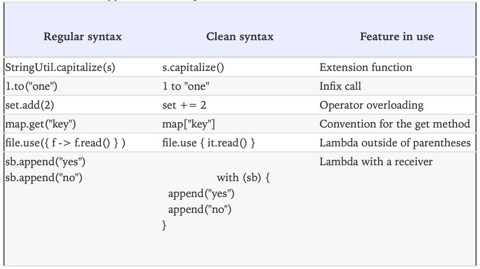
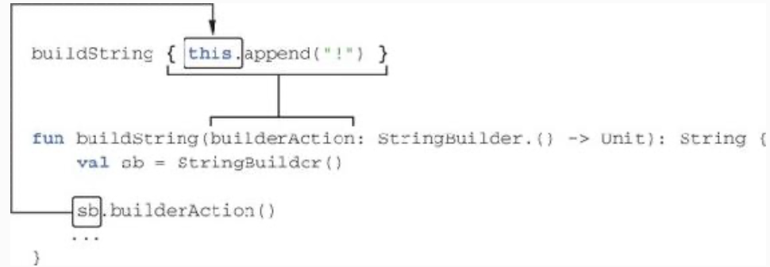

# Chapter 11. DSL Construction

* This chapter covers 
  * Building domain-specific languages 
  * Using lambdas with receivers 
  * Applying the invoke convention 
  * Examples of existing Kotlin DSLs

* We’ll discuss how you can design expressive and idiomatic APIs for your Kotlin classes through the use of 
**domain-specific languages** (DSLs).

* Kotlin DSL design relies on many language features, two of which we haven’t yet fully explored. One of them you saw 
briefly in chapter 5: lambdas with receivers, which let you create a DSL structure by changing the name-resolution 
rules in code blocks. The other is new: the `invoke` convention, which enables more flexibility in combining lambdas 
and property assignments in DSL code.

---

## 11.1. From APIs to DSLs

* The goal is to achieve the best possible code readability and maintainability. To reach that goal, it’s not enough to 
focus on individual classes. Most of the code in a class interacts with other classes, so we need to look at the 
interfaces through which these interactions happen—in other words, the APIs of the classes.

* Over the course of this book, you’ve seen many examples of Kotlin features that allow you to build clean APIs for 
classes.


> Figure 11.1. Kotlin support for clean syntax.

* Kotlin’s DSLs build on the clean-syntax features and extend them with the ability to create **structure** out of 
multiple method calls. As a result, DSLs can be even more expressive and pleasant to work with than APIs constructed 
out of individual method calls.

* Just like other features of the language, Kotlin DSLs are **fully statically typed**. This means all the advantages 
of static typing, such as compile-time error detection and better IDE support, remain in effect when you use DSL 
patterns for your APIs.

### 11.1.1. The concept of domain-specific languages

* We make a distinction between a **general-purpose programming language**, with a set of capabilities complete enough 
to solve essentially any problem that can be solved with a computer; and a **domain-specific language**, which focuses 
on a specific task, or **domain**, and forgoes the functionality that’s irrelevant for that domain.

* The most common DSLs that you’re no doubt familiar with are SQL and regular expressions. They’re great for solving 
the specific tasks of manipulating databases and text strings, respectively, but you can’t use them to develop an 
entire application.

* Another important point is that DSLs tend to be declarative, as opposed to general-purpose languages, most of which 
are imperative. Whereas an **imperative language** describes the exact sequence of steps required to perform an 
operation, a **declarative language** describes the desired result and leaves the execution details to the engine that 
interprets it. This often makes the execution more efficient, because the necessary optimizations are implemented only 
once in the execution engine; on the other hand, an imperative approach requires every implementation of the operation 
to be optimized independently.

* DSLs of this type have one disadvantage: it can be difficult to combine them with a host application in a 
general-purpose language. They have their own syntax that can’t be directly embedded into programs in a different 
language.

* To solve that issue while preserving most of the other benefits of DSLs, the concept of internal DSLs has recently 
gained popularity.

### 11.1.2. Internal DSLs

* As opposed to **external DSLs**, which have their own independent syntax, **internal DSLs** are part of programs 
written in a general-purpose language, using exactly the same syntax. In effect, an internal DSL isn’t a fully separate 
language, but rather a particular way of using the main language while retaining the key advantages of DSLs with an 
independent syntax.

* To compare the two approaches, let’s see how the same task can be accomplished with an external and an internal DSL. 
Imagine that you have two database tables, `Customer` and `Country`, and each `Customer` entry has a reference to the 
country the customer lives in. The task is to query the database and find the country where the majority of customers 
live.

```sql
SELECT Country.name, COUNT(Customer.id)
    FROM Country
    JOIN Customer
      ON Country.id = Customer.country_id
GROUP BY Country.name
ORDER BY COUNT(Customer.id) DESC
   LIMIT 1
```

* Writing the code in SQL directly may not be convenient: you have to provide a means for interaction between your main 
application language (Kotlin in this case) and the query language.

```kotlin
(Country join Customer)
    .slice(Country.name, Count(Customer.id))
    .selectAll()
    .groupBy(Country.name)
    .orderBy(Count(Customer.id), isAsc = false)
    .limit(1)
```

* Executing the second version generates and runs exactly the same SQL query as the one written manually. But the 
second version is regular Kotlin code, and `selectAll`, `groupBy`, `orderBy`, and others are regular Kotlin methods. 
Moreover, you don’t need to spend any effort on converting data from SQL query result sets to Kotlin objects—the 
query-execution results are delivered directly as native Kotlin objects. Thus we call this an internal DSL: the code 
intended to accomplish a specific task (building SQL queries) is implemented as a library in a general-purpose language 
(Kotlin).

### 11.1.3. Structure of DSLs

* One trait comes up often in DSLs and usually doesn’t exist in other APIs: **structure**, or **grammar**.

* A typical library consists of many methods, and the client uses the library by calling the methods one by one. 
There’s no inherent structure in the sequence of calls, and no context is maintained between one call and the next. 
Such an API is sometimes called a **command-query** API. As a contrast, the method calls in a DSL exist in a larger 
structure, defined by the **grammar** of the DSL. In a Kotlin DSL, structure is most commonly created through the 
nesting of lambdas or through chained method calls. You can clearly see this in the previous SQL example.

* This grammar is what allows us to call an internal DSL a **language**.

* One benefit of the DSL structure is that it allows you to reuse the same context between multiple function calls, 
rather than repeat it in every call.

```kotlin
dependencies { // Structure through lambda nesting
    compile("junit:junit:4.11")
    compile("com.google.inject:guice:4.1.0")
}
```

* In contrast, here’s the same operation performed through a regular command-query API.

```kotlin
project.dependencies.add("compile", "junit:junit:4.11")
project.dependencies.add("compile", "com.google.inject:guice:4.1.0")
```

* Chained method calls are another way to create structure in DSLs. For example, they’re commonly used in test 
frameworks to split an assertion into multiple method calls. Such assertions can be much easier to read, especially if 
you can apply the infix call syntax.

```kotlin
str should startWith("kot") // Structure through chained method calls
```

* Note how the same example expressed through regular JUnit APIs is noisier and not as readable:

```kotlin
assertTrue(str.startsWith("kot"))
```

### 11.1.4. Building HTML with an internal DSL

* Here’s a small snippet that creates a table with a single cell:

```kotlin
fun createSimpleTable() = createHTML().
    table {
        tr {
            td { +"cell" }
        }
    }
```

* It’s clear what HTML corresponds to the previous structure:

```html
<table>
  <tr>
    <td>cell</td>
  </tr>
</table>
```

* Why would you want to build this HTML with Kotlin code, rather than write it as text? First, the Kotlin version is 
type-safe: you can use the `td` tag only in `tr`; otherwise, this code won’t compile. What’s more important is that 
it’s regular code, and you can use any language construct in it. That means you can generate table cells dynamically. 

---

## 11.2. Building structured APIs: lambdas with receivers in DSLs

* Lambdas with receivers are a powerful Kotlin feature that allows you to build APIs with a structure. As we already 
discussed, having structure is one of the key traits distinguishing DSLs from regular APIs.

### 11.2.1. Lambdas with receivers and extension function types

* Let’s look at how lambdas with receivers are implemented, using the `buildString` function as an example.

* To begin the discussion, let’s define the `buildString` function so that it takes a regular lambda as an argument.

```kotlin
fun buildString(
  builderAction: (StringBuilder) -> Unit // Declares a parameter of a function type
): String {
    val sb = StringBuilder()
    builderAction(sb) // Passes a StringBuilder as an argument to the lambda
    return sb.toString()
}

val s = buildString { 
    it.append("Hello, ") // Uses "it" to refer to the StringBuilder instance
    it.append("world!")
}
println(s)
// Hello, World!
```

* Note that you have to use `it` in the body of the lambda to refer to the `StringBuilder` instance. The main purpose 
of the lambda is to fill the `StringBuilder` with text, so you want to get rid of the repeated `it.` prefixes and 
invoke the `StringBuilder` methods directly, replacing `it.append` with `append`.

* To do so, you need to convert the lambda into a **lambda with a receiver**. In effect, you can give one of the 
parameters of the lambda the special status of a **receiver**, letting you refer to its members directly without any 
qualifier. The following listing shows how you do that.

> ✅ Ex_11_2.kt (11.2.1)

* You use an **extension function type** instead of a regular function type to declare the parameter type. When you 
declare an extension function type, you effectively pull one of the function type parameters out of the parentheses and
put it in front, separated from the rest of the types with a dot. You replace `(StringBuilder) -> Unit` with 
`StringBuilder.() -> Unit`. This special type is called the **receiver type**, and the value of that type passed to the 
lambda becomes the **receiver object**.


> Figure 11.2. An extension function type with receiver type `String` and two parameters of type `Int`, returning `Unit`.

* The next figure shows the correspondence between an argument and a parameter of the `buildString` function.


> Figure 11.3. The argument of the `buildString` function (lambda with a receiver) corresponds to the parameter of the extension function type (`builderAction`). The receiver (`sb`) becomes an implicit receiver (`this`) when the lambda body is invoked.

* You can also declare a variable of an extension function type, as shown in the following listing. Once you do that, 
you can either invoke it as an extension function or pass it as an argument to a function that expects a lambda with a 
receiver.

```kotlin
val appendExcl : StringBuilder.() -> Unit = { this.append("!") } // appendExcl is a value of an extension function type.

val stringBuilder = StringBuilder("Hi")
stringBuilder.appendExcl() // You can call appendExcl as an extension function
println(stringBuilder)
// Hi!
println(buildString(appendExcl)) // You can also pass appendExcl as an argument
```

* Note that a lambda with a receiver looks exactly the same as a regular lambda in the source code.

* Let’s also study the implementations of `apply` and `with` function:

```kotlin
inline fun <T> T.apply(block: T.() -> Unit): T {
    block() // Equivalent to this.block(): invokes the lambda with the receiver of "apply" as the receiver object
    return this // Returns the receiver
}

inline fun <T, R> with(receiver: T, block: T.() -> R): R = 
    receiver.block() // Returns the result of calling lambda
```

### 11.2.2. Using lambdas with receivers in HTML builders

* A Kotlin DSL for HTML is usually called an **HTML builder**, and it represents a more general concept of 
**type-safe builders**.

```kotlin
fun createSimpleTable() = createHTML().
    table {
        tr {
            td { +"cell" }
        }
    }
```

* This is regular Kotlin code, not a special template language or anything like that: `table`, `tr`, and `td` are just 
functions. Each of them is a higher-order function, taking a lambda with a receiver as an argument.

* The remarkable thing here is that those lambdas **change the name-resolution rules**. In the lambda passed to the 
`table` function, you can use the `tr` function to create the `<tr>` HTML tag. Outside of that lambda, the `tr` 
function would be unresolved. In the same way, the `td` function is only accessible in `tr`.

```kotlin
open class Tag

class TABLE : Tag {
    fun tr(init : TR.() -> Unit) // The tr function expects a lambda with a receiver of type TR
}

class TR : Tag {
    fun td(init : TD.() -> Unit) // The td function expects a lambda with a receiver of type TD
}

class TD : Tag
```

* `TABLE`, `TR`, and `TD` are utility classes that shouldn’t appear explicitly in the code, and that’s why they’re 
named in capital letters. They all extend the `Tag` superclass. Each class defines methods for creating tags allowed in 
it: the `TABLE` class defines the `tr` method, among others, whereas the `TR` class defines the `td` method.

* To make it clearer, you can rewrite the `createSimpleTable` function, making all receivers explicit.

```kotlin
fun createSimpleTable() = createHTML().
    table {
        (this@table)tr { // this@table has type TABLE
            (this@tr)td { // this@tr has type TR
              +"cell" // the implicit receiver this@td of type TD is available here
            }
        }
    }
```

* If you tried to use regular lambdas instead of lambdas with receivers for builders, the syntax would become 
unreadable.

* Note that if one lambda with a receiver is placed in the other one, the receiver defined in the outer lambda remains 
available in the nested lambda. For instance, in the lambda that’s the argument of the `td` function, all three 
receivers (`this@table`, `this@tr`, `this@td`) are available. But starting from Kotlin 1.1, you’ll be able to use the 
`@DslMarker` annotation to constrain the availability of outer receivers in lambdas.

* Next, let’s discuss how the desired HTML is generated.

```kotlin
fun createTable() =
    table {
        tr {
            td {
            }
        }
    }

println(createTable())
// <table><tr><td></td></tr></table>
```

* The `table` function creates a new instance of the `TABLE` tag, initializes it (calls the function passed as the init 
parameter on it), and returns it:

```kotlin
fun table(init: TABLE.() -> Unit) = TABLE().apply(init)
```

* In `createTable`, the lambda passed as an argument to the `table` function contains the invocation of the `tr` 
function. The call can be rewritten to make everything as explicit as possible: `table(init = { this.tr { ... } })`. 
The `tr` function will be called on the created `TABLE` instance, as if you’d written `TABLE().tr { ... }`.

```kotlin
fun tr(init: TR.() -> Unit) {
    val tr = TR()
    tr.init()
    children.add(tr)
}
```

* This logic of initializing a given tag and adding it to the children of the outer tag is common for all tags, so you 
can extract it as a `doInit` member of the `Tag` superclass. The `doInit` function is responsible for two things: 
storing the reference to the child tag and calling the lambda passed as an argument. The different tags then just call 
it: for instance, the `tr` function creates a new instance of the `TR` class and then passes it to the `doInit` 
function along with the `init` lambda argument: `doInit(TR(), init)`.

> ✅ Ex_11_2.kt (11.2.2)

* Every tag stores a list of nested tags and renders itself accordingly: it renders its name and all the nested tags 
recursively.

* Note that tag-creation functions add the corresponding tag to the parent’s list of children on their own. That lets 
you generate tags dynamically.

### 11.2.3. Kotlin builders: enabling abstraction and reuse

* To avoid duplication and to make the code look nicer may not be easy or even possible with SQL or HTML. But using 
internal DSLs in Kotlin to accomplish the same tasks gives you a way to abstract repeated chunks of code into new 
functions and reuse them.

* We’ll consider a specific example: adding drop-down lists to an application. To add such a list directly to an HTML 
page, you can copy the necessary snippet and paste it in the required place, under the button or other element that 
shows the list. You only need to add the necessary references and their titles for the drop-down menu.

```html
<div class="dropdown">
  <button class="btn dropdown-toggle">
    Dropdown
    <span class="caret"></span>
  </button>
  <ul class="dropdown-menu">
    <li><a href="#">Action</a></li>
    <li><a href="#">Another action</a></li>
    <li role="separator" class="divider"></li>
    <li class="dropdown-header">Header</li>
    <li><a href="#">Separated link</a></li>
  </ul>
</div>
```

* In Kotlin with kotlinx.html, you can use the functions `div`, `button`, `ul`, `li`, and so on to replicate the same 
structure.

```kotlin
fun buildDropdown() = createHTML().div(classes = "dropdown") {
    button(classes = "btn dropdown-toggle") {
        +"Dropdown"
        span(classes = "caret")
    }
    ul(classes = "dropdown-menu") {
        li { a("#") { +"Action" } }
        li { a("#") { +"Another action" } }
        li { role = "separator"; classes = setOf("divider") }
        li { classes = setOf("dropdown-header"); +"Header" }
        li { a("#") { +"Separated link" } }
    }
}
```

* But you can do better. Because `div`, `button`, and so on are regular functions, you can extract the repetitive logic 
into separate functions, improving the readability of the code.

```kotlin
fun dropdownExample() = createHTML().dropdown {
    dropdownButton { +"Dropdown" }
    dropdownMenu {
        item("#", "Action")
        item("#", "Another action")
        divider()
        dropdownHeader("Header")
        item("#", "Separated link")
    }
}
```

* Now the unnecessary details are hidden, and the code looks much nicer. Let’s discuss how this trick is implemented, 
starting with the `item` function. This function has two parameters: the reference and the name of the corresponding 
menu item. The function code  should add a new list item: `li { a(href) { +name } }`. The only question that remains 
is, how can you call `li` in the body of the function? Should it be an extension? You can indeed make it an extension 
to the `UL` class, because the `li` function is itself an extension to `UL`. Here `item` is called on an implicit this 
of type `UL`:

```kotlin
fun UL.item(href: String, name: String) = li { a(href) { +name } }
```

* The other extension functions defined on `UL` are added in a similar way, allowing you to replace the remaining `li` 
tags.

```kotlin
fun UL.divider() = li { role = "separator"; classes = setOf("divider") }

fun UL.dropdownHeader(text: String) =
    li { classes = setOf("dropdown-header"); +text }
```

* Now let’s see how the `dropdownMenu` function is implemented. You replace the `ul { ... }` block with the invocation 
of `dropdownMenu { ... }`, so the receiver in the lambda can stay the same. The `dropdownMenu` function can take an 
extension lambda to `UL` as an argument, which allows you to call functions such as `UL.item` as you did before.

```kotlin
fun DIV.dropdownMenu(block: UL.() -> Unit) = ul("dropdown-menu", block)
```

* The `dropdownButton` function is implemented in a similar way.

* Last, let’s look at the `dropdown` function. This one is less trivial, because it can be called on any tag: the 
drop-down menu can be put anywhere in the code.

```kotlin
fun StringBuilder.dropdown(
        block: DIV.() -> Unit
): String = div("dropdown", block)
```

---

## 11.3. More flexible block nesting with the “invoke” convention

* The `invoke` convention allows you to call objects of custom types as functions. You’ve already seen that objects of 
function types can be called as functions; with the `invoke` convention, you can define your own objects that support 
the same syntax. 

* Note that this isn’t a feature for everyday use, because it can be used to write hard-to-understand code, such as 
`1()`. But it’s sometimes very useful in DSLs.

### 11.3.1. The “invoke” convention: objects callable as functions

* The `invoke` convention does the same thing as the `get` convention, except that the brackets are replaced with 
parentheses. A class for which the `invoke` method with an `operator` modifier is defined can be called as a function.

> ✅ Ex_11_3.kt (11.3.1)

* Under the hood, the expression `bavarianGreeter("Jack")` is compiled to the method call 
`bavarianGreeter.invoke ("Jack")`. It works like a regular convention: it provides a way to replace a verbose 
expression with a more concise, clearer one.

* The `invoke` method isn’t restricted to any specific signature. You can define it with any number of parameters and 
with any return type, or even define multiple overloads of `invoke` with different parameter types.

### 11.3.2. The “invoke” convention and functional types

```kotlin
interface Function2<in P1, in P2, out R> { // This interface denotes a function that takes exactly two arguments
    operator fun invoke(p1: P1, p2: P2): R
}
```

* When you invoke a lambda as a function, the operation is translated into a call of the `invoke` method, thanks to the 
convention. Why might that be useful to know? It gives you a way to split the code of a complex lambda into multiple 
methods while still allowing you to use it together with functions that take parameters of a function type. To do so, 
you can define a class that implements a function type interface. You can specify the base interface either as an 
explicit `FunctionN` type or, as shown in the following listing, using the shorthand syntax: `(P1, P2) -> R`. This 
example uses such a class to filter a list of issues by a complex condition.

> ✅ Ex_11_3.kt (11.3.2)

* Converting a lambda into a class that implements a function type interface and overriding the `invoke` method is one 
way to perform such a refactoring. The advantage of this approach is that the scope of methods you extract from the 
lambda body is as narrow as possible; they’re only visible from the predicate class. This is valuable when there’s a 
lot of logic both in the predicate class and in the surrounding code and it’s worthwhile to separate the different 
concerns cleanly.

### 11.3.3. The “invoke” convention in DSLs: declaring dependencies in Gradle

* You often want to be able to support both a nested block structure, and a flat call structure in the same API. In 
other words, you want to allow both of the following:

```kotlin
dependencies.compile("junit:junit:4.11")

dependencies {
    compile("junit:junit:4.11")
}
```

* The first case calls the `compile` method on the `dependencies` variable. You can express the second notation by 
defining the `invoke` method on `dependencies` so that it takes a lambda as an argument. The full syntax of this call 
is `dependencies.invoke({...})`. 

* The `dependencies` object is an instance of the `DependencyHandler` class, which defines both `compile` and `invoke` 
methods. The `invoke` method takes a lambda with a receiver as an argument, and the type of the receiver of this method 
is again `DependencyHandler`.

> ✅ Ex_11_3.kt (11.3.3)

* One fairly small piece of code, the redefined `invoke` method, has significantly increased the flexibility of the DSL 
API. This pattern is generic, and you can reuse it in your own DSLs with minimal modifications.

## 11.4. Kotlin DSLs in practice

### 11.4.1. Chaining infix calls: “should” in test frameworks

* Most internal DSLs boil down to sequences of method calls, so any features that let you reduce syntactic noise in 
method calls find a lot of use there. In Kotlin, these features include the shorthand syntax for invoking lambdas, 
which we’ve discussed in detail, as well as **infix function calls**.

```kotlin
s should startWith("kot")
```

* This call will fail with an assertion if the value of the `s` variable doesn’t start with `“kot”`. The code reads 
almost like English: “The `s` string should start with this constant.” To accomplish this, you declare the `should` 
function with the `infix` modifier.

> ✅ Ex_11_4.kt (11.4.1)

* The `should` function expects an instance of `Matcher`, a generic interface for performing assertions on values. 
`startWith` implements `Matcher` and checks whether a string starts with the given substring.

* Note that in regular code, you’d capitalize the name of the `startWith` class, but DSLs often require you to deviate 
from standard naming conventions.

* This example shows a sequence of two infix calls, and `start` was the argument of the first one. In fact, `start` 
refers to an object declaration, whereas `should` and `with` are functions called using the infix call notation.

* The `should` function has a special overload that uses the `start` object as a parameter type and returns the 
intermediate wrapper on which you can then call the `with` method.

* Note that, outside of the DSL context, using an `object` as a parameter type rarely makes sense, because it has only 
a single instance, and you can access that instance rather than pass it as an argument. Here, it does make sense: the 
`object` is used not to pass any data to the function, but as part of the grammar of the DSL. By passing `start` as an 
argument, you can choose the right overload of `should` and obtain a `StartWrapper` instance as the result. The 
`StartWrapper` class has the `with` member, taking as an argument the actual value that you need to perform the 
assertion.

```text
“kotlin" should end with "in"
"kotlin" should have substring "otl”
```

* To support this, the `should` function has more overloads that take object instances like `end` and `have` and return 
`EndWrapper` and `HaveWrapper` instances, respectively.

### 11.4.2. Defining extensions on primitive types: handling dates

```kotlin
val yesterday = 1.days.ago
val tomorrow = 1.days.fromNow
```

* To implement this DSL using the Java 8 `java.time` API and Kotlin, you need just a few lines of code.

> ✅ Ex_11_4.kt (11.4.2)

### 11.4.3. Member extension functions: internal DSL for SQL

* In this section, we’ll study a further trick that we’ve mentioned previously: declaring extension functions and 
extension properties in a class. Such a function or property is both a member of its containing class and an extension 
to some other type at the same time. We call such functions and properties **member extensions**.

* In order to work with SQL tables, the Exposed framework requires you to declare them as objects extending the `Table` 
class. Here’s a declaration of a simple `Country` table with two columns.

```kotlin
object Country : Table() {
    val id = integer("id").autoIncrement().primaryKey()
    val name = varchar("name", 50)
}
```

* To create this table, you call the `SchemaUtils.create(Country)` method, and it generates the necessary SQL statement 
based on the declared table structure:

```sql
CREATE TABLE IF NOT EXISTS Country (
    id INT AUTO_INCREMENT NOT NULL,
    name VARCHAR(50) NOT NULL,
    CONSTRAINT pk_Country PRIMARY KEY (id)
)
```

* The `Table` class in the Exposed framework defines all types of columns that you can declare for your table, 
including the ones just used:

```kotlin
class Table {
    fun integer(name: String): Column<Int>
    fun varchar(name: String, length: Int): Column<String>
    // ...
}
```

* Let’s see how to specify properties for the columns. This is when member extensions come into play.

* Methods like `autoIncrement` and `primaryKey` are used to specify the properties of each column. Each method can be 
called on `Column` and returns the instance it was called on, allowing you to chain the methods. Here are the 
simplified declarations of these functions:

```kotlin
class Table {
    fun <T> Column<T>.primaryKey(): Column<T> // Sets this column as a primary key in the table
    fun Column<Int>.autoIncrement(): Column<Int> // Only integer values can be auto-incremented
    // ...
}
```

* These functions are members of the `Table` class, which means you can’t use them outside of the scope of this class. 
Now you know why it makes sense to declare methods as member extensions: you constrain their applicability scope. You 
can’t specify the properties of a column outside the context of a table: the necessary methods won’t resolve.

* Another great feature of extension functions that you use here is the ability to restrict the receiver type.

* What’s more, when you mark a column as `primaryKey`, this information is stored in the table containing the column. 
Having this function declared as a member of `Table` allows you to store the information in the table instance 
directly.

* Member extensions have a downside, as well: the lack of extensibility. They belong to the class, so you can’t define 
new member extensions on the side.

* Let’s look at another member extension function that can be found in a simple `SELECT` query. Imagine that you’ve 
declared two tables, `Customer` and `Country`, and each `Customer` entry stores a reference to the country the customer 
is from. The following code prints the names of all customers living in the USA.

```kotlin
var result = (Country join Customer)
  .select { Country.name eq "USA" } // Correspons to this SQL code: WHERE Country.name = "USA"
result.forEach { println(it[Customer.name]) }
```

* The `select` method can be called on `Table` or on a join of two tables. Its argument is a lambda that specifies the 
condition for selecting the necessary data. 

* Where does the `eq` method come from? We can say now that it’s an infix function taking `"USA"` as an argument, and 
you may correctly guess that it’s another member extension.

```kotlin
fun Table.select(where: SqlExpressionBuilder.() -> Op<Boolean>) : Query

object SqlExpressionBuilder {
    infix fun<T> Column<T>.eq(t: T) : Op<Boolean>
    // ...
}
```

* The `SqlExpressionBuilder` object defines many ways to express conditions: compare values, check for being not 
`null`, perform arithmetic operations, and so on. You’ll never refer to it explicitly in the code, but you’ll regularly 
call its methods when it’s an implicit receiver. The `select` function takes a lambda with a receiver as an argument, 
and the `SqlExpressionBuilder` object is an implicit receiver in this lambda. That allows you to use in the body of the 
lambda all the possible extension functions defined in this object, such as `eq`.

* Delegated properties often come up in DSLs, and the Exposed framework illustrates that well.

### 11.4.4. Anko: creating Android UIs dynamically

* While talking about lambdas with receivers, we mentioned that they’re great for laying out UI components. Let’s look 
at how the Anko library can help you build a UI for Android applications.

* The following listing defines an alert dialog that shows a somewhat bothersome message and two options (to proceed 
further or to stop the operation).

```kotlin
fun Activity.showAreYouSureAlert(process: () -> Unit) {
    alert(title = "Are you sure?", message = "Are you really sure?") {
        positiveButton("Yes") { process() }
        negativeButton("No") { cancel() }
    }
}
```

* Can you spot the three lambdas in this code? The first is the third argument of the `alert` function. The other two 
are passed as arguments to `positiveButton` and `negativeButton`. The receiver of the first (outer) lambda has the type 
`AlertDialogBuilder`. The same pattern comes up again: the name of the `AlertDialogBuilder` class won’t appear in the 
code directly, but you can access its members to add elements to the alert dialog.

```kotlin
fun Context.alert(
        message: String,
        title: String,
        init: AlertDialogBuilder.() -> Unit
)

class AlertDialogBuilder {
    fun positiveButton(text: String, callback: DialogInterface.() -> Unit)
    fun negativeButton(text: String, callback: DialogInterface.() -> Unit)
    // ...
}
```

* DSL acts as a complete replacement for a layout definition in XML. The next listing declares a simple form with two 
editable fields: one for entering an email address and another for putting in a password. At the end, you add a button 
with a click handler.

```kotlin
verticalLayout {
    val email = editText { // Declares an EditText view element, and stores a reference to it
        hint = "Email" // An implicit receiver in this lambda is a regular class from Android API: android.widget.EditText
    }
    val password = editText {
      hint = "Password" // A short way to call EditText.setHint("Password")
      transformationMethod =
        PasswordTransformationMethod.getInstance() // Calls EditText.setTransformationMethod(...)
    }
    button("Log In") { // Declares a new button...
        onClick { // ...and defines what should be done when the button is clicked
            logIn(email.text, password.text) // References declared UI elements to access their data
        }
    }
}
```

---

## 11.5. Summary

* Internal DSLs are an API design pattern you can use to build more expressive APIs with structures composed of 
multiple method calls. 
* Lambdas with receivers employ a nesting structure to redefine how methods are resolved in the lambda body. 
* The type of a parameter taking a lambda with a receiver is an extension function type, and the calling function 
provides a receiver instance when invoking the lambda. 
* The benefit of using Kotlin internal DSLs rather than external template or markup languages is the ability to reuse 
code and create abstractions. 
* Using specially named objects as parameters of infix calls allows you to create DSLs that read exactly like English, 
with no extra punctuation. 
* Defining extensions on primitive types lets you create a readable syntax for various kinds of literals, such as 
dates. 
* Using the `invoke` convention, you can call arbitrary objects as if they were functions. 
* The kotlinx.html library provides an internal DSL for building HTML pages, which can be easily extended to support 
various front-end development frameworks. 
* The kotlintest library provides an internal DSL that supports readable assertions in unit tests. 
* The Exposed library provides an internal DSL for working with databases.
* The Anko library provides various tools for Android development, including an internal DSL for defining UI layouts.