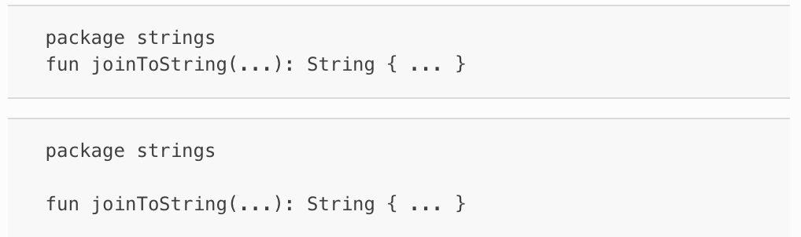
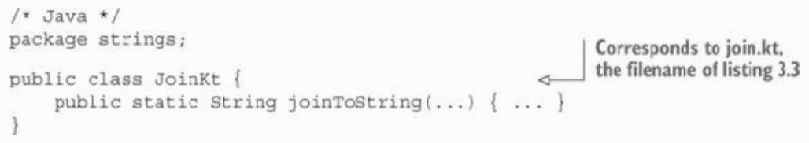
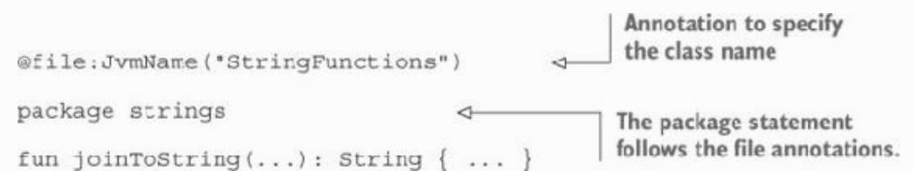
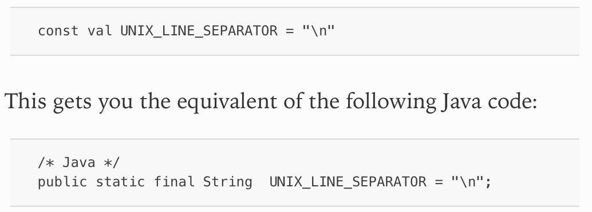
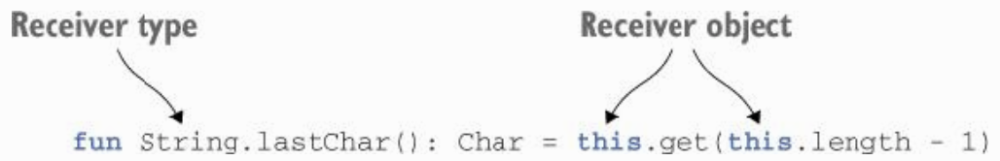
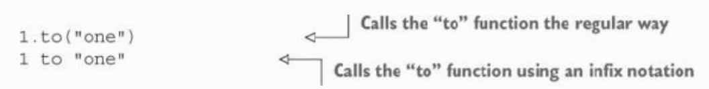
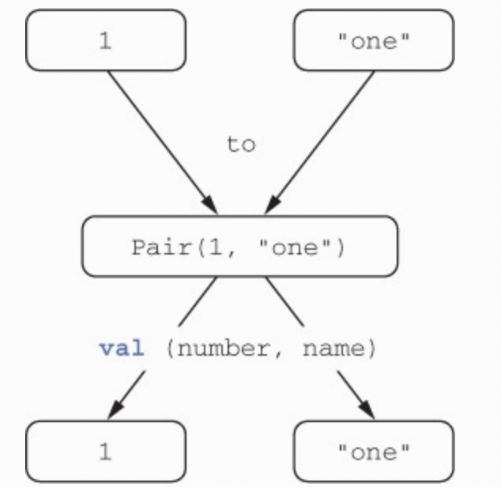
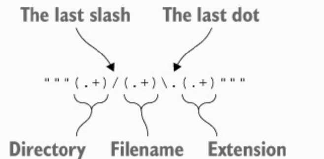

# Chapter 2. Defining and calling functions

---

## 3.1. CREATING COLLECTIONS IN KOTLIN

* Kotlin uses the standard Java collection classes.

* Why are there no Kotlin collections? Because using the standard Java collections makes it much easier to interact with Java code. You don’t need to convert collections one way or the other when you call Java functions from Kotlin or vice versa.

---

## 3.2. MAKING FUNCTIONS EASIER TO CALL

### 3.2.1. Named arguments

* When calling a function written in Kotlin, you can specify the names of some arguments that you’re passing to the function.

* Unfortunately, you can’t use named arguments when calling methods written in Java, including methods from the JDK and the Android framework. Storing parameter names in .class files is supported as an optional feature only starting with Java 8, and Kotlin maintains compatibility with Java 6. As a result, the compiler can’t recognize the parameter names used in your call and match them against the method definition

> ✅ Ex_3_2.kt

### 3.2.2. Default parameter values

* In Kotlin, you can often avoid creating overloads because you can specify default values for parameters in a function declaration.

* Given that Java doesn’t have the concept of default parameter values, you have to specify all the parameter values explicitly when you call a Kotlin function with default parameter values from Java. If you frequently need to call a function from Java and want to make it easier to use for Java callers, you can annotate it with **@Jvm-Overloads**. This instructs the compiler to generate Java overloaded methods, omitting each of the parameters one by one, starting from the last one.

> ✅ Ex_3_2.kt

### 3.2.3. Getting rid of static utility classes: top-level functions and properties

* In Kotlin, you don’t need to create all those meaningless classes. Instead, you can place functions directly at the top level of a source file, outside of any class. Such functions are still members of the package declared at the top of the file, and you still need to import them if you want to call them from other packages, but the unnecessary extra level of nesting no longer exists.

> Figure 3.1. Declaring joinToString() as a top-level function

* How does this run? You know that, when you compile the file, some classes will be produced, because the JVM can only execute code in classes. When you work only with Kotlin, that’s all you need to know. But if you need to call such a function from Java, you have to understand how it will be compiled.

> Figure 3.2. Java code that would compile to the same class

* You can see that the name of the class generated by the Kotlin compiler corresponds to the name of the file containing the function. All top-level functions in the file are compiled to static methods of that class. Therefore, calling this function from Java is as easy as calling any other static method.

* To change the name of the generated class that contains Kotlin top-level functions, you add a **@JvmName** annotation to the file. Place it at the beginning of the file, before the package name:

> Figure 3.3. Adding @JvmName annotation

* Just like functions, properties can be placed at the top level of a file. Storing individual pieces of data outside of a class isn’t needed as often but is still useful.

* By default, top-level properties, just like any other properties, are exposed to Java code as accessor methods (a getter for a val property and a getter/setter pair for a var property). If you want to expose a constant to Java code as a public static final field, to make its use more natural, you can mark it with the const modifier (this is allowed for properties of primitive types, as well as String)

> Figure 3.4. Top-level constant property declaration

---

## 3.3. ADDING METHODS TO OTHER PEOPLE’S CLASSES: EXTENSION FUNCTIONS AND PROPERTIES

* An extension function is a simple thing: it’s a function that can be called as a member of a class but is defined outside of it

* All you need to do is put the name of the class or interface that you’re extending before the name of the function you’re adding. This class name is called the **receiver type**; the value on which you’re calling the extension function is called the **receiver object**.

> Figure 3.5. Extension function

> ✅ Ex_3_3.kt

* Note that extension functions don’t allow you to break encapsulation. Unlike methods defined in the class, extension functions don’t have access to private or protected members of the class.

### 3.3.1. Imports and extension functions

* An extension function needs to be imported, just like any other class or function. This helps avoid accidental name conflicts. Kotlin allows you to import individual functions using the same syntax you use for classes.

* You can change the name of the class or function you’re importing using the **as** keyword.

### 3.3.2. Calling extension functions from Java

* Under the hood, an extension function is a static method that accepts the receiver object as its first argument. Calling it doesn’t involve creating adapter objects or any other runtime overhead.

### 3.3.3. Utility functions as extensions

> ✅ Ex_3_3.kt (3.3.3)

* The static nature of extensions also means that extension functions can’t be overridden in subclasses.

### 3.3.4. No overriding for extension functions

* Extension functions aren’t a part of the class; they’re declared externally to it. Even though you can define extension functions with the same name and parameter types for a base class and its subclass, the function that’s called depends on the declared static type of the variable, not on the runtime type of the value stored in that variable.

> ✅ Ex_3_3.kt (3.3.4)

* Overriding doesn’t apply to extension functions: Kotlin resolves them statically.

* If the class has a member function with the same signature as an extension function, the member function always takes precedence. You should keep this in mind when extending the API of classes: if you add a member function with the same signature as an extension function that a client of your class has defined, and they then recompile their code, it will change its meaning and start referring to the new member function.

### 3.3.5. Extension properties

* Extension properties provide a way to extend classes with APIs that can be accessed using the property syntax, rather than the function syntax. Even though they’re called **properties**, they can’t have any state, because there’s no proper place to store it: it’s not possible to add extra fields to existing instances of Java objects. But the shorter syntax is still sometimes handy.

> ✅ Ex_3_3.kt (3.3.5)

* You can see that, just as with functions, an extension property looks like a regular property with a receiver type added. The getter must always be defined, because there’s no backing field and therefore no default getter implementation. Initializers aren’t allowed for the same reason: there’s nowhere to store the value specified as the initializer.

* If you define the same property on a StringBuilder, you can make it a var, because the contents of a StringBuilder can be modified.

* Note that when you need to access an extension property from Java, you should invoke its getter explicitly: StringUtilKt.getLastChar("Java").

---

## 3.4. WORKING WITH COLLECTIONS: VARARGS, INFIX CALLS, AND LIBRARY SUPPORT

### 3.4.1. Extending the Java Collections API

> ✅ Ex_3_4.kt (3.4.1)

### 3.4.2. Varargs: functions that accept an arbitrary number of arguments

* You’re probably familiar with Java’s varargs: a feature that allows you to pass an arbitrary number of values to a method by packing them in an array. Kotlin’s varargs are similar to those in Java, but the syntax is slightly different: instead of three dots after the type, Kotlin uses the vararg modifier on the parameter.

> ✅ Ex_3_4.kt (3.4.2)

* One other difference between Kotlin and Java is the syntax of calling the function when the arguments you need to pass are already packed in an array. In Java, you pass the array as is, whereas Kotlin requires you to explicitly unpack the array, so that every array element becomes a separate argument to the function being called. Technically, this feature is called using a **spread operator**, but in practice it’s as simple as putting the * character before the corresponding argument.

### 3.4.3. Working with pairs: infix calls and destructuring declarations

* In an **infix call**, the method name is placed immediately between the target object name and the parameter, with no extra separators. The following two calls are equivalent.

> Figure 3.6. Calls the "to" function

* Infix calls can be used with regular methods and extension functions that have one required parameter. To allow a function to be called using the infix notation, you need to mark it with the infix modifier.

* The **to** function returns an instance of **Pair**, which is a Kotlin standard library class that, unsurprisingly, represents a pair of elements. The actual declarations of **Pair** and **to** use generics, but we’re omitting them here to keep things simple.

> ✅ Ex_3_4.kt (3.4.3)

* This feature is called a **destructuring declaration**

> Figure 3.7. The destructuring declaration feature

* This also works with loops, as you’ve seen in the implementation of joinToString, which uses the withIndex function.

---

## 3.5. WORKING WITH STRINGS AND REGULAR EXPRESSIONS

### 3.5.1. Splitting strings

* Kotlin provides several overloaded extensions named split that have different arguments. The one that takes a regular expression requires a value of Regex type, not String. This ensures that it’s always clear whether a string passed to a method is interpreted as plain text or a regular expression.

> ✅ Ex_3_5.kt (3.5.1)

### 3.5.2. Regular expressions and triple-quoted strings

> ✅ Ex_3_5.kt (3.5.2)

* In this example, the regular expression is written in a **triple-quoted string**. In such a string, you don’t need to escape any characters, including the backslash, so you can encode the dot symbol with \. rather than \\. as you’d write in an ordinary string literal. This regular expression divides a path into three groups separated by a slash and a dot. The pattern . matches any character from the beginning, so the first group (.+) contains the substring before the last slash. This substring includes all the previous slashes, because they match the pattern “any character”. Similarly, the second group contains the substring before the last dot, and the third group contains the remaining part.

> Figure 3.8. The regular expression is written in a triple-quoted string

### 3.5.3. Multiline triple-quoted strings

* The purpose of triple-quoted strings is not only to avoid escaping characters. Such a string literal can contain any characters, including line breaks. That gives you an easy way to embed in your programs text containing line breaks.

> ✅ Ex_3_5.kt (3.5.3)

* A triple-quoted string can contain line breaks, but you can’t use special characters like \n. On the other hand, you don’t have to escape \, so the Windows-style path "C:\\Users\\yole\\kotlin-book" can be written as """C:\Users\yole\kotlin-book""".

* One of the areas where multiline strings can be useful in your programs (besides games that use ASCII art) is tests. In tests, it’s fairly common to execute an operation that produces multiline text (for example, a web page fragment) and to compare the result with the expected output. Multiline strings give you a perfect solution for including the expected output as part of your test. No need for clumsy escaping or loading the text from external files—just put in some quotation marks and place the expected HTML or other output between them. And for better formatting, use the aforementioned trimMargin function, which is another example of an extension function.

---

## 3.6. MAKING YOUR CODE TIDY: LOCAL FUNCTIONS AND EXTENSIONS

* Kotlin gives a cleaner solution: you can nest the functions you’ve extracted in the containing function. This way, you have the structure you need without any extra syntactic overhead.

* Local functions have access to all parameters and  variables of the enclosing function.

> ✅ Ex_3_6.kt

* Extension functions can also be declared as local functions, but deeply nested local functions are usually fairly hard to read; so, as a general rule, we don’t recommend using more than one level of nesting.

---

## 3.7. SUMMARY

* Kotlin doesn’t define its own collection classes and instead enhances the Java collection classes with a richer API. 
* Defining default values for function parameters greatly reduces the need to define overloaded functions, and the named-argument syntax makes calls to functions with many parameters much more readable. 
* Functions and properties can be declared directly in a file, not just as members of a class, allowing for a more flexible code structure. Extension functions and properties let you extend the API of any class, including classes defined in external libraries, without modifying its source code and with no runtime overhead. 
* Infix calls provide a clean syntax for calling operator-like methods with a single argument. 
* Kotlin provides a large number of convenient string-handling functions for both regular expressions and plain strings. 
* Triple-quoted strings provide a clean way to write expressions that would require a lot of noisy escaping and string concatenation in Java. 
* Local functions help you structure your code more cleanly and eliminate duplication.