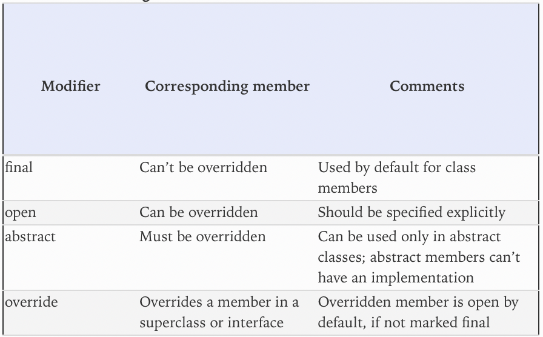
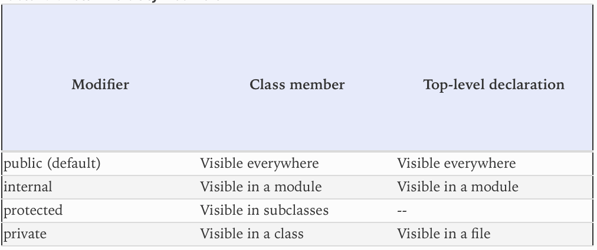
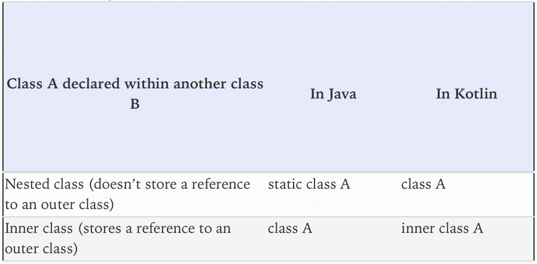
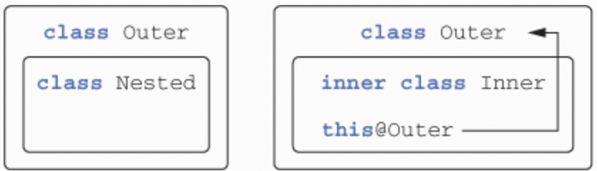
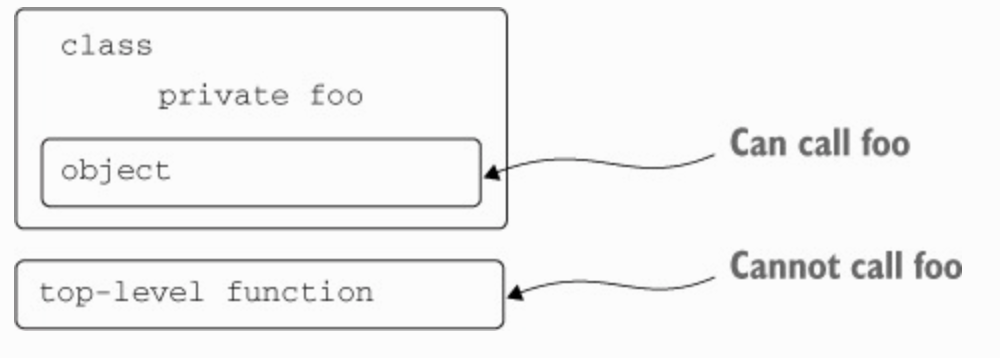

# Chapter 4. Classes, objects, and interfaces

---

## 4.1. DEFINING CLASS HIERARCHIES

### 4.1.1. Interfaces in Kotlin

* Kotlin interfaces are similar to those of Java 8: they can contain definitions of abstract methods as well as 
implementations of non-abstract methods (similar to the Java 8 default methods), but they can’t contain any state.

> ✅ Ex_4_1.kt (4.1.1)

* Kotlin uses the colon after the class name to replace both the `extends` and `implements` keywords used in Java. As 
in Java, a class can implement as many interfaces as it wants, but it can extend only one class.

* Unlike Java, using the `override` modifier is mandatory in Kotlin.

* An interface method can have a default implementation. Unlike Java 8, which requires you to mark such implementations 
with the `default` keyword, Kotlin has no special annotation for such methods: you just provide a method body.

* What happens if you need to implement both interfaces in your class? Each of them contains a `showOff` method with a 
default implementation; which implementation wins? Neither one wins. Instead, you get the compiler error if you don’t 
implement `showOff` explicitly.

* The Kotlin compiler forces you to provide your own implementation.

* To invoke an inherited implementation, you use the same keyword as in Java: `super`. But the syntax for selecting a 
specific implementation is different. Whereas in Java you can put the base type name before the `super` keyword, as in 
`Clickable.super.showOff()`, in Kotlin you put the base type name in angle brackets: `super<Clickable>.showOff()`.

* Kotlin 1.0 has been designed to target Java 6, which doesn’t support default methods in interfaces. Therefore, it compiles each interface with default methods to a combination of a regular interface and a class containing the method bodies as static methods. The interface contains only declarations, and the class contains all the implementations as static methods. Therefore, if you need to implement such an interface in a Java class, you have to define your own implementations of all methods, including those that have method bodies in Kotlin.

### 4.1.2. Open, final, and abstract modifiers: final by default

* Whereas Java’s classes and methods are open by default, Kotlin’s are `final` by default.

* If you want to allow the creation of subclasses of a class, you need to mark the class with the `open` modifier. In 
addition, you need to add the `open` modifier to every property or method that can be overridden.

> ✅ Ex_4_1.kt (4.1.2)

* Note that if you override a member of a base class or interface, the overriding member will also be `open` by 
default.

* If you want to change this and forbid the subclasses of your class from overriding your implementation, you can 
explicitly mark the overriding member as `final`.

* One significant benefit of classes that are `final` by default is that they enable **smart casts** in a larger 
variety of scenarios. As we mentioned in section 2.3.5, **smart casts** work only for variables that couldn’t have 
changed after the type check. For a class, this means smart casts can only be used with a class property that is a 
`val` and that doesn’t have a custom accessor. This requirement means the property has to be `final`, because otherwise 
a subclass could override the property and define a custom accessor, breaking the key requirement of smart casts. 
Because properties are `final` by default, you can use smart casts with most properties without thinking about it 
explicitly, which improves the expressiveness of your code.

* In Kotlin, as in Java, you may declare a class `abstract`, and such classes can’t be instantiated.

* An abstract class usually contains abstract members that don’t have implementations and must be overridden in 
subclasses. Abstract members are always open, so you don’t need to use an explicit `open` modifier.


> Figure 4.1. The meaning of access modifiers in a class

### 4.1.3. Visibility modifiers: public by default

* Basically, visibility modifiers in Kotlin are similar to those in Java. You have the same `public`, `protected`, and 
`private` modifiers. But the default visibility is different: if you omit a modifier, the declaration becomes `public`.

* The default visibility in Java, package-private, isn’t present in Kotlin. Kotlin uses packages only as a way of 
organizing code in namespaces; it doesn’t use them for visibility control.

* As an alternative, Kotlin offers a new visibility modifier, `internal`, which means “visible inside a module.” A 
**module** is a set of Kotlin files compiled together. It may be an IntelliJ IDEA module, an Eclipse project, a Maven 
or Gradle project, or a set of files compiled with an invocation of the Ant task.

* The advantage of `internal` visibility is that it provides real encapsulation for the implementation details of your 
module. With Java, the encapsulation can be easily broken, because external code can define classes in the same 
packages used by your code and thus get access to your package-private declarations.

* Another difference is that Kotlin allows the use of `private` visibility for top-level declarations, including 
classes, functions, and properties. Such declarations are visible only in the file where they are declared.


> Figure 4.2. Kotlin visibility modifiers
 
```kotlin
internal open class TalkativeButton : Focusable {
    private fun yell() = println("Hey!")
    protected fun whisper() = println("Let's talk!")
}

// Error: "public" member exposes its "internal" receiver type TalkativeButton
fun TalkativeButton.giveSpeech() {
    // Error: cannot access "yell": it is "private" in "TalkativeButton"
    yell()
    // Error: cannot access "whisper": it is "protected" in "TalkativeButton"
    whisper()
}
```

* Kotlin forbids you to reference the less-visible type `TalkativeButton` (`internal`, in this case) from the `public` 
function `giveSpeech`. This is a case of a general rule that requires all types used in the list of base types and type 
parameters of a class, or the signature of a method, to be as visible as the class or method itself. This rule ensures 
that you always have access to all types you might need to invoke the function or extend a class. To solve the problem, 
you can either make the function `internal` or make the class `public`.

* Note the difference in behavior for the `protected` modifier in Java and in Kotlin. In Java, you can access a 
`protected` member from the same package, but Kotlin doesn’t allow that. In Kotlin, visibility rules are simple, and a 
`protected` member is only visible in the class and its subclasses. Also note that extension functions of a class don’t
get access to its `private` or `protected` members.

* `public`, `protected`, and `private` modifiers in Kotlin are preserved when compiling to Java bytecode. You use such 
Kotlin declarations from Java code as if they were declared with the same visibility in Java. The only exception is a 
`private` class: it’s compiled to a package-private declaration under the hood (you can’t make a class `private` in 
Java).

* But, you may ask, what happens with the `internal` modifier? There’s no direct analogue in Java. Package-private 
visibility is a totally different thing: a module usually consists of several packages, and different modules may 
contain declarations from the same package. Thus an `internal` modifier becomes `public` in the bytecode.

* This correspondence between Kotlin declarations and their Java analogues (or their bytecode representation) explains 
why sometimes you can access something from Java code that you can’t access from Kotlin. For instance, you can access 
an `internal` class or a top-level declaration from Java code in another module, or a `protected` member from Java code 
in the same package (similar to how you do that in Java).

* But note that the names of `internal` members of a class are mangled. Technically, `internal` members can be used 
from Java, but they look ugly in the Java code. That helps avoid unexpected clashes in overrides when you extend a 
class from another module, and it prevents you from accidentally using `internal` classes.

* One more difference in visibility rules between Kotlin and Java is that an outer class doesn’t see `private` members 
of its `inner` (or nested) classes in Kotlin.

### 4.1.4. Inner and nested classes: nested by default

* Kotlin nested classes don’t have access to the outer class instance, unless you specifically request that.

> ✅ Ex_4_1.kt (4.1.4)

* A nested class in Kotlin with no explicit modifiers is the same as a `static` nested class in Java. To turn it into 
an inner class so that it contains a reference to an outer class, you use the `inner` modifier.


> Figure 4.3. Correspondence between nested and inner classes in Java and Kotlin


> Figure 4.4. Nested classes don’t reference their outer class, whereas inner classes do

* The syntax to reference an instance of an outer class in Kotlin also differs from Java. You write `this@Outer` to 
access the `Outer` class from the Inner class.

### 4.1.5. Sealed classes: defining restricted class hierarchies

* When you evaluate an expression using the when construct, the Kotlin compiler forces you to check for the default 
option.

* Always having to add a default branch isn’t convenient. What’s more, if you add a new subclass, the compiler won’t 
detect that something has changed. If you forget to add a new branch, the default one will be chosen, which can lead to 
subtle bugs.

* Kotlin provides a solution to this problem: `sealed` classes. You mark a superclass with the `sealed` modifier, and 
that restricts the possibility of creating subclasses. All the direct subclasses must be nested in the superclass.

> ✅ Ex_4_1.kt (4.1.5)

* Note that the `sealed` modifier implies that the class is open; you don’t need an explicit `open` modifier.

* When you use `when` with `sealed` classes and add a new subclass, the `when` expression returning a value fails to 
compile, which points you to the code that must be changed.

* Under the hood, the `Expr` class has a `private` constructor, which can be called only inside the class. You can’t 
declare a `sealed` interface. Why? If you could, the Kotlin compiler wouldn’t be able to guarantee that someone 
couldn’t implement this interface in the Java code.

* In Kotlin 1.0, the `sealed` functionality is rather restricted. For instance, all the subclasses must be nested, and 
a subclass can’t be made a `data` class. Kotlin 1.1 relaxes the restrictions and lets you define subclasses of `sealed` 
classes anywhere in the same file.

---

## 4.2. DECLARING A CLASS WITH NONTRIVIAL CONSTRUCTORS OR PROPERTIES

* Kotlin makes a distinction between a **primary** constructor (which is usually the main, concise way to initialize a 
class and is declared outside of the class body) and a **secondary** constructor (which is declared in the class body). 
It also allows you to put additional initialization logic in **initializer blocks**.

### 4.2.1. Initializing classes: primary constructor and initializer blocks

* The block of code surrounded by parentheses is called a **primary constructor**. It serves two purposes: specifying 
constructor parameters and defining properties that are initialized by those parameters.

> ✅ Ex_4_2.kt (4.2.1)

* In this example, you see two new Kotlin keywords: `constructor` and `init`. The `constructor` keyword begins the 
declaration of a primary or secondary constructor. The `init` keyword introduces an **initializer block**. Such blocks 
contain initialization code that’s executed when the class is created, and are intended to be used together with 
primary constructors. Because the primary constructor has a constrained syntax, it can’t contain the initialization 
code; that’s why you have initializer blocks.

* You can also omit the `constructor` keyword if there are no annotations or visibility modifiers on the primary 
constructor.

```kotlin
class User(
  // "val" means the corresponding property is generated for the constructor parameter
  val nickname: String,
  // provides a default value for the constructor parameter
  val isSubscribed: Boolean = true
)
```

* If all the constructor parameters have default values, the compiler generates an additional constructor without 
parameters that uses all the default values. That makes it easier to use Kotlin with libraries that instantiate classes
via parameterless constructors.

* If your class has a superclass, the primary constructor also needs to initialize the superclass.

```kotlin
class TwitterUser(nickname: String) : User(nickname) { ... }
```

* If you don’t declare any constructors for a class, a default constructor that does nothing will be generated for you.

```kotlin
open class Button // The default constructor without arguments is generated
```

* If some class has only a private constructor, the code outside of the class can’t instantiate it.

### 4.2.2. Secondary constructors: initializing the superclass in different ways

* There are still situations when multiple constructors are required. The most common one comes up when you need to 
extend a framework class that provides multiple constructors that initialize the class in different ways.

> ✅ Ex_4_2.kt (4.2.2)

* Just as in Java, you also have an option to call another constructor of your own class from a constructor, using the 
`this()` keyword.

* If the class has no primary constructor, then each secondary constructor has to initialize the base class or delegate 
to another constructor that does so.

* Java interoperability is the main use case when you need to use secondary constructors. But there’s another possible 
case: when you have multiple ways to create instances of your class, with different parameter lists.

### 4.2.3. Implementing properties declared in interfaces

* In Kotlin, an interface can contain abstract property declarations.

> ✅ Ex_4_2.kt (4.2.3)

* This means classes implementing the User interface need to provide a way to obtain the value of nickname. The 
interface doesn’t specify whether the value should be stored in a backing field or obtained through a getter. 
Therefore, the interface itself doesn’t contain any state, and only classes implementing the interface may store the 
value if they need to.

* In addition to abstract property declarations, an interface can contain properties with getters and setters, as long 
as they don’t reference a backing field. (A backing field would require storing state in an interface, which isn’t 
allowed.)

### 4.2.4. Accessing a backing field from a getter or setter

* Now let’s see how you can implement a property that stores a value and provides additional logic that’s executed when 
the value is accessed or modified.

> ✅ Ex_4_2.kt (4.2.4)

* In the body of the setter, you use the special identifier `field` to access the value of the backing field.

* Note that you can redefine only one of the accessors for a mutable property.

### 4.2.5. Changing accessor visibility

* The accessor’s visibility by default is the same as the property’s. But you can change this if you need to, by 
putting a visibility modifier before the `get` or `set` keyword.

> ✅ Ex_4_2.kt (4.2.5)

* Later we’ll continue our discussion of properties. Here are some references:
  * The `lateinit` modifier on a non-null property specifies that this property is initialized later, after the 
  constructor is called, which is a common case for some frameworks.
  * Lazy initialized properties, as part of the more general **delegated properties** feature.
  * The `const` modifier makes working with annotations more convenient and lets you use a property of a primitive type 
  or `String` as an annotation argument.
  
---

## 4.3. COMPILER-GENERATED METHODS: DATA CLASSES AND CLASS DELEGATION

### 4.3.1. Universal object methods

* As is the case in Java, all Kotlin classes have several methods you may want to override: `toString`, `equals`, and 
`hashCode`. Let’s look at what these methods are and how Kotlin can help you generate their implementations 
automatically.

> ✅ Ex_4_3.kt (4.3.1)

* All classes in Kotlin, just as in Java, provide a way to get a string representation of the class’s objects. This is 
primarily used for debugging and logging, although you can use this functionality in other contexts as well. By default, 
the string representation of an object looks like `Client@5e9f23b4`, which isn’t very useful. To change this, you need 
to override the `toString` method.

* In Kotlin, the `==` operator is the default way to compare two objects: it compares their values by calling equals 
under the hood. Thus, if `equals` is overridden in your class, you can safely compare its instances using `==`. For 
reference comparison, you can use the `===` operator, which works exactly the same as `==` in Java by comparing the 
object references.

* The `hashCode` method should be always overridden together with `equals`.

* The `Client` class is missing the `hashCode` method. Therefore, it violates the general `hashCode` contract: if two 
objects are equal, they must have the same hash code. The `processed` set is a `HashSet`. Values in a `HashSet` are 
compared in an optimized way: at first their hash codes are compared, and then, only if they’re equal, the actual 
values are compared. The hash codes are different for two different instances of the Client class in the previous 
example, so the set decides that it doesn’t contain the second object, even though `equals` would return true. 
Therefore, if the rule isn’t followed, the `HashSet` can’t work correctly with such objects.

* Fortunately, the Kotlin compiler can help you by generating all of those methods automatically.

### 4.3.2. Data classes: autogenerated implementations of universal methods

* You don’t have to generate all of these methods in Kotlin. If you add the modifier `data` to your class, the 
necessary methods are automatically generated for you.

> ✅ Ex_4_3.kt (4.3.2)

* Now you have a class that overrides all the standard Java methods:
  * `equals` for comparing instances 
  * `hashCode` for using them as keys in hash-based containers such as `HashMap` 
  * `toString` for generating string representations showing all the fields in declaration order

* The `equals` and `hashCode` methods take into account all the properties declared in the primary constructor. The 
generated `equals` method checks that the values of all the properties are equal. The `hashCode` method returns a value 
that depends on the hash codes of all the properties.

* Note that properties that aren’t declared in the primary constructor don’t take part in the equality checks and hash 
code calculation.

* Note that even though the properties of a data class aren’t required to be `val` — you can use `var` as well—it’s 
strongly recommended that you use only read-only properties, making the instances of the data class `immutable`. This 
is required if you want to use such instances as keys in a `HashMap` or a similar container, because otherwise the 
container could get into an invalid state if the object used as a key was modified after it was added to the container. 
Immutable objects are also much easier to reason about, especially in multithreaded code: once an object has been 
created, it remains in its original state, and you don’t need to worry about other threads modifying the object while 
your code is working with it.

* To make it even easier to use data classes as immutable objects, the Kotlin compiler generates one more method for 
them: a method that allows you to **copy** the instances of your classes, changing the values of some properties. 
Creating a `copy` is usually a good alternative to modifying the instance in place: the `copy` has a separate lifecycle 
and can’t affect the places in the code that refer to the original instance.

### 4.3.3. Class delegation: using the “by” keyword

* Kotlin includes first-class support for delegation as a language feature. Whenever you’re implementing an interface, 
you can say that you’re **delegating** the implementation of the interface to another object, using the `by` keyword.

> ✅ Ex_4_3.kt (4.3.3)

* All the method implementations in the class are gone. The compiler will generate them, and the implementation is 
similar to that in the `DelegatingCollection` example. Because there’s little interesting content in the code, there’s 
no point in writing it manually when the compiler can do the same job for you automatically.

* Now, when you need to change the behavior of some methods, you can override them, and your code will be called 
instead of the generated methods. You can leave out methods for which you’re satisfied with the default implementation 
of delegating to the underlying instance.

---

## 4.4. THE “OBJECT” KEYWORD: DECLARING A CLASS AND CREATING AN INSTANCE, COMBINED

* The `object` keyword comes up in Kotlin in a number of cases, but they all share the same core idea: the keyword 
defines a class and creates an instance (in other words, an object) of that class at the same time. Let’s look at the 
different situations when it’s used:
  * **Object declaration** is a way to define a singleton. 
  * **Companion objects** can contain factory methods and other methods that are related to this class but don’t 
  require a class instance to be called. Their members can be accessed via class name. 
  * **Object expression** is used instead of Java’s anonymous inner class.

### 4.4.1. Object declarations: singletons made easy

* Kotlin provides first-class language support for this using the **object declaration** feature. The object 
declaration combines a **class declaration** and a declaration of a **single instance** of that class.

> ✅ Ex_4_4.kt (4.4.1)

* Object declarations are introduced with the `object` keyword. An object declaration effectively defines a class and a 
variable of that class in a single statement.

* Just like a class, an object declaration can contain declarations of properties, methods, initializer blocks, and so 
on. The only things that aren’t allowed are constructors (either primary or secondary). Unlike instances of regular 
classes, object declarations are created immediately at the point of definition, not through constructor calls from 
other places in the code. Therefore, defining a constructor for an object declaration doesn’t make sense.

* Object declarations can also inherit from classes and interfaces. This is often useful when the framework you’re 
using requires you to implement an interface, but your implementation doesn’t contain any state.

* For example, let’s take the `java.util.Comparator` interface. A `Comparator` implementation receives two objects and 
returns an integer indicating which of the objects is greater. Comparators almost never store any data, so you usually 
need just a single `Comparator` instance for a particular way of comparing objects. That’s a perfect use case for an 
object declaration.

* You use singleton objects in any context where an ordinary object (an instance of a class) can be used. For example, 
you can pass an object as an argument to a function that takes a `Comparator`.

* Just like the Singleton pattern, object declarations aren’t always ideal for use in large software systems. They’re 
great for small pieces of code that have few or no dependencies, but not for large components that interact with many 
other parts of the system. The main reason is that you don’t have any control over the instantiation of objects, and 
you can’t specify parameters for the constructors.

* This means you can’t replace the implementations of the object itself, or other classes the object depends on, in 
unit tests or in different configurations of the software system.

* You can also declare objects in a class. Such objects also have just a single instance; they don’t have a separate 
instance per instance of the containing class.

* An object declaration in Kotlin is compiled as a class with a static field holding its single instance, which is 
always named `INSTANCE`. If you implemented the Singleton pattern in Java, you’d probably do the same thing by hand. 
Thus, to use a Kotlin object from the Java code, you access the static `INSTANCE` field.

```java
/* Java */
CaseInsensitiveFileComparator.INSTANCE.compare(file1, file2);”
```

### 4.4.2. Companion objects: a place for factory methods and static members

* Classes in Kotlin can’t have static members; Java’s `static` keyword isn’t part of the Kotlin language. As a 
replacement, Kotlin relies on package-level functions (which can replace Java’s static methods in many situations) and 
object declarations (which replace Java static methods in other cases, as well as static fields). In most cases, it’s 
recommended that you use top-level functions. But top-level functions can’t access `private` members of a class.


> Figure 4.5. Private members can’t be used in top-level functions outside of the class

* One of the objects defined in a class can be marked with a special keyword: `companion`. If you do that, you gain the 
ability to access the methods and properties of that object directly through the name of the containing class, without 
specifying the name of the object explicitly. The resulting syntax looks exactly like static method invocation in Java.

> ✅ Ex_4_4.kt (4.4.2)

* Remember when we promised you a good place to call a `private` constructor? That’s the `companion` object. The 
companion object has access to all `private` members of the class, including the `private` constructor, and it’s an 
ideal candidate to implement the Factory pattern.

### 4.4.3. Companion objects as regular objects

* A **companion object** is a regular object that is declared in a class. It can be named, implement an interface, or have extension functions or properties.

* If you omit the name of the companion object, the default name assigned to it is `Companion`.

* Just like any other object declaration, a companion object can implement interfaces.

> ✅ Ex_4_4.kt (4.4.3)

* But you may need to work with Java code that requires a member of your class to be static. You can achieve this with 
the `@JvmStatic` annotation on the corresponding member. If you want to declare a `static` field, use the `@JvmField` 
annotation on a top-level property or a property declared in an `object`.

* What if you need to define functions that can be called on the class itself, like companion-object methods or Java 
static methods? If the class has a companion object, you can do so by defining extension functions on it. More 
specifically, if class `C` has a companion object, and you define an extension function `func` on `C.Companion`, you 
can call it as `C.func()`.

### 4.4.4. Object expressions: anonymous inner classes rephrased

* The `object` keyword can be used not only for declaring named singleton-like objects, but also for declaring 
**anonymous objects**. Anonymous objects replace Java’s use of anonymous inner classes.

> ✅ Ex_4_4.kt (4.4.4)

```kotlin
// Declares an anonymous object extending MouseAdapter
val listener = object : MouseAdapter() {
    // Override MouseAdapter method
    override fun mouseClicked(e: MouseEvent?) {
        super.mouseClicked(e)
    }

    // Override MouseAdapter method
    override fun mouseEntered(e: MouseEvent?) {
        super.mouseEntered(e)
    }
}
```

* The syntax is the same as with object declarations, except that you omit the name of the object. The object 
expression declares a class and creates an instance of that class, but it doesn’t assign a name to the class or the 
instance. If you do need to assign a name to the object, you can store it in a variable.

* Unlike a Java anonymous inner class, which can only extend one class or implement one interface, a Kotlin anonymous 
object can implement multiple interfaces or no interfaces.

* Unlike object declarations, anonymous objects aren’t singletons. Every time an object expression is executed, a new 
instance of the object is created.

* Just as with Java’s anonymous classes, code in an object expression can access the variables in the function where it 
was created. But unlike in Java, this isn’t restricted to `final` variables; you can also modify the values of 
variables from within an object expression.

```kotlin
// Accessing local variables from an anonymous object
fun countClicks() {
    var clickCount = 0
    val listener = object : MouseAdapter() {
        override fun mouseClicked(e: MouseEvent?) {
            clickCount++
            super.mouseClicked(e)
        }
    }
}
```

* Object expressions are mostly useful when you need to override multiple methods in your anonymous object. If you only 
need to implement a single-method interface (such as `Runnable`), you can rely on Kotlin’s support for 
**SAM conversion** (converting a function literal to an implementation of an interface with a single abstract method) 
and write your implementation as a function literal (lambda).

---

## 4.5. Summary

* Interfaces in Kotlin are similar to Java’s but can contain default implementations (which Java supports only since 
version 8) and properties. 
* All declarations are `final` and `public` by default. 
* To make a declaration non-`final`, mark it as `open`. 
* `internal` declarations are visible in the same module. 
* Nested classes aren’t inner by default. Use the keyword `inner` to store a reference to the outer class. 
* A `sealed` class can only have subclasses nested in its declaration (Kotlin 1.1 will allow placing them anywhere in 
the same file). 
* Initializer blocks and secondary constructors provide flexibility for initializing class instances. 
* You use the `field` identifier to reference a property backing field from the accessor body. 
* Data classes provide compiler-generated equals, `hashCode`, `toString`, `copy`, and other method. 
* Class delegation helps to avoid many similar delegating methods in your code. 
* Object declaration is Kotlin’s way to define a singleton class. 
* Companion objects (along with package-level functions and properties) replace Java’s static method and field 
definitions. 
* Companion objects, like other objects, can implement interfaces, as well as have extension functions and properties. 
* Object expressions are Kotlin’s replacement for Java’s anonymous inner classes, with added power such as the ability 
to implement multiple interfaces and to modify the variables defined in the scope where the object is created.