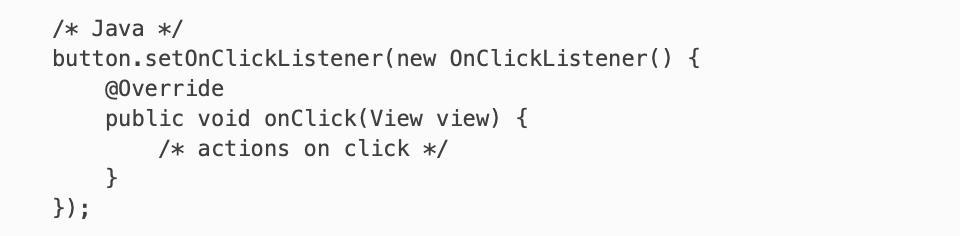
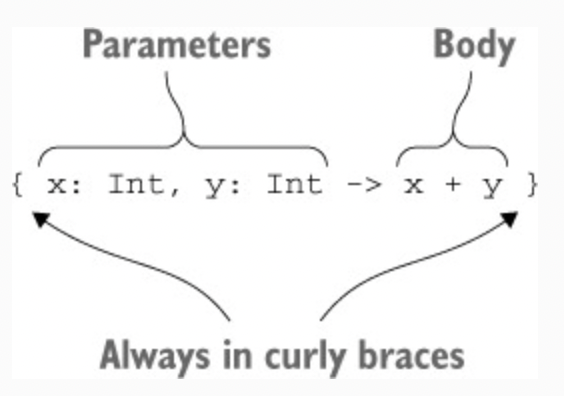
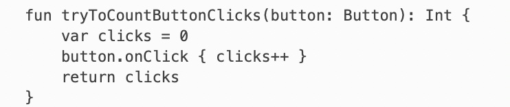
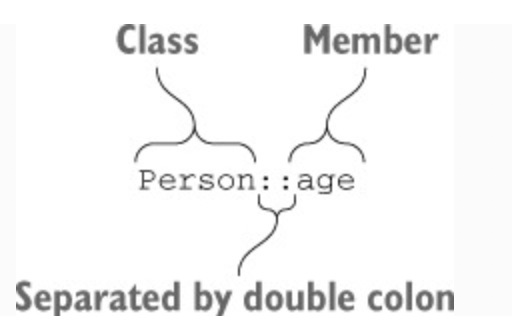
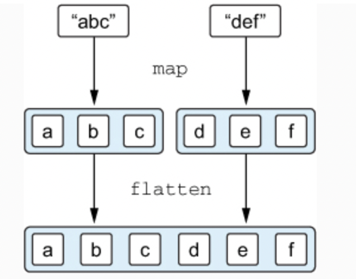
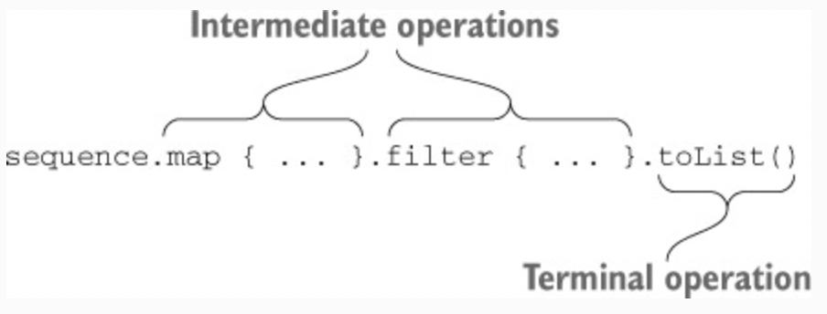
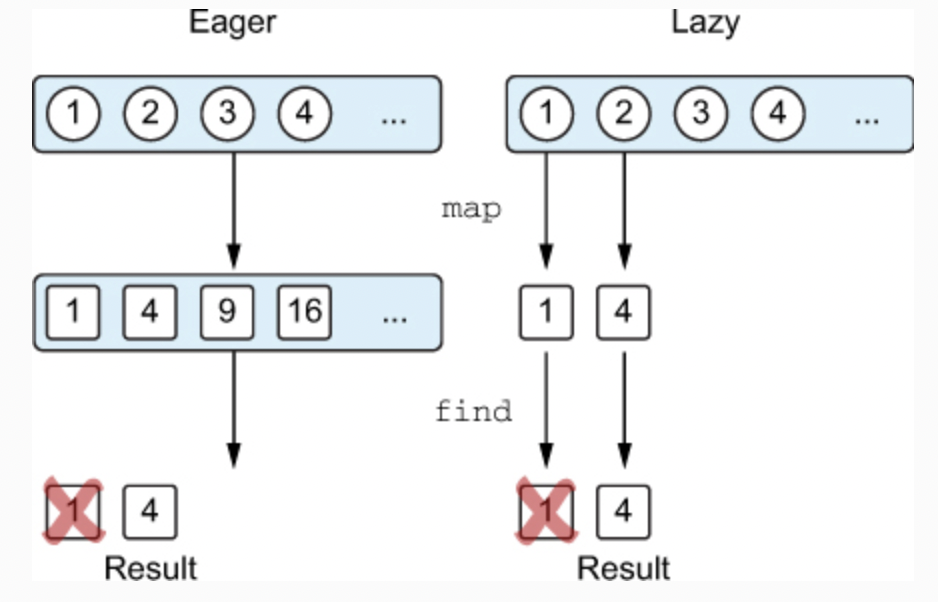
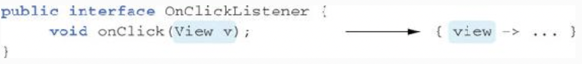
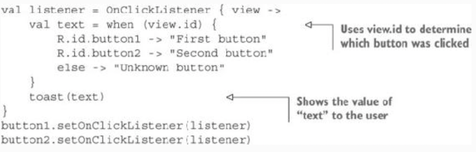

# Chapter 5. Programming with lambdas

* **Lambda expressions**, or simply **lambdas**, are essentially small chunks of code that can be passed to other functions. With lambdas, you can easily extract common code structures into library functions, and the Kotlin standard library makes heavy use of them. One of the most common uses for lambdas is working with collections

---

## 5.1. LAMBDA EXPRESSIONS AND MEMBER REFERENCES

### 5.1.1. Introduction to lambdas: blocks of code as function parameters

> Figure 5.1. Implementing a listener with an anonymous inner class

> Figure 5.2. Implementing a listener with a lambda

### 5.1.2. Lambdas and collections

> ✅ Ex_5_1.kt (5.1.2)

* The **maxBy** function can be called on any collection and takes one argument: the function that specifies what values should be compared to find the maximum element. The code in curly braces **{ it.age }** is a lambda implementing that logic. It receives a collection element as an argument (referred to using it) and returns a value to compare.

* If a lambda just delegates to a function or property, it can be replaced by a member reference.

* Most of the things we typically do with collections in Java (prior to Java 8) can be better expressed with library functions taking lambdas or member references.

### 5.1.3. Syntax for lambda expressions

> Figure 5.3. Lambda expression syntax

* A lambda expression in Kotlin is always surrounded by curly braces. Note that there are no parentheses around the arguments.
The arrow separates the argument list from the body of the lambda.

> ✅ Ex_5_1.kt (5.1.3)

* There are cases when the compiler can’t infer the lambda parameter type. The simple rule you can follow is to always start without the types; if the compiler complains, specify them.

* This default name **"it"** is generated only if you don’t specify the argument name explicitly.

* The **it** convention is great for shortening your code, but you shouldn’t abuse it. In particular, in the case of nested lambdas, it’s better to declare the parameter of each lambda explicitly; otherwise it’s difficult to understand which value the **it** refers to. It’s useful also to declare parameters explicitly if the meaning or the type of the parameter isn’t clear from  the context.

### 5.1.4. Accessing variables in scope

* You know that when you declare an anonymous inner class in a function, you can refer to parameters and local variables of that function from inside the class. With lambdas, you can do exactly the same thing. If you use a lambda in a function, you can access the parameters of that function as well as the local variables declared before the lambda.

> ✅ Ex_5_1.kt (5.1.4)

* One important difference between Kotlin and Java is that in Kotlin, you aren’t restricted to accessing final variables. You can also modify variables from within a lambda.

* Kotlin, unlike Java, allows you to access non-final variables and even modify them in a lambda. External variables accessed from a lambda are said to be **captured** by the lambda.

* Note that, by default, the lifetime of a local variable is constrained by the function in which the variable is declared. But if it’s captured by the lambda, the code that uses this variable can be stored and executed later. 

* When you capture a final variable, its value is stored together with the lambda code that uses it. For non-final variables, the value is enclosed in a special wrapper that lets you change it, and the reference to the wrapper is stored together with the lambda.

* Java allows you to capture only final variables. When you want to capture a mutable variable, you can use one of the following tricks: either declare an array of one element in which to store the mutable value, or create an instance of a wrapper class that stores the reference that can be changed.

* Any time you capture a final variable (**val**), its value is copied, as in Java. When you capture a mutable variable (**var**), its value is stored as an instance of a Ref class. The Ref variable is final and can be easily captured, whereas the actual value is stored in a field and can be changed from the lambda.

* An important caveat is that, if a lambda is used as an event handler or is otherwise executed asynchronously, the modifications to local variables will occur only when the lambda is executed.

* This function will always return 0. Even though the onClick handler will modify the value of clicks, you won’t be able to observe the modification, because the onClick handler will be called after the function returns. A correct implementation of the function would need to store the click count not in a local variable, but in a location that remains accessible outside of the function—for example, in a property of a class.

> Figure 5.4. An incorrect way to count button clicks

### 5.1.5. Member references

> Figure 5.5. Member reference syntax

* This expression is called **member reference**, and it provides a short syntax for creating a function value that calls exactly one method or accesses a property. A double colon separates the name of a class from the name of the member you need to reference (a method or property).

* Note that, regardless of whether you’re referencing a function or a property, you shouldn’t put parentheses after its name in a member reference.

* A member reference has the same type as a lambda that calls that function, so you can use the two interchangeably

* You can have a reference to a function that’s declared at the top level (and isn’t a member of a class), as well

> ✅ Ex_5_1.kt (5.1.5)

---

## 5.2. FUNCTIONAL APIS FOR COLLECTIONS

### 5.2.1. Essentials: filter and map

* The **filter** and **map** functions form the basis for manipulating collections.

> ✅ Ex_5_2.kt (5.2.1)

* The **filter** function goes through a collection and selects the elements for which the given lambda returns **true**.

* The **filter** function can remove unwanted elements from a collection, but it doesn’t change the elements. Transforming elements is where **map** comes into play.

* The **map** function applies the given function to each element in the collection and collects the results into a new collection.

### 5.2.2. “all”, “any”, “count”, and “find”: applying a predicate to a collection

* The **count** function checks how many elements satisfy the predicate, and the **find** function returns the first matching element.

* The **all** function checks whether all the elements satisfy this predicate, and the **any** function checks whether there’s at least one matching element.

> ✅ Ex_5_2.kt (5.2.2)

* As a general rule, try to find the most appropriate operation that suits your needs.

### 5.2.3. groupBy: converting a list to a map of groups

* The result of **groupBy** function is a map from the key by which the elements are grouped to the groups of elements. The result type is Map<Int, List<Person>>. You can do further modifications with this map, using functions such as **mapKeys** and **mapValues**.

> ✅ Ex_5_2.kt (5.2.3)

### 5.2.4. flatMap and flatten: processing elements in nested collections

* The **flatMap** function does two things: At first it transforms (or **maps**) each element to a collection according to the function given as an argument, and then it combines (or **flattens**) several lists into one.

> ✅ Ex_5_2.kt (5.2.4)

> Figure 5.6. The result of applying the flatMap function

* Note that if you don’t need to transform anything and just need to flatten such a collection, you can use the flatten function.

---

## 5.3. Lazy collection operations: sequences

* Chained collection functions, such as **map** and **filter** create intermediate collections eagerly, meaning the intermediate result of each step is stored in a temporary list. **Sequences** give you an alternative way to perform such computations that avoids the creation of intermediate temporary objects.

* The Kotlin standard library reference says that both **filter** and **map** return a list. That means this chain of calls will create two lists: one to hold the results of the **filter** function and another for the results of **map**. This isn’t a problem when the source list contains two elements, but it becomes much less efficient if you have a million.

* To make this more efficient, you can convert the operation so it uses **sequences** instead of using collections directly.

> ✅ Ex_5_3.kt (5.3.0)

* **Sequences** support the same API as collections.

* The entry point for lazy collection operations in Kotlin is the Sequence interface. The interface represents just that: a sequence of elements that can be enumerated one by one. Sequence provides only one method, **iterator**, that you can use to obtain the values from the sequence.

* The strength of the Sequence interface is in the way operations on it are implemented. The elements in a sequence are evaluated lazily. Therefore, you can use sequences to efficiently perform chains of operations on elements of a collection without creating collections to hold intermediate results of the processing.

* As a rule, use a sequence whenever you have a chain of operations on a large collection. In section 8.2, we’ll discuss why eager operations on regular collections are efficient in Kotlin, in spite of creating intermediate collections. But if the collection contains a large number of elements, the intermediate rearranging of elements costs a lot, so lazy evaluation is preferable.

### 5.3.1. Executing sequence operations: intermediate and terminal operations

* Operations on a sequence are divided into two categories: **intermediate** and **terminal**. An **intermediate operation** returns another sequence, which knows how to transform the elements of the original sequence. A **terminal operation** returns a result, which may be a collection, an element, a number, or any other object that’s somehow obtained by the sequence of transformations of the initial collection

> Figure 5.7. Intermediate and terminal operations on sequences

* Intermediate operations are always lazy.

> ✅ Ex_5_3.kt (5.3.1)

* The terminal operation causes all the postponed computations to be performed.

* One more important thing to notice in this example is the order in which the computations are performed. The naive approach would be to call the **map** function on each element first and then call the **filter** function on each element of the resulting sequence. That’s how **map** and **filter** work on collections, but not on sequences. For sequences, all operations are applied to each element sequentially: the first element is processed (mapped, then filtered), then the second element is processed, and so on.

* With sequences, the lazy approach means you can skip processing some of the elements.

> Figure 5.8. Eager evaluation runs each operation on the entire collection; lazy evaluation processes elements one by one

* If you’re familiar with Java 8 streams, you’ll see that sequences are exactly the same concept. Kotlin provides its own version of the same concept because Java 8 streams aren’t available on platforms built on older versions of Java, such as Android. If you’re targeting Java 8, streams give you one big feature that isn’t currently implemented for Kotlin collections and sequences: the ability to run a stream operation (such as map or filter) on multiple CPUs in parallel. You can choose between streams and sequences based on the Java versions you target and your specific requirements.

### 5.3.2. Creating sequences

* The previous examples used the same method to create a sequence: you called **as-Sequence()** on a collection. Another possibility is to use the **generateSequence** function. This function calculates the next element in a sequence given the previous one.

> ✅ Ex_5_3.kt (5.3.2)

* Another common use case is a sequence of parents. If an element has parents of its own type (such as a human being or a Java file), you may be interested in qualities of the sequence of all of its ancestors.

* Note that using sequences allows you to stop traversing the parents as soon as you find the required directory.

---

## 5.4. Using Java functional interfaces

* The good news is that Kotlin lambdas are fully interoperable with Java APIs.

> Figure 5.9. Parameters of the lambda correspond to method parameters

* This works because the **OnClickListener** interface has only one abstract method. Such interfaces are called **functional interfaces**, or **SAM interfaces**, where SAM stands for **single abstract method**. The Java API is full of functional interfaces like **Runnable** and **Callable**, as well as methods working with them. Kotlin allows you to use lambdas when calling Java methods that take functional interfaces as parameters, ensuring that your Kotlin code remains clean and idiomatic.

### 5.4.1. Passing a lambda as a parameter to a Java method

> ✅ Ex_5_4.kt (5.4.1)

* You can pass a lambda to any Java method that expects a functional interface.

* When you explicitly declare an object, a new instance is created on each invocation. With a lambda, the situation is different: if the lambda doesn’t access any variables from the function where it’s defined, the corresponding anonymous class instance is reused between calls.

* If the lambda captures variables from the surrounding scope, it’s no longer possible to reuse the same instance for every invocation. In that case, the compiler creates a new object for every call and stores the values of the captured variables in that object.

* As of Kotlin 1.0, every lambda expression is compiled into an anonymous class, unless it’s an inline lambda. Support for generating Java 8 bytecode is planned for later versions of Kotlin. Once implemented, it will allow the compiler to avoid generating a separate .class file for every lambda expression.

* Note that the discussion of creating an anonymous class and an instance of this class for a lambda is valid for Java methods expecting functional interfaces, but does not apply to working with collections using Kotlin extension methods. If you pass a lambda to the Kotlin function that’s marked inline, no anonymous classes are created. And most of the library functions are marked inline.

### 5.4.2. SAM constructors: explicit conversion of lambdas to functional interfaces

* A **SAM** constructor is a compiler-generated function that lets you perform an explicit conversion of a lambda into an instance of a functional interface. You can use it in contexts when the compiler doesn’t apply the conversion automatically. For instance, if you have a method that returns an instance of a functional interface, you can’t return a lambda directly; you need to wrap it into a SAM constructor. Here’s a simple example.

> ✅ Ex_5_4.kt (5.4.2)

* In addition to returning values, SAM constructors are used when you need to store a functional interface instance generated from a lambda in a variable.

> Figure 5.10. Using a SAM constructor to reuse a listener instance

* Note that there’s no **this** in a lambda as there is in an anonymous object: there’s no way to refer to the anonymous class instance into which the lambda is converted. From the compiler’s point of view, the lambda is a block of code, not an object, and you can’t refer to it as an object. The **this** reference in a lambda refers to a surrounding class.

* If your event listener needs to unsubscribe itself while handling an event, you can’t use a lambda for that. Use an anonymous object to implement a listener, instead. In an anonymous object, the **this** keyword refers to the instance of that object, and you can pass it to the API that removes the listener.

---

## 5.5. Lambdas with receivers: “with” and “apply

* The explanations in this section, however, help you become familiar with a unique feature of Kotlin’s lambdas that isn’t available with Java: the ability to call methods of a different object in the body of a lambda without any additional qualifiers. Such lambdas are called **lambdas with receivers**.

### 5.5.1. The “with” function

* Many languages have special statements you can use to perform multiple operations on the same object without repeating its name. Kotlin also has this facility, but it’s provided as a library function called **with**, not as a special language construct.

> ✅ Ex_5_5.kt (5.5.1)

* The **with** function converts its first argument into a **receiver** of the lambda that’s passed as a second argument. You can access this receiver via an explicit **this** reference. Alternatively, as usual for a **this** reference, you can omit it and access methods or properties of this value without any additional qualifiers.

* A lambda is a way to define behavior similar to a regular function. A lambda with a receiver is a way to define behavior similar to an extension function.

* The value that **with** returns is the result of executing the lambda code. The result is the last expression in the lambda.

### 5.5.2. The “apply” function

* The **apply** function works almost exactly the same as **with**; the only difference is that **apply** always returns the object passed to it as an argument (in other words, the receiver object).

> ✅ Ex_5_5.kt (5.5.2)

* The **apply** function is declared as an extension function. Its receiver becomes the receiver of the lambda passed as an argument.

* One of many cases where this is useful is when you’re creating an instance of an object and need to initialize some properties right away. In Java, this is usually accomplished through a separate **Builder** object; and in Kotlin, you can use **apply** on any object without any special support from the library where the object is defined.

---

## 5.6. Summary

* Lambdas allow you to pass chunks of code as arguments to functions. 
* Kotlin lets you pass lambdas to functions outside of parentheses and refer to a single lambda parameter as **it**. 
* Code in a lambda can access and modify variables in the function containing the call to the lambda. 
* You can create references to methods, constructors, and properties by prefixing the name of the function with ::, and pass such references to functions instead of lambdas. 
* Most common operations with collections can be performed without manually iterating over elements, using functions such as **filter, map, all, any**, and so on. 
* Sequences allow you to combine multiple operations on a collection without creating collections to hold intermediate results. 
* You can pass lambdas as arguments to methods that take a Java functional interface (an interface with a single abstract method, also known as a SAM interface) as a parameter. 
* Lambdas with receivers are lambdas in which you can directly call methods on a special receiver object. 
* The **with** standard library function allows you to call multiple methods on the same object without repeating the reference to the object. **apply** lets you construct and initialize any object using a builder-style API.