# Chapter 6. The Kotlin type system

* Compared to Java, Kotlin’s type system introduces several new features that are essential for improving the reliability of your code, such as support for **nullable types** and **read-only collections**. It also removes some of the features of the Java type system that have turned out to be unnecessary or problematic, such as first-class support for arrays.

---

## 6.1. NULLABILITY

* **Nullability** is a feature of the Kotlin type system that helps you avoid **NullPointer-Exception errors**.

* The approach of modern languages, including Kotlin, is to convert these problems from runtime errors into compile-time errors.

### 6.1.1. Nullable types

* **Nullable types** is a way to indicate which variables or properties in your program are allowed to be null. If a variable can be null, calling a method on it isn’t safe, because it can cause a NullPointerException. Kotlin disallows such calls and thereby prevents many possible exceptions.

* Calling function with an argument that may be null isn’t allowed and will be flagged as error at compile time.

* You can put a question mark after any type, to indicate that the variables of this type can store null references: String?, Int?, MyCustomType?, and so on.

> ✅ Ex_6_1.kt (6.1.1)

### 6.1.2. The meaning of types

* A **type** is a classification ... that determines the possible values for that type, and the operations that can be done on values of that type.

* In Java, such a variable can hold one of two kinds of values: an instance of the class **String** or **null**. Those kinds of values are completely unlike each other: even Java’s own **instanceof** operator will tell you that **null** isn’t a **String**. The operations that can be done on the value of the variable are also completely different: an actual **String** instance allows you to call any methods on the string, whereas a **null** value allows only a limited set of operations.

* This means Java’s type system isn’t doing a good job in this case. Even though the variable has a declared type —String— you don’t know what you can do with values of this variable unless you perform additional checks.

* Java has some tools to help solve the problem of **NullPointerException**. For example, some people use annotations (such as **@Nullable** and **@NotNull**) to express the nullability of values. There are tools (for example, IntelliJ IDEA’s built-in code inspections) that can use these annotations to detect places where a **NullPointerException** can be thrown. But such tools aren’t part of the standard Java compilation process, so it’s hard to ensure that they’re applied consistently. It’s also difficult to annotate the entire codebase, including the libraries used by the project, so that all possible error locations can be detected. Our own experience at JetBrains shows that even widespread use of nullability annotations in Java doesn’t completely solve the problem of NPEs.

* Nullable types in Kotlin provide a comprehensive solution to this problem. Distinguishing nullable and non-null types provides a clear understanding of what operations are allowed on the value and what operations can lead to exceptions at runtime and are therefore forbidden.

* Objects of **nullable** or **non-null** types at runtime are the same; a nullable type isn’t a wrapper for a non-null type. All checks are performed at compilation time. That means there’s no runtime overhead for working with nullable types in Kotlin.

### 6.1.3. Safe call operator: “?.”

* One of the most useful tools in Kotlin’s arsenal is the **safe-call** operator: **?.**, which allows you to combine a **null** check and a method call into a single operation. For example, the expression **s?.toUpperCase()** is equivalent to the following, more cumbersome one: **if (s != null) s.toUpperCase() else null**.

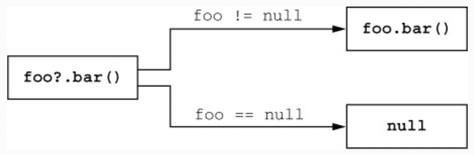
> Figure 6.1. The safe-call operator calls methods only on non-null values.

> ✅ Ex_6_1.kt (6.1.3)

* Safe calls can be used for accessing properties as well, not just for method calls.

### 6.1.4. Elvis operator: “?:”

* Kotlin has a handy operator to provide default values instead of **null**. It’s called the **Elvis operator** (or the **null-coalescing operator**, if you prefer more serious-sounding names for things). It looks like this: **?:** (you can visualize it being Elvis if you turn your head sideways).”

* The operator takes two values, and its result is the first value if it isn’t **null** or the second value if the first one is **null**.

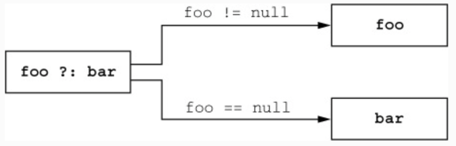
> Figure 6.2. The Elvis operator substitutes a specified value for null.

* The Elvis operator is often used together with the safe-call operator to substitute a value other than **null** when the object on which the method is called is **null**.

> ✅ Ex_6_1.kt (6.1.4)

* What makes the Elvis operator particularly handy in Kotlin is that operations such as **return** and **throw** work as expressions and therefore can be used on the operator’s right side. In that case, if the value on the left side is **null**, the function will immediately return a value or throw an exception. This is helpful for checking preconditions in a function.

### 6.1.5. Safe casts: “as?”

* The **as?** operator tries to cast a value to the specified type and returns **null** if the value doesn’t have the proper type.

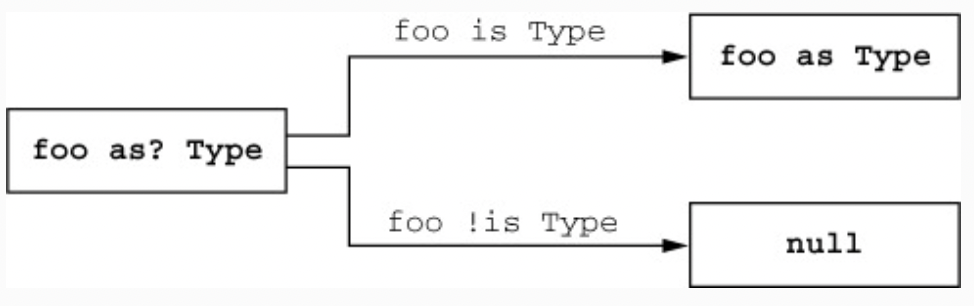
> Figure 6.3. The safe-cast operator tries to cast a value to the given type and returns null if the type differs.

* One common pattern of using a safe cast is combining it with the Elvis operator. For example, this comes in handy for implementing the **equals** method.

> ✅ Ex_6_1.kt (6.1.5)

### 6.1.6. Not-null assertions: “!!”

* The **not-null assertion** is the simplest and bluntest tool Kotlin gives you for dealing with a value of a nullable type. It’s represented by a double exclamation mark and converts any value to a **non-null** type. For **null** values, an exception is thrown.

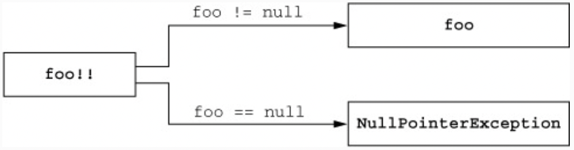
> Figure 6.4. By using a not-null assertion, you can explicitly throw an exception if the value is null.

> ✅ Ex_6_1.kt (6.1.6)

* Note that the place where the exception is thrown is the assertion itself, not a subsequent line where you’re trying to use the value.

* When you check for null in one function and use the value in another function, the compiler can’t recognize that the use is safe. If you’re certain the check is always performed in another function, you may not want to duplicate it before using the value; then you can use a **not-null** assertion instead.

* There’s one more caveat to keep in mind: when you use !! and it results in an exception, the stack trace identifies the line number in which the exception was thrown but not a specific expression. To make it clear exactly which value was **null**, it’s best to avoid using multiple **!!** assertions on the same line.

### 6.1.7. The “let” function

* The **let** function makes it easier to deal with nullable expressions. Together with a safe-call operator, it allows you to evaluate an expression, check the result for **null**, and store the result in a variable, all in a single, concise expression.

* All the **let** function does is turn the object on which it’s called into a parameter of the lambda. If you combine it with the safe call syntax, it effectively converts an object of a nullable type on which you call **let** into a **non-null** type.

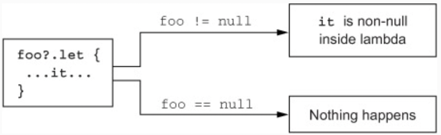
> Figure 6.5. Safe-calling “let” executes a lambda only if an expression isn’t null.

> ✅ Ex_6_1.kt (6.1.7)

### 6.1.8. Late-initialized properties

* Kotlin normally requires you to initialize all properties in the constructor, and if a property has a **non-null** type, you have to provide a **non-null** initializer value. If you can’t provide that value, you have to use a nullable type instead. If you do that, every access to the property requires either a **null** check or the **!!** operator.

* If you access the property many times, you can declare the property as **late-initialized**. This is done by applying the **lateinit** modifier.

* Note that a **late-initialized** property is always a **var**, because you need to be able to change its value outside of the constructor, and **val** properties are compiled into final fields that must be initialized in the constructor. But you no longer need to initialize it in a constructor, even though the property has a **non-null** type. If you access the property before it’s been initialized, you get an exception **“lateinit property ... has not been initialized”**. It clearly identifies what has happened and is much easier to understand than a generic **NullPointerException**.

* A common use case for **lateinit** properties is dependency injection. In that scenario, the values of **lateinit** properties are set externally by a dependency-injection framework. To ensure compatibility with a broad range of Java frameworks, Kotlin generates a field with the same visibility as the **lateinit** property. If the property is declared as **public**, the field will be **public** as well.

### 6.1.9. Extensions for nullable types

* Defining extension functions for nullable types is one more powerful way to deal with **null** values. Rather than ensuring that a variable can’t be **null** before a method call, you can allow the calls with **null** as a receiver, and deal with **null** in the function. This is only possible for extension functions; regular member calls are dispatched through the object instance and therefore can never be performed when the instance is **null**.

> ✅ Ex_6_1.kt (6.1.9)

* When you declare an extension function for a nullable type (ending with **?**), that means you can call this function on nullable values; and **this** in a function body can be **null**, so you have to check for that explicitly. In Java, **this** is always **not-null**, because it references the instance of a class you’re in. In Kotlin, that’s no longer the case: in an extension function for a nullable type, **this** can be **null**.

### 6.1.10. Nullability of type parameters

* By default, all type parameters of functions and classes in Kotlin are **nullable**. Any type, including a nullable type, can be substituted for a type parameter; in this case, declarations using the type parameter as a type are allowed to be **null** even though the type parameter **T** doesn’t end with a question mark.

> ✅ Ex_6_1.kt (6.1.10)

* In the **printHashCode** call, the inferred type for the type parameter **T** is a nullable type, **Any?**. Therefore, the parameter **t** is allowed to hold **null**, even without a question mark after **T**.

* To make the type parameter **non-null**, you need to specify a **non-null** upper bound for it. That will reject a nullable value as an argument.

### 6.1.11. Nullability and Java

* Sometimes Java code contains information about nullability, expressed using annotations. When this information is present in the code, Kotlin uses it. Thus **@Nullable String** in Java is seen as **String?** by Kotlin, and **@NotNull String** is just **String**.

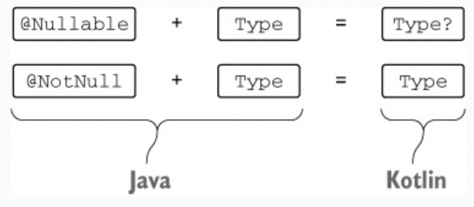
> Figure 6.6. Annotated Java types are represented as nullable and non-null types in Kotlin, according to the annotations.

* When the annotations aren’t present, the Java type becomes a **platform type** in Kotlin.

* A **platform type** is essentially a type for which Kotlin doesn’t have nullability information; you can work with it as either a **nullable** or a **non-null** type. This means, just as in Java, you have full responsibility for the operations you perform with that type. The compiler will allow all operations. It also won’t highlight as redundant any **null-safe** operations on such values, which it normally does when you perform a **null-safe** operation on a value of a **non-null** type. If you know the value can be **null**, you can compare it with **null** before use. If you know it’s not **null**, you can use it directly. Just as in Java, you’ll get a **NullPointerException** at the usage site if you get this wrong.

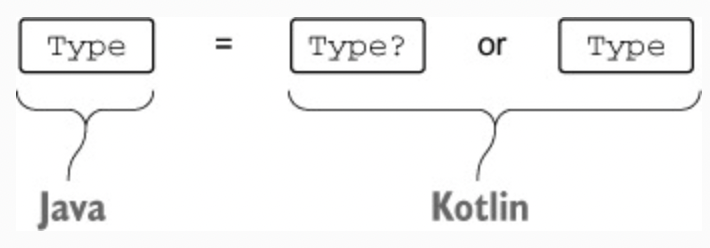
> Figure 6.7. Java types are represented in Kotlin as platform types, which you can use either as a nullable type or as a non-null type.

> ✅ Ex_6_1.kt (6.1.11)

* Be careful while working with Java APIs. Most of the libraries aren’t annotated, so you may interpret all the types as **non-null**, but that can lead to errors. To avoid errors, you should check the documentation (and, if needed, the implementation) of the Java methods you’re using to find out when they can return **null**, and add checks for those methods.

* You may interpret platform types any way you like—as **nullable** or as **non-null** — so both of the following declarations are valid.

* When overriding a Java method in Kotlin, you have a choice whether to declare the parameters and the return type as **nullable** or **non-null**. In Kotlin, both of the following implementations will be accepted by the compiler.

* Note that it’s important to get nullability right when implementing methods from Java classes or interfaces. Because the implementation methods can be called from non-Kotlin code, the Kotlin compiler will generate **non-null** assertions for every parameter that you declare with a **non-null** type. If the Java code does pass a **null** value to the method, the assertion will trigger, and you’ll get an exception, even if you never access the parameter value in your implementation.

--- 

## 6.2. Primitive and other basic types

* Unlike Java, Kotlin doesn’t differentiate primitive types and wrappers.

### 6.2.1. Primitive types: Int, Boolean, and more

* Values of primitive types can be stored and passed around more efficiently, but you can’t call methods on such values or store them in collections. Java provides special wrapper types (such as **java.lang.Integer**) that encapsulate primitive types in situations when an object is needed. Thus, to define a collection of integers, you can’t say **Collection<int>**; you have to use **Collection<Integer>** instead.

* Kotlin doesn’t distinguish between primitive types and wrapper types. You always use the same type. That’s convenient. What’s more, you can call methods on values of a number type.

* If primitive and reference types are the same, does that mean Kotlin represents all numbers as objects? Wouldn’t that be terribly inefficient? Indeed it would, so Kotlin doesn’t do that.

* At runtime, the number types are represented in the most efficient way possible. In most cases—for variables, properties, parameters, and return types—Kotlin’s **Int** type is compiled to the Java primitive type **int**. The only case in which this isn’t possible is generic classes, such as collections. A primitive type used as a type argument of a generic class is compiled to the corresponding Java wrapper type. For example, if the **Int** type is used as a type argument of the collection, then the collection will store instances of **java.lang.Integer**, the corresponding wrapper type.

> ✅ Ex_6_2.kt (6.2.1)

* The full list of types that correspond to Java primitive types is:
  * Integer types — Byte, Short, Int, Long 
  * Floating-point number types — Float, Double 
  * Character type — Char 
  * Boolean type — Boolean

* A Kotlin type such as **Int** can be easily compiled under the hood to the corresponding Java primitive type, because the values of both types can’t store the null reference. The other direction works in a similar way. When you use Java declarations from Kotlin, Java primitive types become **non-null** types (not platform types), because they can’t hold **null** values.

### 6.2.2. Nullable primitive types: Int?, Boolean?, and more

* Nullable types in Kotlin can’t be represented by Java primitive types, because **null** can only be stored in a variable of a Java reference type. That means whenever you use a nullable version of a primitive type in Kotlin, it’s compiled to the corresponding wrapper type.

> ✅ Ex_6_2.kt (6.2.2)

* Note how the regular nullability rules apply here. You can’t just compare two values of type **Int?**, because one of them may be **null**. Instead, you have to check that both values aren’t **null**. After that, the compiler allows you to work with them normally.

* Generic classes are another case when wrapper types come into play. If you use a primitive type as a type argument of a class, Kotlin uses the boxed representation of the type.

* This happens because of the way generics are implemented on the Java virtual machine. The **JVM doesn’t support using a primitive type as a type argument**, so a generic class (both in Java and in Kotlin) must always use a boxed representation of the type. As a consequence, if you need to efficiently store large collections of primitive types, you need to either use a third-party library (such as Trove4J, http://trove.starlight-systems.com) that provides support for such collections or store them in arrays.

### 6.2.3. Number conversions

* One important difference between Kotlin and Java is the way they handle numeric conversions. Kotlin doesn’t automatically convert numbers from one type to the other, even when the other type is larger. 

* You need to apply the conversion explicitly. The functions support converting in both directions.

> ✅ Ex_6_2.kt (6.2.3)

* The **equals** method for two boxed values checks the box type, not just the value stored in it. Thus, in Java, **new Integer(42).equals(new Long(42))** returns false.

* If you use different number types in your code at the same time, you have to convert variables explicitly to avoid unexpected behavior.

* Kotlin supports the following ways to write number literals in source code, in addition to simple decimal numbers:
  * Literals of type Long use the L suffix: 123L. 
  * Literals of type Double use the standard representation of floating-point numbers: 0.12, 2.0, 1.2e10, 1.2e-10. 
  * Literals of type Float use the f or F suffix: 123.4f, .456F, 1e3f. 
  * Hexadecimal literals use the 0x or 0X prefix (such as 0xCAFEBABE or 0xbcdL). 
  * Binary literals use the 0b or 0B prefix (such as 0b000000101).

* Note that underscores in number literals are only supported starting with Kotlin 1.1.

* Note that when you’re writing a number literal, you usually don’t need to use conversion functions. In addition, arithmetic operators are overloaded to accept all appropriate numeric types.

### 6.2.4. “Any” and “Any?”: the root types

* Similar to how **Object** is the root of the class hierarchy in Java, the **Any** type is the supertype of all non-nullable types in Kotlin. But in Java, **Object** is a supertype of all reference types only, and primitive types aren’t part of the hierarchy. That means you have to use wrapper types such as **java.lang.Integer** to represent a primitive type value when **Object** is required. In Kotlin, **Any** is a supertype of all types, including the primitive types such as **Int**.

* Under the hood, the **Any** type corresponds to **java.lang.Object**. The **Object** type used in parameters and return types of Java methods is seen as **Any** in Kotlin. (More specifically, it’s viewed as a platform type, because its nullability is unknown.) When a Kotlin function uses **Any**, it’s compiled to **Object** in the Java bytecode.

* All Kotlin classes have the following three methods: **toString**, **equals**, and **hashCode**. These methods are inherited from **Any**. Other methods defined on **java.lang.Object** (such as **wait** and **notify**) aren’t available on **Any**, but you can call them if you manually cast the value to **java.lang.Object**.

### 6.2.5. The Unit type: Kotlin’s “void”

* The **Unit** type in Kotlin fulfills the same function as **void** in Java. It can be used as a return type of a function that has nothing interesting to return.

* Syntactically, it’s the same as writing a function with a block body without a type declaration.

* What distinguishes Kotlin’s **Unit** from Java’s **void**, then? **Unit** is a full-fledged type, and, unlike **void**, it can be used as a type argument. Only one value of this type exists; it’s also called **Unit** and is returned implicitly. This is useful when you override a function that returns a generic parameter and make it return a value of the **Unit** type.

> ✅ Ex_6_2.kt (6.2.5)

### 6.2.6. The Nothing type: “This function never returns”

* For some functions in Kotlin, the concept of a “return value” doesn’t make sense because they never complete successfully. For example, many testing libraries have a function called **fail** that fails the current test by throwing an exception with a specified message. A function that has an infinite loop in it will also never complete successfully.

* When analyzing code that calls such a function, it’s useful to know that the function will never terminate normally. To express that, Kotlin uses a special return type called **Nothing**.

> ✅ Ex_6_2.kt (6.2.6)

* The **Nothing** type doesn’t have any values, so it only makes sense to use it as a function return type or as a type argument for a type parameter that’s used as a generic function return type. In all other cases, declaring a variable where you can’t store any value doesn’t make sense.

* Note that functions returning **Nothing** can be used on the right side of the Elvis operator to perform precondition checking.

* The compiler knows that a function with **Nothing** return type never terminates normally and uses that information when analyzing the code calling the function.

---

## 6.3. Collections and arrays

### 6.3.1. Nullability and collections

* Kotlin fully supports nullability for type arguments. Just as the type of a variable can have a **?** character appended to indicate that the variable can hold **null**, a type used as a type argument can be marked in the same way.

* List<Int?> is a list that can hold values of type Int?: in other words, Int or null.

* Note how the nullability of the type of the variable itself is distinct from the nullability of the type used as a type argument.

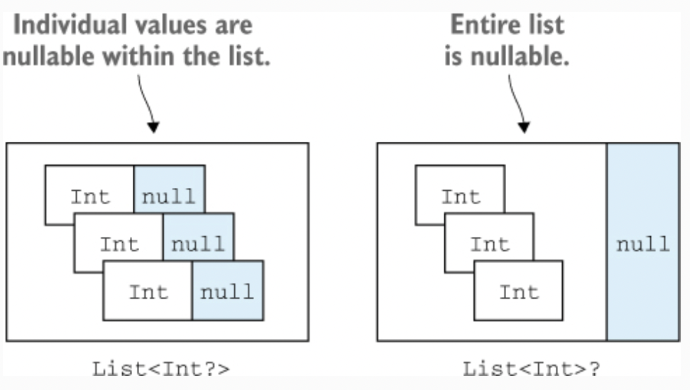
> Figure 6.8. Be careful what you make nullable: the elements of the collection or the collection itself?

> ✅ Ex_6_3.kt (6.3.1)

### 6.3.2. Read-only and mutable collections

* An important trait that sets apart Kotlin’s collection design from Java’s is that it separates interfaces for accessing the data in a collection and for modifying the data. This distinction exists starting with the most basic interface for working with collections, **kotlin.collections.Collection**. Using this interface, you can iterate over the elements in a collection, obtain its size, check whether it contains a certain element, and perform other operations that read data from the collection. But this interface doesn’t have any methods for adding or removing elements.

* To modify the data in the collection, use the **kotlin.collections.Mutable-Collection** interface. It extends the regular **kotlin.collections.Collection** and provides methods for adding and removing the elements, clearing the collection, and so on.

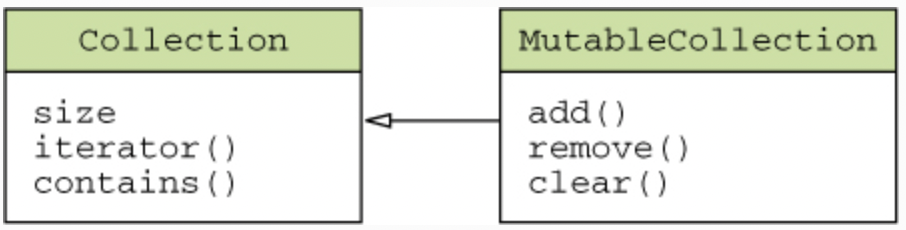
> Figure 6.9. MutableCollection extends Collection and adds methods to modify a collection’s contents.

* As a general rule, you should use read-only interfaces everywhere in your code. Use the mutable variants only if the code will modify the collection.

> ✅ Ex_6_3.kt (6.3.2)

* A key thing to keep in mind when working with collection interfaces is that read-only collections aren’t necessarily immutable. If you’re working with a variable that has a read-only interface type, this can be just one of the many references to the same collection. Other references can have a mutable interface type.

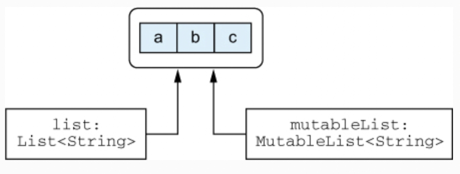
> Figure 6.10. Two different references, one read-only and one mutable, pointing to the same collection object.

* If you call the code holding the other reference to your collection or run it in parallel, you can still come across situations where the collection is modified by other code while you’re working with it, which leads to **ConcurrentModification-Exception** errors and other problems. Therefore, it’s essential to understand that **read-only collections aren’t always thread-safe**. If you’re working with data in a multithreaded environment, you need to ensure that your code properly synchronizes access to the data or uses data structures that support concurrent access.

### 6.3.3. Kotlin collections and Java

* It’s true that every Kotlin collection is an instance of the corresponding Java collection interface. No conversion is involved when moving between Kotlin and Java; there’s no need for wrappers or copying data. But every Java collection interface has **two representations** in Kotlin: a read-only one and a mutable one.

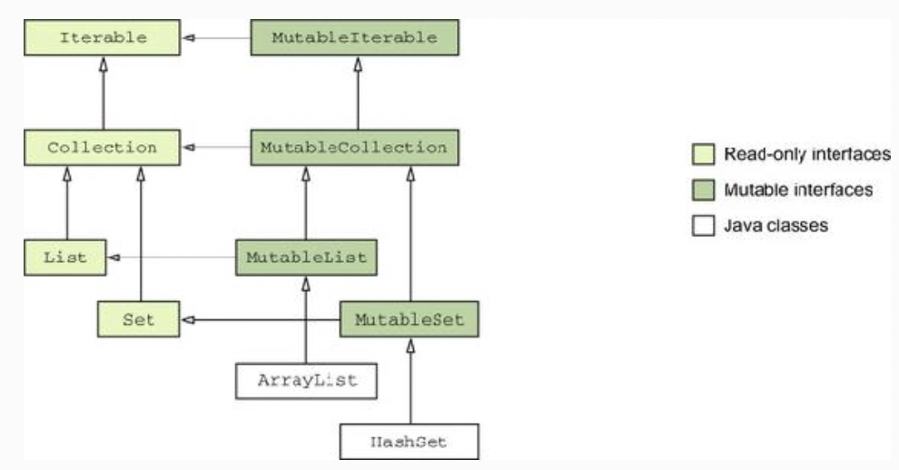
> Figure 6.11. The hierarchy of the Kotlin collection interfaces. The Java classes ArrayList and HashSet extend Kotlin mutable interfaces.

* This fugure also contains the Java classes **java.util.ArrayList** and **java.util.HashSet** to show how Java standard classes are treated in Kotlin. Kotlin sees them as if they inherited from the Kotlin’s **MutableList** and **MutableSet** interfaces, respectively.

* In addition to the collections, the **Map** class (which doesn’t extend **Collection** or **Iterable**) is also represented in Kotlin as two distinct versions: **Map** and **Mutable-Map**.

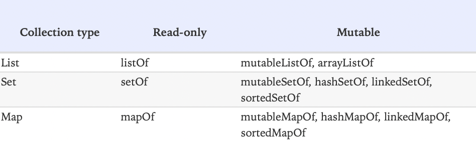
> Figure 6.12. Collection-creation functions.

* Note that **setOf()** and **mapOf()** return instances of classes from the Java standard library (at least in Kotlin 1.0), which are all mutable under the hood. But you shouldn’t rely on that: it’s possible that a future version of Kotlin will use truly immutable implementation classes as return values of **setOf** and **mapOf**.

* When you need to call a Java method and pass a collection as an argument, you can do so directly without any extra steps. For example, if you have a Java method that takes a **java.util.Collection** as a parameter, you can pass any **Collection** or **MutableCollection** value as an argument to that parameter.

* This has important consequences with regard to mutability of collections. Because Java doesn’t distinguish between read-only and mutable collections, Java code **can modify the collection** even if it’s declared as a read-only **Collection** on the Kotlin side. The Kotlin compiler can’t fully analyze what’s being done to the collection in the Java code, and therefore there’s no way for Kotlin to reject a call passing a read-only **Collection** to Java code that modifies it.

> ✅ Ex_6_3.kt (6.3.3)

* Therefore, if you’re writing a Kotlin function that takes a collection and passes it to Java, it’s **your responsibility to use the correct type for the parameter**, depending on whether the Java code you’re calling will modify the collection.

* Note that this caveat also applies to collections with **non-null** element types. If you pass such a collection to a Java method, the method can put a **null** value into it; there’s no way for Kotlin to forbid that or even to detect that it has happened without compromising performance.

### 6.3.4. Collections as platform types

* A collection with a platform type is essentially a collection of unknown mutability—the Kotlin code can treat it as either read-only or mutable. Usually this doesn’t matter, because, in effect, all the operations you may want to perform just work. 

* The difference becomes important when you’re overriding or implementing a Java method that has a collection type in its signature. Here, as with platform types for nullability, you need to decide which Kotlin type you’re going to use to represent a Java type coming from the method you’re overriding or implementing.

> ✅ Ex_6_3.kt (6.3.4)

### 6.3.5. Arrays of objects and primitive types

* You should prefer using collections to arrays by default. But because many Java APIs still use arrays, we’ll cover how to work with them in Kotlin. 

* An **array** in Kotlin is a class with a type parameter, and the element type is specified as the corresponding type argument.

* To create an array in Kotlin, you have the following possibilities:
  * The **arrayOf** function creates an array containing the elements specified as arguments to this function. 
  * The **arrayOfNulls** function creates an array of a given size containing null elements. Of course, it can only be used to create arrays where the element type is nullable. 
  * The **Array** constructor takes the size of the array and a lambda, and initializes each array element by calling the lambda. This is how you can initialize an array with a non-null element type without passing each element explicitly.

> ✅ Ex_6_3.kt (6.3.5)

* Having said that, one of the most common cases for creating an array in Kotlin code is when you need to call a Java method that takes an array, or a Kotlin function with a **vararg** parameter. In those situations, you often have the data already stored in a collection, and you just need to convert it into an array. You can do this using the **toTypedArray** method.

* As with other types, **type arguments of array types always become object types**. Therefore, if you declare something like an **Array<Int>**, it will become an array of boxed integers (its Java type will be **java.lang.Integer[]**). If you need to create an array of values of a primitive type without boxing, you must use one of the specialized classes for arrays of primitive types.

* To represent arrays of primitive types, Kotlin provides a number of separate classes, one for each primitive type. For example, an array of values of type **Int** is called **IntArray**. For other types, Kotlin provides **ByteArray**, **CharArray**, **Boolean-Array**, and so on. All of these types are compiled to regular Java primitive type arrays, such as **int[]**, **byte[]**, **char[]**, and so on. Therefore, values in such an array are stored without boxing, in the most efficient manner possible.

* To create an array of a primitive type, you have the following options:
  * The constructor of the type takes a size parameter and returns an array initialized with default values for the corresponding primitive type (usually zeros). 
  * The factory function (intArrayOf for IntArray, and so on for other array types) takes a variable number of values as arguments and creates an array holding those values. 
  * Another constructor takes a size and a lambda used to initialize each element.

* Alternatively, if you have an array or a collection holding boxed values of a primitive type, you can convert them to an array of that primitive type using the corresponding conversion function, such as **toIntArray**.

* In addition to the basic operations (getting the array’s length and getting and setting elements), the Kotlin standard library supports the same set of extension functions for arrays as for collections. All the functions you saw in chapter 5 (filter, map, and so on) work for arrays as well, including the arrays of primitive types. (Note that the return values of these functions are lists, not arrays.)

---

## 6.4. SUMMARY

* Kotlin’s support of nullable types detects possible **NullPointerException** errors at compile time. 
* Kotlin provides tools such as safe calls (**?.**), the Elvis operator (**?:**), not-null assertions (**!!**), and the **let** function for dealing with nullable types concisely. 
* The **as?** operator provides an easy way to cast a value to a type and to handle the case when it has a different type. 
* Types coming from Java are interpreted as platform types in Kotlin, allowing the developer to treat them as either nullable or non-null. 
* Types representing basic numbers (such as **Int**) look and function like regular classes but are usually compiled to Java primitive types. 
* Nullable primitive types (such as **Int?**) correspond to boxed primitive types in Java (such as **java.lang.Integer**). 
* The **Any** type is a supertype of all other types and is analogous to Java’s **Object**. **Unit** is an analogue of **void**. 
* The **Nothing** type is used as a return type of functions that don’t terminate normally. 
* Kotlin uses the standard Java classes for collections and enhances them with a distinction between read-only and mutable collections. 
* You need to carefully consider nullability and mutability of parameters when you extend Java classes or implement Java interfaces in Kotlin. 
* Kotlin’s **Array** class looks like a regular generic class, but it’s compiled to a Java array. 
* Arrays of primitive types are represented by special classes such as **IntArray**.