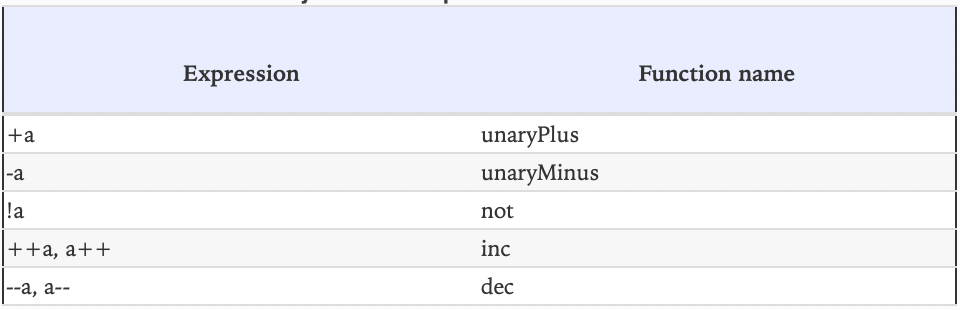
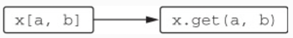

# Chapter 7. Operator overloading and other conventions

* This chapter covers 
  * Operator overloading 
  * Conventions: special-named functions supporting various operations 
  * Delegated properties

* Kotlin has a number of features, where specific language constructs are implemented by calling functions that you 
define in your own code. But instead of being tied to specific types, in Kotlin those features are tied to functions 
with specific names. For example, if your class defines a special method named `plus`, then, by convention, you can use 
the `+` operator on instances of this class. Because of that, in Kotlin we refer to this technique as **conventions**.

* Kotlin uses the principle of conventions, instead of relying on types as Java does, because this allows developers to 
adapt existing Java classes to the requirements of Kotlin language features. The set of interfaces implemented by a 
class is fixed, and Kotlin can’t modify an existing class so that it would implement additional interfaces. On the other 
hand, defining new methods for a class is possible through the mechanism of extension functions. You can define any 
convention methods as extensions and thereby adapt any existing Java class without modifying its code.  

---

## 7.1. Overloading arithmetic operators

* The most straightforward example of the use of conventions in Kotlin is arithmetic operators. In Java, the full set of 
arithmetic operations can be used only with primitive types, and additionally, the `+` operator can be used with `String`
values. But these operations could be convenient in other cases as well. For example, if you’re working with numbers 
through the `BigInteger` class, it’s more elegant to sum them using `+` than to call the `add` method explicitly. To add 
an element to a collection, you may want to use the `+=` operator. Kotlin allows you to do that.

### 7.1.1. Overloading binary arithmetic operations

> ✅ Ex_7_1.kt (7.1.1)

* Note how you use the `operator` keyword to declare the `plus` function. All functions used to overload operators need 
to be marked with that keyword. This makes it explicit that you intend to use the function as an implementation of the 
corresponding convention and that you didn’t define a function that accidentally had a matching name.

* After you declare the plus function with the `operator` modifier, you can sum up your objects using just the `+` sign.

> Figure 7.1. The + operator is transformed into a plus function call.

* As an alternative to declaring the operator as a member, you can define the operator as an extension function.

* Kotlin has a limited set of operators that you can overload, and each one corresponds to the name of the function you 
need to define in your class.

> Figure 7.2. Overloadable binary arithmetic operators.

* Operators for your own types always use the same precedence as the standard numeric types. For example, if you write 
`a + b * c`, the multiplication will always be executed before the addition, even if you’ve defined those operators 
yourself. The operators `*`, `/`, and `%` have the same precedence, which is higher than the precedence of the `+` and 
`-` operators.

* Kotlin operators are easy to call from Java: because every overloaded operator is defined as a function, you call them 
as regular functions using the full name.

* When you define an operator, you don’t need to use the same types for the two operands.

* Note that Kotlin operators don’t automatically support **commutativity** (the ability to swap the left and right sides 
of an operator). If you want users to be able to write `1.5 * p` in addition to `p * 1.5`, you need to define a separate 
operator for that: `operator fun Double.times(p: Point): Point`.

* The return type of an operator function can also be different from either of the operand types.

* Note that you can `overload` operator functions like regular functions: you can define multiple methods with different 
parameter types for the same method name.

* Here’s the full list of functions provided by Kotlin for performing bitwise operations:
  * `shl` — Signed shift left 
  * `shr` — Signed shift right 
  * `ushr` — Unsigned shift right 
  * `and` — Bitwise and 
  * `or` — Bitwise or 
  * `xor` — Bitwise xor 
  * `inv` — Bitwise inversion
  
### 7.1.2. Overloading compound assignment operators

* Normally, when you define an operator such as `plus`, Kotlin supports not only the `+` operation but `+=` as well. 
Operators such as `+=`, `-=`, and so on are called **compound assignment operators**.

> ✅ Ex_7_1.kt (7.1.2)

* In some cases, it makes sense to define the `+=` operation that would modify an object referenced by the variable on 
which it’s used, but not reassign the reference. One such case is adding an element to a mutable collection.

* If you define a function named `plusAssign` with the `Unit` return type, Kotlin will call it when the `+=` operator is 
used. Other binary arithmetic operators have similarly named counterparts: `minusAssign`, `timesAssign`, and so on.

* When you write `+=` in your code, theoretically both `plus` and `plusAssign` functions can be called. If this is the 
case, and both functions are defined and applicable, the compiler reports an error. One possibility to resolve it is 
replacing your use of the operator with a regular function call. Another is to replace a `var` with a `val`, so that the 
`plusAssign` operation becomes inapplicable. But in general, it’s best to design new classes consistently: try not to 
add both `plus` and `plusAssign` operations at the same time. If your class is immutable, like `Point` in one of the 
earlier examples, you should provide only operations that return a new value (such as `plus`). If you design a mutable 
class, like a builder, provide only `plusAssign` and similar operations.

> Figure 7.3. The `+=` operator can be transformed into either the `plus` or the `plusAssign` function call.

* The Kotlin standard library supports both approaches for collections. The `+` and `-` operators always return a new 
collection. The `+=` and `-=` operators work on mutable collections by modifying them in place, and on read-only 
collections by returning a modified copy. (This means `+=` and `-=` can only be used with a read-only collection if the 
variable referencing it is declared as a `var`.) As operands of those operators, you can use either individual elements 
or other collections with a matching element type.

### 7.1.3. Overloading unary operators

* The procedure for overloading a unary operator is the same as you saw previously: declare a function (member or 
extension) with a predefined name, and mark it with the modifier `operator`.

> ✅ Ex_7_1.kt (7.1.3)

> Figure 7.4. Overloadable unary arithmetic operators.

* When you define the `inc` and `dec` functions to overload increment and decrement operators, the compiler 
automatically supports the same semantics for pre- and post-increment operators as for the regular number types.

---

## 7.2. Overloading comparison operators

### 7.2.1. Equality operators: “equals“

* Using the `==` operator in Kotlin is translated into a call of the `equals` method. Using the `!=` operator is also 
translated into a call of `equals`, with the obvious difference that the result is inverted. Note that unlike all other 
operators, `==` and `!=` can be used with nullable operands, because those operators check equality to `null` under 
the hood.

> Figure 7.5. An equality check `==` is transformed into an `equals` call and a `null` check.

> ✅ Ex_7_2.kt (7.2.1)

* You use the identity equals operator (`===`) to check whether the parameter to `equals` is the same object as the one
on which `equals` is called. Note that the `===` operator can’t be overloaded.

* The `equals` function is marked as `override`, because, unlike other conventions, the method implementing it is 
defined in the `Any` class. That also explains why you don’t need to mark it as `operator`: the base method in `Any` is 
marked as such, and the `operator` modifier on a method applies also to all methods that implement or override it.

* Note that `equals` can’t be implemented as an extension, because the implementation inherited from the `Any` class 
would always take precedence over the extension.

* This example shows that using the `!=` operator is also translated into a call of the `equals` method. The compiler 
automatically negates the return value, so you don’t need to do anything for this to work correctly.

### 7.2.2. Ordering operators: compareTo

* In Java, classes can implement the `Comparable` interface in order to be used in algorithms that compare values, such 
as finding a maximum or sorting. The `compareTo` method defined in that interface is used to determine whether one 
object is larger than another. But in Java, there’s no shorthand syntax for calling this method. Only values of 
primitive types can be compared using `<` and `>`; all other types require you to write `element1.compareTo(element2)` 
explicitly.

* Kotlin supports the same `Comparable` interface. But the `compareTo` method defined in that interface can be called by 
convention, and uses of comparison operators (`<`, `>`, `<=`, and `>=`) are translated into calls of `compareTo`. The 
return type of compareTo has to be `Int`. The expression `p1 < p2` is equivalent to `p1.compareTo(p2) < 0`. Other 
comparison operators work exactly the same way.

> Figure 7.6. Comparison of two objects is transformed into comparing the result of the `compareTo` call with zero.

> ✅ Ex_7_2.kt (7.2.2)

* Just as with `equals`, the `operator` modifier is applied to the function in the base interface, so you don’t need to 
repeat the keyword when you override the function.

* Note how you can use the `compareValuesBy` function from the Kotlin standard library to implement the `compareTo` 
method easily and concisely. This function receives a list of callbacks that calculate values to be compared. The 
function calls each callback in order for both objects and compares the return values. If the values are different, 
it returns the result of the comparison. If they’re the same, it proceeds to the next callback or returns 0 if there are 
no more callbacks to call. The callbacks can be passed as lambdas or, as you do here, as property references.

* All Java classes that implement the `Comparable` interface can be compared in Kotlin using the concise 
operator syntax.

---

## 7.3. Conventions used for collections and ranges

* Some of the most common operations for working with collections are getting and setting elements by index, as well as 
checking whether an element belongs to a collection. All of these operations are supported via operator syntax: To get 
or set an element by index, you use the syntax `a[b]` (called the **index operator**). The `in` operator can be used to 
check whether an element is in a collection or range and also to iterate over a collection. You can add those operations 
for your own classes that act as collections.

### 7.3.1. Accessing elements by index: “get” and “set”

> ✅ Ex_7_3.kt (7.3.1)

* All you need to do is define a function named `get` and mark it as `operator`.

> Figure 7.7. Access via square brackets is transformed into a `get` function call.

* Note that the parameter of `get` can be any type, not just `Int`. You can also define a `get` method with multiple 
parameters. For example, if you’re implementing a class to represent a two-dimensional array or matrix, you can define a 
method such as `operator fun get(row-Index: Int, colIndex: Int)` and call it as `matrix[row, col]`. You can define 
multiple overloaded `get` methods with different parameter types, if your collection can be accessed with different 
key types.

* To allow the use of the index operator in assignments, you just need to define a function named `set`. The last 
parameter to `set` receives the value used on the right side of the assignment, and the other arguments are taken from 
the indices used inside the brackets.

> Figure 7.8. Assignment through square brackets is transformed into a set function call.

### 7.3.2. The “in” convention

* One other operator supported by collections is the `in` operator, which is used to check whether an object belongs to 
a collection. The corresponding function is called `contains`.

> ✅ Ex_7_3.kt (7.3.2)

> Figure 7.9. The `in` operator is transformed into a `contains` function call.

* In the implementation of `Rectangle.contains`, you use the `until` standard library function to build an 
**open range** and then you use the `in` operator on a range to check that a point belongs to it.

* An **open range** is a range that doesn’t include its ending point.

### 7.3.3. The rangeTo convention

* The `..` operator is a concise way to call the `rangeTo` function.

> Figure 7.10. The `..` operator is transformed into a `rangeTo` function call.

* The `rangeTo` function returns a range. You can define this operator for your own class. But if your class implements 
the `Comparable` interface, you don’t need that: you can create a range of any comparable elements by means of the 
Kotlin standard library. The library defines the `rangeTo` function that can be called on any comparable element.

> ✅ Ex_7_3.kt (7.3.3)

* The `rangeTo` operator has lower priority than arithmetic operators. But it’s better to use parentheses for its 
arguments to avoid confusion.

### 7.3.4. The “iterator” convention for the “for” loop

* `for` loops in Kotlin use the same in operator as range checks. But its meaning is different in this context: it’s 
used to perform iteration. This means a statement such as `for (x in list) { ... }` will be translated into a call 
of `list.iterator()`, on which the `hasNext` and `next` methods are then repeatedly called, just like in Java.

* Note that in Kotlin, it’s also a convention, which means the `iterator` method can be defined as an extension. That 
explains why it’s possible to iterate over a regular Java string: the standard library defines an extension function 
`iterator` on `Char-Sequence`, a superclass of `String`.

* You can define the `iterator` method for your own classes.

> ✅ Ex_7_3.kt (7.3.4)

---

## 7.4. Destructuring declarations and component functions

* **Destructuring declarations** allow you to unpack a single composite value and use it to initialize several separate 
variables.

> ✅ Ex_7_4.kt

* A destructuring declaration looks like a regular variable declaration, but it has multiple variables grouped in 
parentheses.

* Under the hood, the destructuring declaration once again uses the principle of conventions. To initialize each 
variable in a destructuring declaration, a function named `componentN` is called, where `N` is the position of the 
variable in the declaration.

> Figure 7.11. Destructuring declarations are transformed into `componentN` function calls.

* For a `data` class, the compiler generates a `componentN` function for every property declared in the primary constructor.

### 7.4.1. Destructuring declarations and loops

* Destructuring declarations work not only as top-level statements in functions but also in other places where you can 
declare variables — for example, in loops. One good use for that is enumerating entries in a map.

> ✅ Ex_7_4.kt (7.4.1)

* This simple example uses two Kotlin conventions: one to iterate over an object and another to destructure 
declarations. The Kotlin standard library contains an extension function `iterator` on a map that returns an iterator 
over map entries. Thus, unlike Java, you can iterate over a map directly. It also contains extensions functions 
`component1` and `component2` on `Map.Entry`, returning its key and value, respectively.

---

## 7.5. Reusing property accessor logic: delegated properties

* **Delegated properties** let you easily implement properties that work in a more complex way than storing values in 
backing fields, without duplicating the logic in each accessor. For example, properties can store their values in 
database tables, in a browser session, in a map, and so on.

* The foundation for this feature is **delegation**: a design pattern where an object, instead of performing a task, 
delegates that task to another helper object. The helper object is called a **delegate**.

### 7.5.1. Delegated properties: the basics

> Figure 7.12. The general syntax of a delegated property.

* The property `p` delegates the logic of its accessors to another object: in this case, a new instance of the 
`Delegate` class. The object is obtained by evaluating the expression following the `by` keyword, which can be anything 
that satisfies the rules of the convention for property delegates.

* The compiler creates a hidden helper property, initialized with the instance of the delegate object, to which the 
initial property `p` delegates.

> Figure 7.13. Generated class.

* By convention, the `Delegate` class must have `getValue` and `setValue` methods (the latter is required only for 
mutable properties). As usual, they can be members or extensions. To simplify the explanation, we omit their parameters; 
the exact signatures will be covered later in this chapter. In a simple form, the `Delegate` class might look like the 
following:

> Figure 7.14. The Delegate class.

### 7.5.2. Using delegated properties: lazy initialization and “by lazy()”

* **Lazy initialization** is a common pattern that entails creating part of an object on demand, when it’s accessed for 
the first time. This is helpful when the initialization process consumes significant resources and the data isn’t always 
required when the object is used.

> ✅ Ex_7_5.kt (7.5.2)

* Here you use the so-called **backing property** technique. You have one property, `_emails`, which stores the value, 
and another, `emails`, which provides read access to it. You need to use two properties because the properties have 
different types: `_emails` is nullable, whereas `emails` is non-null. This technique can be used fairly often, so it’s 
worth getting familiar with it.

* But the code is somewhat cumbersome: imagine how much longer it would become if you had several lazy properties. 
What’s more, it doesn’t always work correctly: the implementation isn’t thread-safe. Surely Kotlin provides a better 
solution.

* The code becomes much simpler with the use of a delegated property, which can encapsulate both the backing property 
used to store the value and the logic ensuring that the value is initialized only once. The delegate you can use here is 
returned by the `lazy` standard library function.

* The `lazy` function returns an object that has a method called `getValue` with the proper signature, so you can use it 
together with the `by` keyword to create a delegated property. The argument of `lazy` is a lambda that it calls to 
initialize the value. The `lazy` function is thread-safe by default; and if you need to, you can specify additional 
options to tell it which lock to use or to bypass the synchronization entirely if the class is never used in a 
multithreaded environment.

### 7.5.3. Implementing delegated properties

* Java has a standard mechanism for notifications: the `PropertyChangeSupport` and `PropertyChangeEvent` classes. Let’s 
see how you can use them in Kotlin without using delegated properties first, and then refactor the code into a 
delegated property. 

* The `PropertyChangeSupport` class manages a list of listeners and dispatches `PropertyChangeEvent` events to them. To 
use it, you normally store an instance of this class as a field of the bean class and delegate property change 
processing to it. 

* To avoid adding this field to every class, you’ll create a small helper class that will store a 
`PropertyChangeSupport` instance and keep track of the property change listeners. Later, your classes will extend this 
helper class to access `changeSupport`.

> ✅ Ex_7_5.kt (7.5.3)

* Compared to the previous version, this `ObservableProperty` has the following changes:
  * The `getValue` and `setValue` functions are now marked as `operator`, as required for all functions used through 
  conventions. 
  * You add two parameters to those functions: one to receive the instance for which the property is get or set, and the 
  second to represent the property itself. The property is represented as an object of type `KProperty`. All you need to 
  know now is that you can access the name of the property as `KProperty.name`. 
  * You remove the name property from the primary constructor because you can now access the property name through 
  `KProperty`.

* Through the `by` keyword, the Kotlin compiler does automatically what you did manually in the previous version of the 
code. Compare this code to the previous version of the `Human` class: the generated code when you use delegated 
properties is very similar. The object to the right of by is called the **delegate**. Kotlin automatically stores the 
delegate in a hidden property and calls `getValue` and `setValue` on the delegate when you access or modify the main 
property.

* Instead of implementing the observable property logic by hand, you can use the Kotlin standard library. It turns out 
the standard library already contains a class similar to `ObservableProperty`. The standard library class isn’t coupled 
to the `PropertyChangeSupport` class you’re using here, so you need to pass it a lambda that tells it how to report the 
changes in the property value.

* The expression to the right of `by` doesn’t have to be a new instance creation. It can also be a function call, 
another property, or any other expression, as long as the value of this expression is an object on which the compiler 
can call `getValue` and `setValue` with the correct parameter types. As with other conventions, `getValue` and 
`setValue` can be either methods declared on the object itself or extension functions.

### 7.5.4. Delegated-property translation rules

* Let’s summarize the rules for how delegated properties work.

* The instance of `MyDelegate` will be stored in a hidden property, which we’ll refer to as `<delegate>`. The compiler 
will also use an object of type `KProperty` to represent the property. We’ll refer to this object as `<property>`.

> Figure 7.15. When you access a property, the getValue and setValue functions on <delegate> are called.

* The mechanism is fairly simple, yet it enables many interesting scenarios. You can customize where the value of the 
property is stored (in a map, in a database table, or in the cookies of a user session) and also what happens when the 
property is accessed (to add validation, change notifications, and so on). All of this can be accomplished with compact 
code.

### 7.5.5. Storing property values in a map

* Another common pattern where delegated properties come into play is objects that have a dynamically defined set of 
attributes associated with them. Such objects are sometimes called **expando objects**.

> ✅ Ex_7_5.kt (7.5.5)

* Here you use a generic API to load the data into the object and then a specific API to access the value of one 
property. Changing this to use a delegated property is trivial; you can put the map directly after the `by` keyword.

* This works because the standard library defines `getValue` and `setValue` extension functions on the standard `Map` 
and `MutableMap` interfaces. The name of the property is automatically used as the key to store the value in the map. 
`p.name` hides the call of `_attributes.getValue(p, prop)`, which in turn is implemented as `_attributes[prop.name]`.

### 7.5.6. Delegated properties in frameworks

* Let’s say your database contains the table `Users` with two columns: `name` of string type and `age` of integer type. 
You can define the classes `Users` and `User` in Kotlin. Then all the user entities stored in the database can be loaded 
and changed in Kotlin code via instances of the `User` class.

> Figure 7.16. Accessing database columns using delegated properties.

* The `Users` object describes a database table; it’s declared as an object because it describes the table as a whole, 
so you only need one instance of it. Properties of the object represent columns of the table.

* The `Entity` class, the superclass of `User`, contains a mapping of database columns to their values for the entity. 
The properties for the specific `User` have the values `name` and `age` specified in the database for this user.

* Using the framework is especially convenient because accessing the property automatically retrieves the corresponding 
value from the mapping in the `Entity` class, and modifying it marks the object as dirty so that it can be saved to the 
database when needed. You can write `user.age += 1` in your Kotlin code, and the corresponding entity in the database 
will be automatically updated.

* Now you know enough to understand how a framework with such an API can be implemented. Each of the entity attributes 
`(name, age)` is implemented as a delegated property, using the column object (`Users.name`, `Users.age`) as 
the delegate.

* When you write `user.age += 1` in your code, the code will perform something similar to 
`user.ageDelegate.setValue(user.ageDelegate.getValue() + 1)` (omitting the parameters for the property and object 
instances). The `getValue` and `setValue` methods take care of retrieving and updating the information in the database.

---

## 7.6. Summary

* Kotlin allows you to overload some of the standard mathematical operations by defining functions with the 
corresponding names, but you can’t define your own operators. 
* Comparison operators are mapped to calls of `equals` and `compareTo` methods. 
* By defining functions named `get`, `set`, and `contains`, you can support the `[]` and `in` operators to make your 
class similar to Kotlin collections. 
* Creating ranges and iterating over collections and arrays also work through conventions. 
* Destructuring declarations let you initialize multiple variables by unpacking a single object, which is handy for 
returning multiple values from a function. They work with data classes automatically, and you can support them for your 
own classes by defining functions named `componentN`. 
* Delegated properties allow you to reuse logic controlling how property values are stored, initialized, accessed, and 
modified, which is a powerful tool for building frameworks. 
* The `lazy` standard library function provides an easy way to implement lazily initialized properties. 
* The `Delegates.observable` function lets you add an observer of property changes. 
* Delegated properties can use any map as a property delegate, providing a flexible way to work with objects that have 
variable sets of attributes.
