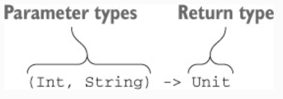

# Chapter 8. Higher-order functions: lambdas as parameters and return values

* This chapter covers 
  * Function types 
  * Higher-order functions and their use for structuring code 
  * Inline functions 
  * Non-local returns and labels 
  * Anonymous functions

* In this chapter, you’ll learn how to create **higher-order functions** — your own functions that take lambdas as 
arguments or return them. You’ll see how higher-order functions can help simplify your code, remove code duplication, 
and build nice abstractions. You’ll also become acquainted with **inline functions** — a powerful Kotlin feature that 
removes the performance overhead associated with using lambdas and enables more flexible control flow within lambdas.

---

## 8.1. Declaring higher-order functions

* The key new idea of this chapter is the concept of **higher-order functions**. By definition, a higher-order function 
is a function that takes another function as an argument or returns one. In Kotlin, functions can be represented as 
values using lambdas or function references. Therefore, a higher-order function is any function to which you can pass a 
lambda or a function reference as an argument, or a function which returns one, or both. For example, the `filter` 
standard-library function takes a predicate function as an argument and is therefore a higher-order function.

* Now you’ll learn how you can declare such functions in your own code. To do this, you must first be introduced 
to **function types**.

### 8.1.1. Function types

* First you need to know how to declare the type of the corresponding parameter. Before we get to this, let’s look at a 
simpler case and store a lambda in a local variable. 

> ✅ Ex_8_1.kt (8.1.1)

* The compiler infers that both the sum and action variables have function types.

* To declare a function type, you put the function parameter types in parentheses, followed by an arrow and the return 
type of the function

> Figure 8.1. Function-type syntax in Kotlin.

* As you remember, the `Unit` type is used to specify that a function returns no meaningful value. The `Unit` return 
type can be omitted when you declare a regular function, but a function type declaration always requires an explicit 
return type, so you can’t omit `Unit` in this context.

* Note how you can omit the types of the parameters `x`, `y` in the lambda expression `{ x, y -> x + y }`. Because 
they’re specified in the function type as part of the variable declaration, you don’t need to repeat them in the 
lambda itself.

* The return type of a function type can be marked as nullable.

* You can also define a nullable variable of a function type. To specify that the variable itself, rather than the 
return type of the function, is nullable, you need to enclose the entire function type definition in parentheses and put 
the question mark after the parentheses.

* You can specify names for parameters of a function type.

* Parameter names don’t affect type matching. But the names improve readability of the code and can be used in the IDE 
for code completion.

### 8.1.2. Calling functions passed as arguments

* Let’s discuss how to implement a higher-order function.

> ✅ Ex_8_1.kt (8.1.2)

* The syntax for calling the function passed as an argument is the same as calling a regular function: you put the 
parentheses after the function name, and you put the parameters inside the parentheses.

> Figure 8.2. Declaration of the filter function, taking a predicate as a parameter.

* The `filter` function takes a predicate as a parameter. The type of `predicate` is a function that takes a character 
parameter and returns a `boolean` result. The result is `true` if the character passed to the predicate needs to be 
present in the resulting string, or `false` otherwise.

### 8.1.3. Using function types from Java

* Under the hood, function types are declared as regular interfaces: a variable of a function type is an implementation 
of a `FunctionN` interface. The Kotlin standard library defines a series of interfaces, corresponding to different 
numbers of function arguments: `Function0<R>` (this function takes no arguments), `Function1<P1, R>` (this function 
takes one argument), and so on. Each interface defines a single `invoke` method, and calling it will execute the 
function. A variable of a function type is an instance of a class implementing the corresponding `FunctionN` interface, 
with the `invoke` method containing the body of the lambda.

> ✅ Ex_8_1.kt (8.1.3)

* Kotlin functions that use function types can be called easily from Java. Java 8 lambdas are automatically converted 
to values of function types.

* In older Java versions, you can pass an instance of an anonymous class implementing the `invoke` method from the 
corresponding function interface.

### 8.1.4. Default and null values for parameters with function types

* This implementation of the `joinToString` is flexible, but it doesn’t let you control one key aspect of the 
conversion: how individual values in the collection are converted to strings. The code uses 
`StringBuilder.append(o: Any?)`, which always converts the object to a string using the `toString` method. This is good 
in a lot of cases, but not always. You now know that you can pass a lambda to specify how values are converted into 
strings. But requiring all callers to pass that lambda would be cumbersome, because most of them are OK with the default 
behavior. To solve this, you can define a parameter of a function type and specify a default value for it as a lambda.

> ✅ Ex_8_1.kt (8.1.4)

* An alternative approach is to declare a parameter of a nullable function type. Note that you can’t call the function 
passed in such a parameter directly: Kotlin will refuse to compile such code, because it detects the possibility of null 
pointer exceptions in this case. One option is to check for `null` explicitly.

* A shorter version makes use of the fact that a function type is an implementation of an interface with an `invoke` 
method. As a regular method, invoke can be called through the safe-call syntax: `callback?.invoke()`.

### 8.1.5. Returning functions from functions

* The requirement to return a function from another function doesn’t come up as often as passing functions to other 
functions, but it’s still useful. For instance, imagine a piece of logic in a program that can vary depending on the 
state of the program or other conditions — for example, calculating the cost of shipping depending on the selected 
shipping method. You can define a function that chooses the appropriate logic variant and returns it as another 
function.

> ✅ Ex_8_1.kt (8.1.5)

* To declare a function that returns another function, you specify a function type as its return type. To return a 
function, you write a `return` expression followed by a lambda, a member reference, or another expression of a function 
type, such as a local variable.

### 8.1.6. Removing duplication through lambdas

* Function types and lambda expressions together constitute a great tool to create reusable code. Many kinds of code 
duplication that previously could be avoided only through cumbersome constructions can now be eliminated by using 
succinct lambda expressions.

> ✅ Ex_8_1.kt (8.1.6)

* Function types can help eliminate code duplication. If you’re tempted to copy and paste a piece of the code, it’s 
likely that the duplication can be avoided. With lambdas, you can extract not only the data that’s repeated, but the 
behavior as well.

* Some well-known design patterns can be simplified using function types and lambda expressions. Let’s consider the 
**Strategy pattern**, for example. Without lambda expressions, it requires you to declare an interface with several 
implementations for each possible strategy. With function types in your language, you can use a general function type 
to describe the strategy, and pass different lambda expressions as different strategies.

---

## 8.2. Inline functions: removing the overhead of lambdas

* You’ve probably noticed that the shorthand syntax for passing a lambda as an argument to a function in Kotlin looks 
similar to the syntax of regular statements such as if and for. But what about performance? Aren’t we creating 
unpleasant surprises by defining functions that look exactly like Java statements but run much more slowly?

* In chapter 5, we explained that lambdas are normally compiled to anonymous classes. But that means every time you use 
a lambda expression, an extra class is created; and if the lambda captures some variables, then a new object is created 
on every invocation. This introduces runtime overhead, causing an implementation that uses a lambda to be less efficient 
than a function that executes the same code directly.

* Could it be possible to tell the compiler to generate code that’s as efficient as a Java statement and yet lets you 
extract the repeated logic into a library function? Indeed, the Kotlin compiler allows you to do that. If you mark a 
function with the `inline` modifier, the compiler won’t generate a function call when this function is used and instead 
will replace every call to the function with the actual code implementing the function.

### 8.2.1. How inlining works

* When you declare a function as `inline`, its body is inlined—in other words, it’s substituted directly into places 
where the function is called instead of being invoked normally.

> ✅ Ex_8_2.kt (8.2.1)

* The function above can be used to ensure that a shared resource isn’t accessed concurrently by multiple threads. The 
function locks a `Lock` object, executes the given block of code, and then releases the lock.

* The syntax for calling this function looks exactly like using the `synchronized` statement in Java. The difference is 
that the Java `synchronized` statement can be used with any object, whereas this function requires you to pass a Lock 
instance. The definition shown here is just an example; the Kotlin standard library defines a different version of 
`synchronized` that accepts any object as an argument.

* Because you’ve declared the `synchronized` function as `inline`, the code generated for every call to it is the same 
as for a `synchronized` statement in Java.

> Figure 8.3. The compiled version of the `foo` function.

* Note that the inlining is applied to the lambda expression as well as the implementation of the `synchronized` 
function. The bytecode generated from the lambda becomes part of the definition of the calling function and isn’t 
wrapped in an anonymous class implementing a function interface.

* Note that it’s also possible to call an inline function and pass the parameter of a function type from a variable.

> Figure 8.4. The `runUnderLock` function.

* In this case, the lambda’s code isn’t available at the site where the inline function is called, and therefore it 
isn’t inlined. Only the body of the `synchronized` function is inlined; the lambda is called as usual. The 
`runUnderLock` function will be compiled to bytecode similar to the following function: 

> Figure 8.5. The compiled version of the `runUnderLock` function.

* If you have two uses of an inline function in different locations with different lambdas, then every call site will be 
inlined independently. The code of the inline function will be copied to both locations where you use it, with different 
lambdas substituted into it.

### 8.2.2. Restrictions on inline functions

* Due to the way inlining is performed, not every function that uses lambdas can be inlined. When the function is 
inlined, the body of the lambda expression that’s passed as an argument is substituted directly into the resulting code. 
That restricts the possible uses of the corresponding parameter in the function body. If this parameter is called, such 
code can be easily inlined. But if the parameter is stored somewhere for further use, the code of the lambda expression 
can’t be inlined, because there must be an object that contains this code.

* Generally, the parameter can be inlined if it’s called directly or passed as an argument to another inline function. 
Otherwise, the compiler will prohibit the inlining of the parameter with an error message that says “Illegal usage of 
inline-parameter.”

* If you have a function that expects two or more lambdas as arguments, you may choose to inline only some of them. 
This makes sense when one of the lambdas is expected to contain a lot of code or is used in a way that doesn’t allow 
inlining. You can mark the parameters that accept such non-inlineable lambdas with the `noinline` modifier.

* Note that the compiler fully supports inlining functions across modules, or functions defined in third-party 
libraries. You can also call most inline functions from Java; such calls will not be inlined, but will be compiled as 
regular function calls.

### 8.2.3. Inlining collection operations

* Let’s consider the performance of Kotlin standard library functions that work on collections. Most of the collection 
functions in the standard library take lambda expressions as arguments. Would it be more efficient to implement these 
operations directly, instead of using the standard library functions?

* In Kotlin, the `filter` function is declared as inline. It means the bytecode of the `filter` function, together with 
the bytecode of the lambda passed to it, will be inlined where `filter` is called. You can safely use idiomatic 
operations on collections, and Kotlin’s support for inline functions ensures that you don’t need to worry about 
performance.

* Imagine now that you apply two operations, `filter` and `map`, in a chain. This example uses a lambda expression and 
a member reference. Once again, both `filter` and `map` are declared as `inline`, so their bodies are inlined, and no 
extra classes or objects are created. But the code creates an intermediate collection to store the result of filtering 
the list. The code generated from the `filter` function adds elements to that collection, and the code generated from 
`map` reads from it.

* If the number of elements to process is large, and the overhead of an intermediate collection becomes a concern, you 
can use a sequence instead, by adding an `asSequence` call to the chain. But as you saw in the previous section, 
lambdas used to process a sequence aren’t inlined. Each intermediate sequence is represented as an object storing a 
lambda in its field, and the terminal operation causes a chain of calls through each intermediate sequence to be 
performed. Therefore, even though operations on sequences are lazy, you shouldn’t strive to insert an `asSequence` call 
into every chain of collection operations in your code. This helps only for large collections; smaller ones can be 
processed nicely with regular collection operations.

### 8.2.4. Deciding when to declare functions as inline

* Using the `inline` keyword is likely to improve performance only with functions that take lambdas as arguments; all 
other cases require additional measuring and investigation.

* For regular function calls, the JVM already provides powerful inlining support. It analyzes the execution of your code 
and inlines calls whenever doing so provides the most benefit. This happens automatically while translating bytecode to 
machine code. In bytecode, the implementation of each function is repeated only once and doesn’t need to be copied to 
every place where the function is called, as with Kotlin’s `inline` functions. What’s more, the stacktrace is clearer if 
the function is called directly.

* On the other hand, inlining functions with lambda arguments is beneficial. First, the overhead you avoid through 
inlining is more significant. You save not only on the call, but also on the creation of the extra class for each lambda 
and an object for the lambda instance. Second, the JVM currently isn’t smart enough to always perform inlining through 
the call and the lambda. Finally, inlining lets you use features that are impossible to make work with regular lambdas, 
such as non-local returns, which we’ll discuss later in this chapter.

* But you should still pay attention to the code size when deciding whether to use the `inline` modifier. If the 
function you want to inline is large, copying its bytecode into every call site could be expensive in terms of bytecode 
size. In that case, you should try to extract the code not related to the lambda arguments into a separate non-inline 
function. You can verify for yourself that the `inline` functions in the Kotlin standard library are always small.

### 8.2.5. Using inlined lambdas for resource management

* One common pattern where lambdas can remove duplicate code is resource management: acquiring a resource before an 
operation and releasing it afterward. _Resource_ here can mean many different things: a file, a lock, a database 
transaction, and so on. The standard way to implement such a pattern is to use a `try/finally` statement in which the 
resource is acquired before the `try` block and released in the `finally` block.

* Files are another common type of resource where this pattern is used. Java 7 has even introduced special syntax for 
this pattern: the try-with-resources statement. The following listing shows a Java method that uses this statement to 
read the first line from a file.

> Figure 8.6. Using try-with-resources in Java.

* Kotlin doesn’t have equivalent syntax, because the same task can be accomplished almost as seamlessly through a 
function with a parameter of a function type (that expects a lambda as an argument). The function is called `use` and is 
included in the Kotlin standard library. Here’s how you can use this function in Kotlin.

> ✅ Ex_8_2.kt (8.2.5)

* The `use` function is an extension function called on a closable resource; it receives a lambda as an argument. The 
function calls the lambda and ensures that the resource is closed, regardless of whether the lambda completes normally 
or throws an exception. Of course, the `use` function is inlined, so its use doesn’t incur any performance overhead.

* Note that in the body of the lambda, you use a non-local return to `return` a value from the `readFirstLineFromFile` 
function. Let’s discuss the use of `return` expressions in lambdas in detail.

---

## 8.3. Control flow in higher-order functions

* When you start using lambdas to replace imperative code constructs such as loops, you quickly run into the issue of 
`return` expressions. Putting a `return` statement in the middle of a loop is a no-brainer. But what if you convert the 
loop into the use of a function such as `filter`? How does `return` work in that case? Let’s look at some examples.

### 8.3.1. Return statements in lambdas: return from an enclosing function

* We’ll compare two different ways of iterating over a collection. In the following listing, it’s clear that if the 
person’s name is Alice, you return from the function `lookForAlice`.

> ✅ Ex_8_3.kt (8.3.1)

* Is it safe to rewrite this code using `forEach` iteration? Will the `return` statement mean the same thing? Yes, it’s safe to use the forEach function instead.

* If you use the `return` keyword in a lambda, it **returns from the function in which you called the lambda**, not just 
from the lambda itself. Such a `return` statement is called a **non-local return**, because it returns from a larger 
block than the block containing the `return` statement.

* To understand the logic behind the rule, think about using a `return` keyword in a `for` loop or a `synchronized` 
block in a Java method. It’s obvious that it returns from the function and not from the loop or block. Kotlin allows you 
to preserve the same behavior when you switch from language features to functions that take lambdas as arguments.

* Note that the return from the outer function is possible 
**only if the function that takes the lambda as an argument is inlined**. The body of the `forEach` function is inlined 
together with the body of the lambda, so it’s easy to compile the `return` expression so that it returns from the 
enclosing function. Using the `return` expression in lambdas passed to non-inline functions isn’t allowed. A non-inline 
function can save the lambda passed to it in a variable and execute it later, when the function has already returned, so 
it’s too late for the lambda to affect when the surrounding function returns.

### 8.3.2. Returning from lambdas: return with a label

* You can write a **local** return from a lambda expression as well. A local return in a lambda is similar to a `break` 
expression in a `for` loop. It stops the execution of the lambda and continues execution of the code from which the 
lambda was invoked. To distinguish a local return from a non-local one, you use **labels**. You can label a lambda 
expression from which you want to return, and then refer to this label after the `return` keyword.

> ✅ Ex_8_3.kt (8.3.2)

* To label a lambda expression, put the label name (which can be any identifier), followed by the `@` character, before 
the opening curly brace of the lambda. To return from a lambda, put the `@` character followed by the label name after 
the `return` keyword.

> Figure 8.7. Returns from a lambda use the “`@`” character to mark a label.

* Alternatively, the name of the function that takes this lambda as an argument can be used as a label.

* Note that if you specify the label of the lambda expression explicitly, labeling using the function name doesn’t work. 
A lambda expression can’t have more than one label.

* The same rules apply to the labels of `this` expressions. If you specify the label of a lambda with a receiver, you 
can access its implicit receiver using the corresponding labeled `this` expression.

* As with labels for return expressions, you can specify the label of the lambda expression explicitly or use the 
function name instead.

* The non-local return syntax is fairly verbose and becomes cumbersome if a lambda contains multiple return expressions. 
As a solution, you can use an alternate syntax to pass around blocks of code: anonymous functions.

### 8.3.3. Anonymous functions: local returns by default

* You can see that an anonymous function looks similar to a regular function, except that its name and parameter types 
are omitted.

* Anonymous functions follow the same rules as regular functions for specifying the return type. Anonymous functions 
with a block body, require the return type to be specified explicitly. If you use an expression body, you can omit the 
return type.

* Inside an anonymous function, a `return` expression without a label returns from the anonymous function, not from the 
enclosing one. The rule is simple: `return` **returns from the closest function declared using the** `fun` **keyword**. 
Lambda expressions don’t use the `fun` keyword, so a `return` in a lambda returns from the outer function. Anonymous 
functions do use `fun`; therefore, in the previous example, the anonymous function is the closest matching function. 
Consequently, the `return` expression returns from the anonymous function, not from the enclosing one.

> Figure 8.8. The return expression returns from the function declared using the `fun` keyword.

* Note that despite the fact that an anonymous function looks similar to a regular function declaration, it’s another 
syntactic form of a lambda expression. The discussion of how lambda expressions are implemented and how they’re inlined 
for inline functions applies to anonymous functions as well.

---

## 8.4. Summary

* Function types allow you to declare a variable, parameter, or function return value that holds a reference to a 
function. 
* Higher-order functions take other functions as arguments or return them. You can create such functions by using a 
function type as the type of a function parameter or return value. 
* When an inline function is compiled, its bytecode along with the bytecode of a lambda passed to it is inserted 
directly into the code of the calling function, which ensures that the call happens with no overhead compared to similar 
code written directly. 
* Higher-order functions facilitate code reuse within the parts of a single component and let you build powerful generic 
libraries. 
* Inline functions allow you to use **non-local returns** — return expressions placed in a lambda that return from the 
enclosing function. 
* Anonymous functions provide an alternative syntax to lambda expressions with different rules for resolving the 
`return` expressions. You can use them if you need to write a block of code with multiple exit points.