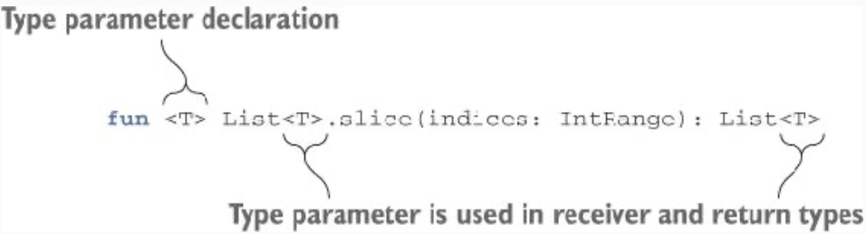
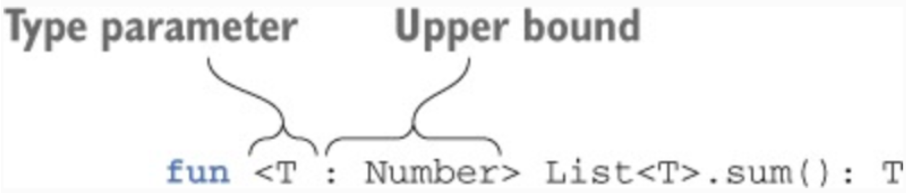
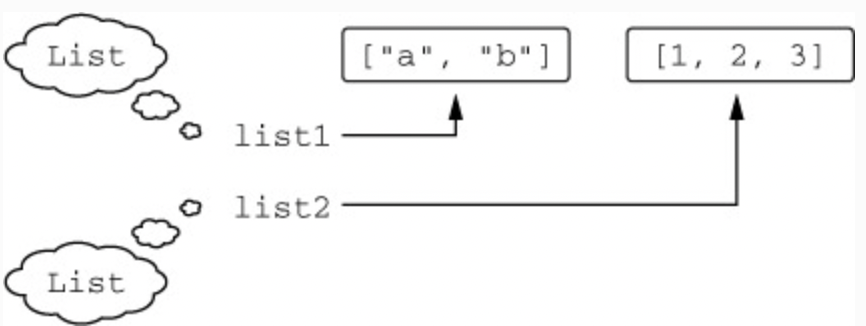
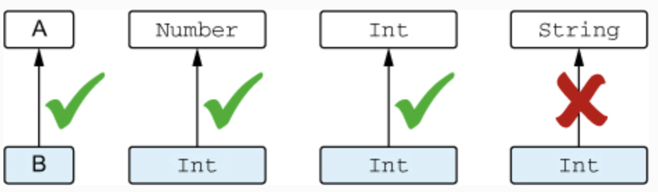
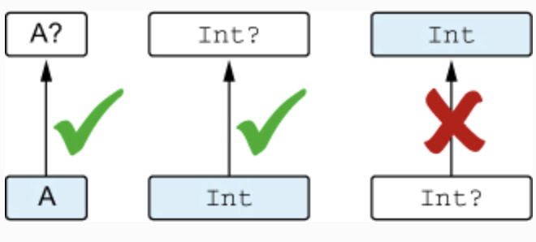
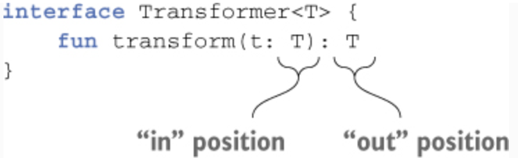
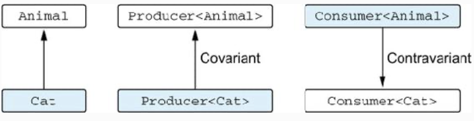
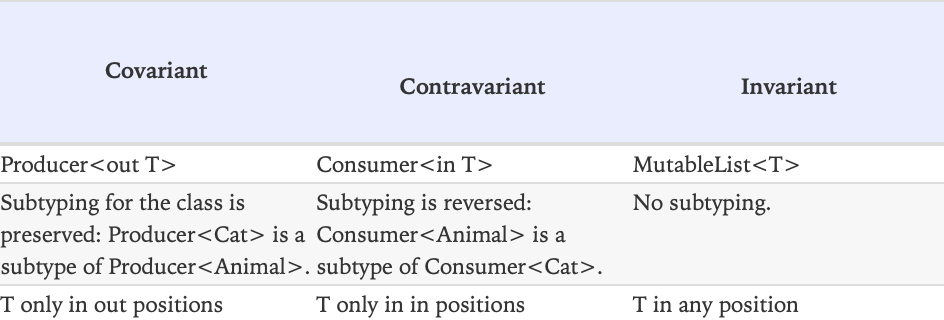
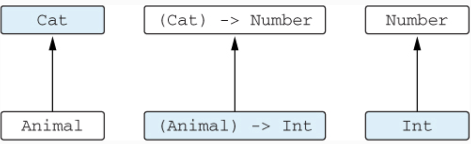

# Chapter 9. Generics

* This chapter covers 
  * Declaring generic functions and classes 
  * Type erasure and reified type parameters 
  * Declaration-site and use-site variance

* You’ve already seen a few code examples that use generics in this book. The basic concepts of declaring and using 
generic classes and functions in Kotlin are similar to Java, so the earlier examples should have been clear without a 
detailed explanation.

* We’ll then go deeper into the topic of generics and explore new concepts introduced in Kotlin, such as reified type 
parameters and declaration-site variance.

* **Reified type parameters** allow you to refer at runtime to the specific types used as type arguments in an inline 
function call. (For normal classes or functions, this isn’t possible, because type arguments are erased at runtime.)

* **Declaration-site variance** lets you specify whether a generic type with a type argument is a subtype or a 
supertype of another generic type with the same base type and a different type argument. For example, it regulates 
whether it’s possible to pass arguments of type `List<Int>` to functions expecting `List<Any>`. **Use-site variance** 
achieves the same goal for a specific use of a generic type and therefore accomplishes the same task as Java’s 
wildcards.

---

## 9.1. Generic type parameters

* Generics allow you to define types that have **type parameters**. When an instance of such a type is created, type 
parameters are substituted with specific types called **type arguments**. For example, if you have a variable of type 
`List`, it’s useful to know what kind of things are stored in that list. The type parameter lets you specify exactly 
that — instead of “This variable holds a list,” you can say something like “This variable holds a list of strings.” 
Kotlin’s syntax for saying “a list of strings” looks the same as in Java: `List<String>`. You can also declare multiple 
type parameters for a class. For example, the `Map` class has type parameters for the key type and the value type: 
`class Map<K, V>`. We can instantiate it with specific arguments: `Map<String, Person>`. So far, everything looks 
exactly as it does in Java.

* Just as with types in general, type arguments can often be inferred by the Kotlin compiler.

* If the two values passed to the `listOf` function are both strings, the compiler infers that you’re creating a 
`List<String>`. On the other hand, if you need to create an empty list, there’s nothing from which to infer the type 
argument, so you need to specify it explicitly.

* Unlike Java, Kotlin always requires type arguments to be either specified explicitly or inferred by the compiler. 
Because generics were added to Java only in version 1.5, it had to maintain compatibility with code written for older 
versions, so it allows you to use a generic type without type arguments — a so-called **raw type**. For example, in 
Java, you can declare a variable of type `List` without specifying what kind of things it contains. Because Kotlin has 
had generics from the beginning, it doesn’t support raw types, and the type arguments must always be defined.

### 9.1.1. Generic functions and properties

* If you’re going to write a function that works with a list, and you want it to work with any list (a generic one), 
not a list of elements of a specific type, you need to write a **generic function**. A generic function has type 
parameters of its own. These type parameters must be replaced with the specific type arguments on each function 
invocation.

* Most of the library functions working with collections are generic. For example, let’s look at the `slice` function 
declaration:


> Figure 9.1. The generic function `slice` has the type parameter `T`.

* The function’s type parameter `T` is used in the receiver type and in the return type; both of them are `List<T>`. 
When you call such a function on a specific list, you can specify the type argument explicitly. But in almost all cases 
you don’t need to, because the compiler infers it.

> ✅ Ex_9_1.kt (9.1.1)

* You can declare type parameters on methods of classes or interfaces, top-level functions, and extension functions.

* You can also declare generic extension properties using the same syntax.

* Regular (non-extension) properties **can’t have type parameters**. It’s not possible to store multiple values of 
different types in a property of a class, and therefore declaring a generic non-extension property doesn’t make sense. 
If you try to do that, the compiler reports an error:

```kotlin
val <T> x: T = TODO()
// ERROR: type parameter of a property must be used in its receiver type
```

### 9.1.2. Declaring generic classes

* Just as in Java, you declare a Kotlin generic class or interface by putting angle brackets after the class name and 
the type parameters in the angle brackets. Once you do that, you can use the type parameters in the body of the class, 
just like any other types. Let’s look at how the standard Java interface `List` can be declared in Kotlin.

```kotlin
// The List interface defines a type parameter T
interface List<T> {
    operator fun get(index: Int): T // T can be used as a regular type in an interface or a class
    // ...
}
```

* If your class extends a generic class (or implements a generic interface), you have to provide a type argument for 
the generic parameter of the base type. It can be either a specific type or another type parameter.

```kotlin
// This class implements List, providing a specific type argument: String
class StringList: List<String> {
    override fun get(index: Int): String = ...
}

// Now the generic type parameter T of ArrayList is a type argument for List
class ArrayList<T>: List<T> {
    override fun get(index: Int): T = ...
}
```

* A class can even refer to itself as a type argument. Classes implementing the `Comparable` interface are the 
classical example of this pattern. Any comparable element must define how to compare it with objects of the same type.

```kotlin
interface Comparable<T> {
  fun compareTo(other: T): Int
}

class StringExample: Comparable<String> {
  override fun compareTo(other: String): Int = /* .. */
}
```

### 9.1.3. Type parameter constraints

* **Type parameter constraints** let you restrict the types that can be used as type arguments for a class or function. 
For example, consider a function that calculates the sum of elements in a list. It can be used on a `List<Int>` or a 
`List<Double>`, but not, for example, a `List<String>`. To express this, you can define a type parameter constraint 
that specifies that the type parameter of `sum` must be a number.

* When you specify a type as an **upper bound** constraint for a type parameter of a generic type, the corresponding 
type arguments in specific instantiations of the generic type must be either the specified type or its subtypes.

* To specify a constraint, you put a colon after the type parameter name, followed by the type that’s the upper bound 
for the type parameter. In Java, you use the keyword `extends` to express the same concept: 
`<T extends Number> T sum(List<T> list)`.


> Figure 9.2. Constraints are defined by specifying an upper bound after a type parameter.

> ✅ Ex_9_1.kt (9.1.3)

* Once you’ve specified a bound for a type parameter `T`, you can use values of type `T` as values of its upper bound.

* In the rare case when you need to specify multiple constraints on a type parameter, you use a slightly different 
syntax. For example, the example with function `ensureTrailingPeriod` is a generic way to ensure that the given 
`CharSequence` has a period at the end. It works with both the standard `StringBuilder` class and the 
`java.nio.CharBuffer` class.

* In this case, you specify that the type used as a type argument must implement both the `CharSequence` and 
`Appendable` interfaces. This means both the operations accessing the data (`endsWith`) as well as the operation 
modifying it (`append`) can be used with values of that type.

### 9.1.4. Making type parameters non-null

* If you declare a generic class or function, any type arguments, including nullable ones, can be substituted for its 
type parameters. In effect, a type parameter with no upper bound specified will have the upper bound of `Any?`.

> ✅ Ex_9_1.kt (9.1.4)

* In the `process` function, the parameter `value` is nullable, even though `T` isn’t marked with a question mark. This 
is the case because specific instantiations of the `Processor` class can use a nullable type for `T`.

* If you want to guarantee that a non-`null` type will always be substituted for a type parameter, you can achieve this 
by specifying a constraint. If you don’t have any restrictions other than nullability, you can use `Any` as the upper 
bound, replacing the default `Any?`.

* The `<T : Any>` constraint ensures that the `T` type will always be a non-nullable type.

* Note that you can make a type parameter non-`null` by specifying any non-`null` type as an upper bound, not only the 
type `Any`.

---

## 9.2. Generics at runtime: erased and reified type parameters

* As you probably know, generics on the JVM are normally implemented through type erasure, meaning the type arguments 
of an instance of a generic class aren’t preserved at runtime. In this section, we’ll discuss the practical 
implications of type erasure for Kotlin, and how you can get around its limitations by declaring a function as 
`inline`. You can declare an `inline` function so that its type arguments aren’t erased (or, in Kotlin terms, are
reified). We’ll discuss reified type parameters in detail and look at examples when they’re useful.

### 9.2.1. Generics at runtime: type checks and casts

* Just as in Java, Kotlin’s generics are **erased** at runtime. This means an instance of a generic class doesn’t carry 
information about the type arguments used to create that instance. For example, if you create a `List<String>` and put 
a bunch of strings into it, at runtime you’ll only be able to see that it’s a `List`. It’s not possible to identify 
which type of elements the list was intended to contain. (Of course, you can get an element and check its type, but 
that won’t give you any guarantees, because other elements may have different types.)


> Figure 9.3. At runtime, you don’t know whether `list1` and `list2` were declared as lists of strings or integers. Each of them is just `List`.

* Even though the compiler sees two distinct types for the lists, at execution time they look exactly the same. Despite 
that, you can normally be sure that a `List<String>` contains only strings and a `List<Int>` contains only integers, 
because the compiler knows the type arguments and ensures that only elements of the correct type are stored in each 
list. (You can deceive the compiler through type casts or by using Java raw types to access the list, but you need to 
make a special effort to do that.)

* Let’s talk next about the constraints that go with erasing the type information. Because type arguments aren’t 
stored, you can’t check them — for example, you can’t check whether a list is a list of strings rather than other 
objects. As a general rule, it’s not possible to use types with type arguments in `is` checks.

```kotlin
if (value is List<String>) { /*...*/ }
// ERROR: Cannot check for instance of erased type
```

* Even though it’s perfectly possible to find out at runtime that value is a `List`, you can’t tell whether it’s a list 
of strings, persons, or something else: that information has been erased. Note that erasing generic type information 
has its benefits: the overall amount of memory used by your application is smaller, because less type information needs 
to be saved in memory.

* You may wonder how to check that the value is a list, rather than a set or another object. You can do that by using 
the special **star projection** syntax:

```kotlin
if (value is List<*>) { /*...*/ }
```

* Effectively, you need to include a `*` for every type parameter the type has.

* Note that you can still use normal generic types in `as` and `as?` casts. But the cast won’t fail if the class has 
the correct base type and a wrong type argument, because the type argument isn’t known at runtime when the cast is 
performed. Because of that, the compiler will emit an “unchecked cast” warning on such a cast. It’s only a warning, so 
you can later use the value as having the necessary type.

> ✅ Ex_9_2.kt (9.2.1)

* Let’s discuss the exception that’s thrown if you call the `printSum` function on a list of strings. You don’t get an 
`IllegalArgumentException`, because you can’t check whether the argument is a `List<Int>`. Therefore the cast succeeds, 
and the function `sum` is called on such a list anyway. During its execution, an exception is thrown. This happens 
because the function tries to get `Number` values from the list and add them together. An attempt to use a `String` as 
a `Number` results in a `ClassCastException` at runtime.

* Note that the Kotlin compiler is smart enough to allow `is` checks when the corresponding type information is already 
known at compile time.

* Generally, the Kotlin compiler takes care of letting you know which checks are dangerous (forbidding `is` checks and 
emitting warnings for `as` casts) and which are possible. You just have to know the meaning of those warnings and 
understand which operations are safe.

* As we already mentioned, Kotlin does have a special construct that allows you to use specific type arguments in the 
body of a function, but that’s only possible for `inline` functions. Let’s look at this feature.

### 9.2.2. Declaring functions with reified type parameters

* When you call a generic function, in its body you can’t determine the type arguments it was invoked with:

```kotlin
fun <T> isA(value: Any) = value is T
// Error: Cannot check for instance of erased type: T
```

* This is true in general, but there’s one case where this limitation can be avoided: inline functions. Type parameters 
of inline functions can be reified, which means you can refer to actual type arguments at runtime.

* If you declare the previous `isA` function as `inline` and mark the type parameter as `reified`, you can check 
`value` to see whether it’s an instance of `T`.

> ✅ Ex_9_2.kt (9.2.2)

* One of the simplest examples where reified type parameters come into play is the `filterIsInstance` standard library 
function. The function takes a collection, selects instances of the specified class, and returns only those instances.

* In this case, **the type argument is known at runtime**, and `filterIsInstance` uses it to check which values in the 
list are instances of the class specified as the type argument.

* How does this work? Why are you allowed to write `element is T` in `inline` function but not in a regular class or 
function?

* The compiler inserts the bytecode implementing the inline function into every place where it’s called. Every time you 
call the function with a reified type parameter, the compiler knows the exact type used as the type argument in that 
particular call. Therefore, the compiler can generate the bytecode that references the specific class used as a type 
argument. In effect, for the `filterIsInstance<String>` call, the generated code will be equivalent to the following:

```kotlin
for (element in this) {
    if (element is String) { // References a specific class
        destination.add(element)
    }
}
```

* Because the generated bytecode references a specific class, not a type parameter, it isn’t affected by the 
type-argument erasure that happens at runtime.

* Note that `inline` function with `reified` type parameters can’t be called from Java code. Normal inline functions 
are accessible to Java as regular functions — they can be called but aren’t inlined. Functions with reified type 
parameters require additional processing to substitute the type argument values into the bytecode, and therefore they 
must always be inlined. This makes it impossible to call them in a regular way, as the Java code does.

* An inline function can have multiple reified type parameters, and it can have non-reified type parameters in addition 
to the reified ones. Note that the `filterIsInstance` function is marked as `inline` even though it doesn’t expect any 
lambdas as arguments. You’re doing it to enable the use of reified type parameters.

* To ensure good performance, you still need to keep track of the size of the function marked as `inline`. If the 
function becomes large, it’s better to extract the code that doesn’t depend on the reified type parameters into 
separate non-inline functions.

### 9.2.3. Replacing class references with reified type parameters

* One common use case for reified type parameters is building adapters for APIs that take parameters of type 
`java.lang.Class`. An example of such an API is `ServiceLoader` from the JDK, which takes a `java.lang.Class` 
representing an interface or an abstract class and returns an instance of a service class implementing that interface. 
Let’s look at how you can use reified type parameters to make those APIs simpler to call.

```kotlin
val serviceImpl = ServiceLoader.load(Service::class.java)
```

* The `::class.java` syntax shows how you can get a `java.lang.Class` corresponding to a Kotlin class. This is an exact 
equivalent of `Service.class` in Java.

* Now let’s rewrite this example using a function with a reified type parameter:

```kotlin
val serviceImpl = loadService<Service>()
```

* Specifying a class as a type argument is easier to read because it’s shorter than the `::class.java` syntax you need 
to use otherwise.

```kotlin
inline fun <reified T> loadService() { // The type parameter is marked as "reified"
    return ServiceLoader.load(T::class.java) // Access the class of the type parameter as T::class
}
```

* You can use the same `::class.java` syntax on reified type parameters that you can use on regular classes. Using this 
syntax gives you the `java.lang.Class` corresponding to the class specified as the type parameter, which you can then 
use normally.

* Another example. Instead of passing the class of the android activity as a `java.lang.Class`, you can also use a 
reified type parameter:

```kotlin
inline fun <reified T : Activity> Context.startActivity() { // The type parameter is marked as "reified"
    val intent = Intent(this, T::class.java) // Access the class of the type parameter as T::class
    startActivity(intent)
}

startActivity<DetailActivity>() // Invokes the method to show an activity
```

### 9.2.4. Restrictions on reified type parameters

* How you can use a reified type parameter:
  * In type checks and casts (`is`, `!is`, `as`, `as?`)
  * To use the Kotlin reflection APIs (`::class`)
  * To get the corresponding `java.lang.Class` (`::class.java`)
  * As a type argument to call other functions

* You can’t do the following:
  * Create new instances of the class specified as a type parameter 
  * Call methods on the companion object of the type parameter class 
  * Use a non-reified type parameter as a type argument when calling a function with a reified type parameter 
  * Mark type parameters of classes, properties, or non-inline functions as `reified`

* The last constraint leads to an interesting consequence: because reified type parameters can only be used in inline 
functions, using a reified type parameter means the function along with all the lambdas passed to it are inlined. If 
the lambdas can’t be inlined because of the way the inline function uses them, or if you don’t want them to be inlined 
for performance reasons, you can use the `noinline` modifier to mark them as non-inlineable.

---

## 9.3. Variance: generics and subtyping

* The concept of **variance** describes how types with the same base type and different type arguments relate to each 
other: for example, `List<String>` and `List<Any>`.

### 9.3.1. Why variance exists: passing an argument to a function

* Imagine that you have a function that takes a `List<Any>` as an argument. Is it safe to pass a variable of type 
`List<String>` to this function? It’s definitely safe to pass a string to a function expecting `Any`, because the 
`String` class extends `Any`. But when `Any` and `String` become type arguments of the `List` interface, it’s not so 
clear any more.

```kotlin
fun printContents(list: List<Any>) {
    println(list.joinToString())
}

printContents(listOf("abc", "bac"))
// abc, bac
```

* It looks like a list of strings works fine here. The function treats each element as `Any`, and because every string 
is `Any`, it’s totally safe.

```kotlin
fun addAnswer(list: MutableList<Any>) {
    list.add(42)
}
```

* Can anything bad happen if you pass a list of strings to this function?

```kotlin
val strings = mutableListOf("abc", "bac") 
addAnswer(strings) // If this line compiled...
println(strings.maxByOrNull { it.length }) // ... you'd get an exception at runtime
```

* You declare a variable `strings` of type `MutableList<String>`. Then you try to pass it to the function. If the 
compiler accepted it, you’d be able to add an integer to a list of strings, which would then lead to a runtime 
exception when you tried to access the contents of the list as strings. Because of that, this call doesn’t compile. 
This example shows that it’s not safe to pass a `MutableList<String>` as an argument when a `MutableList<Any>` is 
expected; the Kotlin compiler correctly forbids that.

* It’s not safe if the function adds or replaces elements in the list, because this creates the possibility of type 
inconsistencies. It’s safe otherwise (we’ll discuss why in more detail later in this section). In Kotlin, this can be 
easily controlled by choosing the right interface, depending on whether the list is mutable. If a function accepts a 
read-only list, you can pass a `List` with a more specific element type. If the list is mutable, you can’t do that.

### 9.3.2. Classes, types, and subtypes

* The type of a variable specifies the possible values for this variable. We’ve sometimes used the terms **type** and 
**class** as equivalent, but they aren’t, and now is the time to look at the difference.

* To get a valid type of the generic class, you have to substitute a specific type as a type argument for the class’s 
type parameter. `List` isn’t a type (it’s a class), but all of the following substitutions are valid types: 
`List<Int>`,`List<String?>`, `List<List<String>>`, and so on. Each generic class produces a potentially infinite number 
of types.

* In order for us to discuss the relation between types, you need to be familiar with the term **subtype**. A type `B` 
is a subtype of a type `A` if you can use the value of the type `B` whenever a value of the type `A` is required. For 
instance, `Int` is a subtype of `Number`, but `Int` isn’t a subtype of `String`.


> Figure 9.4. `B` is a subtype of `A` if you can use it when `A` is expected.

* The term **supertype** is the opposite of **subtype**. If `A` is a subtype of `B`, then `B` is a supertype of `A`.

* The compiler performs this check every time when you assign a value to a variable or pass an argument to a function.

```kotlin
fun test(i: Int) {
    val n: Number = i // Compiles, because Int is a subtype of Number
  
    fun f(s: String) { /*..*/ }
    f(i) // Doesn't compile, because Int isn't a subtype of String
}
```

* Storing a value in a variable is allowed only when the value type is a subtype of the variable type. Passing an 
expression to a function is allowed only when the type of the expression is a subtype of the function parameter type.

* In simple cases, subtype means essentially the same thing as **subclass**. If a class implements an interface, its 
type is a subtype of the interface type: `String` is a subtype of `CharSequence`.


> Figure 9.5. A non-`null` type `A` is a subtype of nullable `A?`, but not vice versa.

* A non-`null` type is a subtype of its nullable version, but they both correspond to one class.

```kotlin
val s: String = "abc"
val t: String? = s // This assignment is legal because String is a subtype of String?
```

* The difference between subclasses and subtypes becomes especially important when we start talking about generic 
types. The question from the previous section of whether it’s safe to pass a variable of type `List<String>` to a 
function expecting `List<Any>` now can be reformulated in terms of subtyping: is `List<String>` a subtype of 
`List<Any>?` You’ve seen why it’s not safe to treat `MutableList<String>` as a subtype of `MutableList<Any>`. Clearly, 
the reverse isn’t true either: `MutableList<Any>` isn’t a subtype of `MutableList<String>`.

* A generic class — for instance, `MutableList` — is called **invariant** on the type parameter if, for any two 
different types `A` and `B`, `MutableList<A>` isn’t a subtype or a supertype of `MutableList<B>`. In Java, all classes 
are invariant (even though specific uses of those classes can be marked as non-invariant).

* The `List` interface in Kotlin represents a read-only collection. If `A` is a subtype of `B`, then `List<A>` is a 
subtype of `List<B>`. Such classes or interfaces are called **covariant**. The next section discusses the concept of 
covariance in detail and explains when it’s possible to declare a class or interface as covariant.

### 9.3.3. Covariance: preserved subtyping relation

* A **covariant** class is a generic class (we’ll use `Producer<T>` as an example) for which the following holds: 
`Producer<A>` is a subtype of `Producer<B>` if `A` is a subtype of `B`. We say that **the subtyping is preserved**. For 
example, `Producer<Cat>` is a subtype of `Producer<Animal>` because `Cat` is a subtype of `Animal`.

* In Kotlin, to declare the class to be covariant on a certain type parameter, you put the `out` keyword before the 
name of the type parameter:

```kotlin
interface Producer<out T> { // This class is declared as covariant on T
    fun produce(): T
}
```

* Marking a type parameter of a class as covariant makes it possible to pass values of that class as function arguments 
and return values when **the type arguments don’t exactly match** the ones in the function definition. For example, 
imagine a function that takes care of feeding a group of animals, represented by the `Herd` class. The type parameter 
of the `Herd` class identifies the type of the animal in the herd.

```kotlin
open class Animal {
    fun feed() { /*...*/ }
}

class Herd<T: Animal> { // The type parameter isn't declared as covariant
    val size: Int get() = ...
    operator fun get(i: Int): T { ... }
}

fun feedAll(animals: Herd<Animal>) {
    for (i in 0 until animals.size) {
        animals[i].feed()
    }
}
```

* Suppose that a user of your code has a herd of cats and needs to take care of them.

```kotlin
class Cat : Animal() { // A Cat is an Animal
    fun cleanLitter() { ... }
}

fun takeCareOfCats(cats: Herd<Cat>) {
  for (i in 0 until cats.size) {
    cats[i].cleanLitter()
    // feedAll(cats) Error: inferred type is Herd<Cat>, but Herd<Animal> was expected
  }
}
```

* If you tried to pass the herd to the `feedAll` function, you’d get a type-mismatch error during compilation. Because 
you don’t use any variance modifier on the `T` type parameter in the `Herd` class, the herd of cats isn’t a subclass of 
the herd of animals. You could use an explicit cast to work around the problem, but that approach is verbose, 
error-prone, and almost never a correct way to deal with a type-mismatch problem.

* Because the `Herd` class has an API similar to `List` and doesn’t allow its clients to add or change the animals in 
the herd, you can make it covariant and change the calling code accordingly.

```kotlin
class Herd<out T : Animals> { // The T parameter is now covariant
    ...
}

fun takeCareOfCats(cats: Herd<Cat>) {
  for (i in 0 until cats.size) {
    cats[i].cleanLitter()
    feedAll(cats) // You don't need a cast
  }
}
```

* You can’t make any class covariant: it would be unsafe. Making the class covariant on a certain type parameter 
constrains the possible uses of this type parameter in the class. To guarantee type safety, it can be used only in 
so-called **out** positions, meaning the class can produce values of type `T` but not consume them.

* Uses of a type parameter in declarations of class members can be divided into `in` and `out` positions. Let’s 
consider a class that declares a type parameter `T` and contains a function that uses `T`. We say that if `T` is used 
as the return type of a function, it’s in the `out` position. In this case, the function **produces** values of type 
`T`. If `T` is used as the type of a function parameter, it’s in the `in` position. Such a function **consumes** values 
of type `T`.


> Figure 9.6. The function parameter type is called `in` position, and the function return type is called `out` position.

* The `out` keyword on a type parameter of the class requires that all methods using `T` have `T` only in `out` 
positions and not in `in` positions. This keyword constrains possible use of `T`, which guarantees safety of the 
corresponding subtype relation.

* As an example, consider the `Herd` class. It uses the type parameter `T` in only one place: in the return value of 
the `get` method.

```kotlin
class Herd<out T : Animal> {
    val size: Int get() = // ...
    operator fun get(i: Int): T { ... } // Uses T as the return type
}
```

* This is an `out` position, which makes it safe to declare the class as covariant. Any code calling `get` on a 
`Herd<Animal>` will work perfectly if the method returns a `Cat`, because `Cat` is a subtype of `Animal`.

* The `out` keyword on the type parameter `T` means two things:
  * The subtyping is preserved (`Producer<Cat>` is a subtype of `Producer<Animal>`). 
  * `T` can be used only in `out` positions.

* `List` is read-only in Kotlin, so it has a method `get` that returns an element of type `T` but doesn’t define any 
methods that store a value of type `T` in the list. Therefore, it’s also covariant.

```kotlin
interface List<out T : Collection<T>> {
    // Read-only interface that defines only methods that return T (so T is in the "out" position)
    operator fun get(index: Int): T
    // ...
}
```

* Note that a type parameter can be used not only as a parameter type or return type directly, but also as a type 
argument of another type. For example, the `List` interface contains a method `subList` that returns `List<T>`.

```kotlin
interface List<out T : Collection<T>> {
    fun subList(fromIndex: Int, toIndex: Int): List<T> // Here T is in the "out position as well"
    // ...
}
```

* Note that you can’t declare `MutableList<T>` as covariant on its type parameter, because it contains methods that 
take values of type `T` as parameters and return such values (therefore, `T` appears in both `in` and `out` positions).

```kotlin
// MutableList can't be declared as covariant on T ...
interface MutableList<T> : List<T>, MutableCollection<T> {
    override fun add(element: T): Boolean // ... because T is used in the "in" position
}
```

* The compiler enforces this restriction. It would report an error if the class was declared as covariant: 
`Type parameter T is declared as 'out' but occurs in 'in' position`.

* Note that constructor parameters are in neither the `in` nor the `out` position. Even if a type parameter is declared 
as `out`, you can still use it in a constructor parameter declaration:

```kotlin
class Herd<out T: Animal>(vararg animals: T) { ... }
```

* The variance protects the class instance from misuse if you’re working with it as an instance of a more generic type: 
you just can’t call the potentially dangerous methods. The constructor isn’t a method that can be called later (after 
an instance creation), and therefore it can’t be potentially dangerous.

* If you use the `val` or `var` keyword with a constructor parameter, however, you also declare a getter and a setter 
(if the property is mutable). Therefore, the type parameter is used in the `out` position for a read-only property and 
in both `out` and `in` positions for a mutable property.

```kotlin
class Herd<T: Animal>(var leadAnimal: T, vararg animals: T) { ... }
```

* In this case, `T` can’t be marked as `out`, because the class contains a setter for the `leadAnimal` property that 
uses `T` in the `in` position.

* Also note that the position rules cover only the externally visible (`public`, `protected`, and `internal`) API of a 
class. Parameters of private methods are in neither the `in` nor the `out` position. The variance rules protect a class 
from misuse by external clients and don’t come into play in the implementation of the class itself:

```kotlin
class Herd<out T: Animal>(private var leadAnimal: T, vararg animals: T) { ... }
```

### 9.3.4. Contravariance: reversed subtyping relation

* The concept of **contravariance** can be thought of as a mirror to covariance: for a contravariant class, the 
subtyping relation is the opposite of the subtyping relations of classes used as its type arguments.

```kotlin
interface Comparator<T> {
    fun compare(e1: T, e2: T): Int { ... } // Uses T in "in" positions
}
```

* You can see that the method of this interface only consumes values of type `T`. That means `T` is used only in `in` 
positions, and therefore its declaration can be preceded by the `in` keyword.

* A comparator defined for values of a certain type can, of course, compare the values of any subtype of that type. For 
example, if you have a `Comparator<Any>`, you can use it to compare values of any specific type.

```kotlin
val anyComparator = Comparator<Any> {
    e1, e2 -> e1.hashCode() - e2.hashCode()
}
val strings: List<String> = ...
// You can use any comparator for any objects to compare specific objects, such as strings.
strings.sortedWith(anyComparator)
```

* The `sortedWith` function expects a `Comparator<String>` (a comparator that can compare strings), and it’s safe to 
pass one that can compare more general types. If you need to perform comparisons on objects of a certain type, you can 
use a comparator that handles either that type or any of its supertypes. This means `Comparator<Any>` is a subtype of 
`Comparator<String>`, where `Any` is a supertype of `String`. The subtyping relation between comparators for two 
different types goes in the opposite direction of the subtyping relation between those types.

* Now you’re ready for the full definition of contravariance. A class that is **contravariant** on the type parameter 
is a generic class (let’s consider `Consumer<T>` as an example) for which the following holds: `Consumer<A>` is a 
subtype of `Consumer<B>` if `B` is a subtype of `A`. The type arguments `A` and `B` changed places, so we say the 
subtyping is reversed. For example, `Consumer<Animal>` is a subtype of `Consumer<Cat>`.


> Figure 9.7. For a covariant type `Producer<T>`, the subtyping is preserved, but for a contravariant type `Consumer<T>`, the subtyping is reversed.

* The `in` keyword means values of the corresponding type are **passed in** to methods of this class and consumed by 
those methods. 


> Figure 9.8. Covariant, contravariant, and invariant classes.

* A class or interface can be covariant on one type parameter and contravariant on another.

```kotlin
interface Function1<in P, out R> {
    operator fun invoke(p: P): R
}
```

* The Kotlin notation `(P) -> R` is another, more readable form to express `Function1<P, R>`. You can see that `P` (the 
parameter type) is used only in the `in` position and is marked with the `in` keyword, whereas `R` (the return type) is 
used only in the `out` position and is marked with the `out` keyword. That means the subtyping for the function type is 
reversed for its first type argument and preserved for the second. For example, if you have a higher-order function 
that tries to enumerate your cats, you can pass a lambda accepting any animals.

```kotlin
fun enumerateCats(f: (Cat) -> Number) { ... }
fun Animal.getIndex(): Int = ...
// This code is legal in Kotlin. Animal is a subtype of Cat, and Int is a subtype of Number.
enumerateCats(Animal::getIndex)
```


> Figure 9.9. The function `(T) -> R` is contravariant on its argument and covariant on its return type.

* Note that in all the examples so far, the variance of a class is specified directly in its declaration and applies to 
all places where the class is used. Java doesn’t support that and instead uses wildcards to specify the variance for 
specific uses of a class. Let’s look at the difference between the two approaches and see how you can use the second 
approach in Kotlin.

### 9.3.5. Use-site variance: specifying variance for type occurrences

* The ability to specify variance modifiers on class declarations is convenient because the modifiers apply to all 
places where the class is used. This is called **declaration-site variance**. If you’re familiar with Java’s wildcard 
types (`? extends` and `? super`), you’ll realize that Java handles variance differently. In Java, every time you use a 
type with a type parameter, you can also specify whether this type parameter can be replaced with its subtypes or 
supertypes. This is called **use-site variance**.

#### Declaration-site variance in Kotlin vs. Java wildcards

* In Java, to create APIs that behave according to users’ expectations, the library writer has to use wildcards all the 
time: `Function<? super T, ? extends R>`. If you examine the source code of the Java 8 standard library, you’ll find 
wildcards on every use of the `Function` interface. For example, here’s how the `Stream.map` method is declared:

```kotlin
public interface Stream<T> {
    <R> Stream<R> map(Function<? super T, ? extends R> mapper);
}
```

* Kotlin supports use-site variance too, allowing you to specify the variance for a specific occurrence of a type 
parameter even when it can’t be declared as covariant or contravariant in the class declaration.

```kotlin
fun <T> copyData(source: MutableList<T>, destination: MutableList<T>) {
  for (item in source) {
    destination.add(item)
  }
}
```

* This function copies elements from one collection to another. Even though both collections have an invariant type, 
the source collection is only used for reading, and the destination collection is only used for writing. In this 
situation, the element types of the collections don’t need to match exactly. For example, it’s perfectly valid to copy 
a collection of strings into a collection that can contain any objects.

* To make this function work with lists of different types, you can introduce the second generic parameter.

```kotlin
// Source's element type should be a subtype of the destination's element type
fun <T: R, R> copyData(source: MutableList<T>, destination: MutableList<T>) {
  for (item in source) {
    destination.add(item)
  }
}

val ints = mutableListOf(1, 2, 3)
val anyItems = mutableListOf<Any>()
copyData(ints, anyItems)
println(anyItems)
// [1, 2, 3]
```

* To be able to copy elements from one list to the other, the `source` element type should be a subtype of elements in 
the `destination` list, like `Int` is a subtype of `Any`.

* But Kotlin provides a more elegant way to express this. When the implementation of a function only calls methods that 
have the type parameter in the `out` (or only in the `in`) position, you can take advantage of it and add variance 
modifiers to the particular usages of the type parameter in the function definition.

```kotlin
// You can add the "out" keyword to the type usage: no methods with T in the "in" position are used
fun <T> copyData(source: MutableList<out T>, destination: MutableList<T>) {
  for (item in source) {
    destination.add(item)
  }
}
```

* What happens here is called **type projection**: we say that `source` isn’t a regular `MutableList`, but a 
**projected** (restricted) one. You can only call methods that return the generic type parameter or, strictly speaking, 
use it in the `out` position only. The compiler prohibits calling methods where this type parameter is used as an 
argument (in the `in` position):

```kotlin
val list: MutableList<out Number> = ...
list.add(42)
// Error: Out-projected type 'MutableList<out Number>' prohibits the use of 'fun add(element: E): Boolean
```

* **Don’t be surprised that you can’t call some of the methods if you’re using a projected type**. If you need to call 
them, you need to use a regular type instead of a projection. This may require you to declare a second type parameter 
that depends on the one that was originally a projection.

* Of course, the right way to implement the function `copyData` would be to use `List<T>` as a type of the source 
argument, because we’re only using the methods declared in `List`, not in `MutableList`, and the variance of the `List` 
type parameter is specified in its declaration. But this example is still important for illustrating the concept, 
especially keeping in mind that most classes don’t have a separate covariant read interface and an invariant read/write 
interface, such as `List` and `MutableList`.

* There is no sense to get an `out` projection of a type parameter that already has out variance, such as 
`List<out T>`. That would mean the same as `List<T>`, because `List` is declared as `class List<out T>`. The Kotlin 
compiler will warn that such a projection is redundant.

* In a similar way, you can use the `in` modifier on a usage of a type parameter to indicate that in this particular 
location the corresponding value acts as a consumer, and the type parameter can be substituted with any of its 
supertypes.

```kotlin
// Allows the destination element type to be a supertype of the source element
fun <T> copyData(source: MutableList<T>, destination: MutableList<in T>) {
  for (item in source) {
    destination.add(item)
  }
}
```

* Use-site variance declarations in Kotlin correspond directly to Java bounded wildcards. `MutableList<out T>` in 
Kotlin means the same as `MutableList<? extends T>` in Java. The `in`-projected `MutableList<in T>` corresponds to 
Java’s `MutableList<? super T>`.

* Use-site projections can help to widen the range of acceptable types.

### 9.3.6. Star projection: using * instead of a type argument

* While talking about type checks and casts earlier in this chapter, we mentioned the special **star-projection** 
syntax you can use to indicate that you have **no information about a generic argument**.

* First, note that `MutableList<*>` isn’t the same as `MutableList<Any?>` (it’s important here that `MutableList<T>` is 
invariant on `T`). A `MutableList<Any?>` is a list that you know can contain elements of any type. On the other hand, a 
`MutableList<*>` is a list that contains elements of a specific type, but you don’t know what type it is. The list was 
created as a list of elements of a specific type, such as `String` (you can’t create a new `ArrayList<*>`), and the 
code that created it expects that it will only contain elements of that type. Because you don’t know what the type is, 
you can’t put anything into the list, because any value you put there might violate the expectations of the calling 
code. But it’s possible to get the elements from the list, because you know for sure that all values stored there will 
match the type `Any?`, which is the supertype of all Kotlin types:

```kotlin
    val list: MutableList<Any?> = mutableListOf('a', 1, "qwe")
    val chars = mutableListOf('a', 'b', 'c')
    val unknownElements: MutableList<*> = // MutableList<*> isn't the same as MutableList<Any?>
        if (Random().nextBoolean()) list else chars
    // unknownElements.add(42) // The compiler forbids you to call this method
    // Error: Out-projected type 'MutableList<*>' prohibits the use of 'fun add(element: E): Boolean'
    println(unknownElements.first()) // It's safe to get elements: first() returns an element of the Any? type
```

* Why does the compiler refers to `MutableList<*>` as an `out`-projected type? In this context, `MutableList<*>` is 
projected to (acts as) `MutableList<out Any?>`: when you know nothing about the type of the element, it’s safe to get 
elements of `Any?` type, but it’s not safe to put elements into the list. Speaking about Java wildcards, `MyType<*>` in 
Kotlin corresponds to Java’s `MyType<?>`.

* For contravariant type parameters such as `Consumer<in T>`, a star projection is equivalent to `<in Nothing>`. In 
effect, you can’t call any methods that have `T` in the signature on such a star projection. If the type parameter is 
contravariant, it acts only as a consumer, and, as we discussed earlier, you don’t know exactly what it can consume.

* You can use the star-projection syntax when the information about type arguments isn’t important: you don’t use any 
methods that refer to the type parameter in the signature, or you only read the data and you don’t care about its 
specific type. For instance, you can implement the `printFirst` function taking `List<*>` as a parameter:

> ✅ Ex_9_3.kt (9.3.6)

* The syntax with star projection is more concise, but it works only if you aren’t interested in the exact value of the 
generic type parameter: you use only methods that produce values, and you don’t care about the types of those values.

* One of the ways to fix that is to cast a validator explicitly to the type you need. It’s not safe and isn’t 
recommended.

* This pattern can be easily extended to the storage of any custom generic classes. Localizing unsafe code in a 
separate place prevents misuse and makes uses of a container safe.

* Java generics and variance are generally considered the trickiest part of the language. In Kotlin, we’ve tried hard 
to come up with a design that is easier to understand and easier to work with, while remaining interoperable with Java.

---

## 9.4. SUMMARY

* Kotlin’s generics are fairly similar to those in Java: you declare a generic function or class in the same way. 
* As in Java, type arguments for generic types only exist at compile time. 
* You can’t use types with type arguments together with the `is` operator, because type arguments are erased at 
runtime.
* Type parameters of inline functions can be marked as `reified`, which allows you to use them at runtime to perform 
`is` checks and obtain `java.lang.Class` instances. 
* Variance is a way to specify whether one of two generic types with the same base class and different type arguments 
is a subtype or a supertype of the other one if one of the type arguments is the subtype of the other one. 
* You can declare a class as covariant on a type parameter if the parameter is used only in `out` positions.
* The opposite is true for contravariant cases: you can declare a class as contravariant on a type parameter if it’s 
used only in `in` positions. 
* The read-only interface `List` in Kotlin is declared as covariant, which means `List<String>` is a subtype of 
`List<Any>`. 
* The function interface is declared as contravariant on its first type parameter and covariant on its second, which 
makes `(Animal)->Int` a subtype of `(Cat)->Number`. 
* Kotlin lets you specify variance both for a generic class as a whole (`declaration-site variance`) and for a specific 
use of a generic type (`use-site variance`). 
* The star-projection syntax can be used when the exact type arguments are unknown or unimportant.
