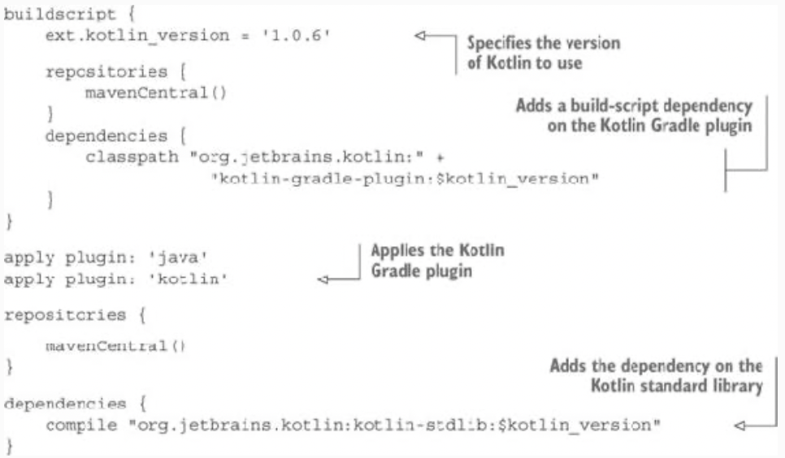
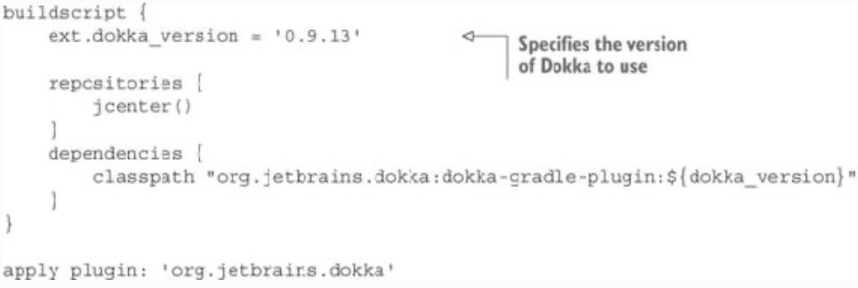

# Appendix A. Building Kotlin projects

* This appendix explains how to build Kotlin code with Gradle, Maven, and Ant. It also covers how to build Kotlin 
Android applications.

## A.1. Building Kotlin code with Gradle

* The recommended system for building Kotlin projects is Gradle. Gradle is the standard build system for Android 
projects, and it also supports all other kinds of projects where Kotlin can be used. Gradle has a flexible project 
model and delivers great build performance thanks to its support for incremental builds, long-lived build processes 
(the Gradle daemon), and other advanced techniques.

* The standard Gradle build script for building a Kotlin project looks like this:


> Figure A.1. The standard Gradle build script for building a Kotlin project.

* The script looks for Kotlin source files in the following locations:
  * src/main/java and src/main/kotlin for the production source files 
  * src/test/java and src/test/kotlin for the test source files
            
* In most cases, the recommended approach is to store both Kotlin and Java source files in the same directory. 
Especially when you’re introducing Kotlin into an existing project, using a single source directory reduces friction 
when converting Java files to Kotlin.

### A.1.1. Building Kotlin Android applications with Gradle

* Android applications use a different build process compared to regular Java applications, so you need to use a 
different Gradle plugin to build them. Instead of `apply plugin: 'kotlin'`, add the following line to your build 
script:

```groovy
apply plugin: 'kotlin-android'
```

* The rest of the setup is the same as for non-Android applications. 

* If you prefer to store your Kotlin source code in Kotlin-specific directories such as src/main/kotlin, you need to 
register them so that Android Studio recognizes them as source roots.

```groovy
android {
    // ...

    sourceSets {
        main.java.srcDirs += 'src/main/kotlin'
    }
}
```

### A.1.2. Building projects that use annotation processing

* Many Java frameworks, especially those used in Android development, rely on annotation processing to generate code at 
compile time. To use those frameworks with Kotlin, you need to enable Kotlin annotation processing in your build 
script. You can do this by adding the following line:

```groovy
apply plugin: 'kotlin-kapt'
``` 

* If you have an existing Java project that uses annotation processing and you’re introducing Kotlin to it, you need to 
remove the existing configuration of the `apt` tool. The Kotlin annotation processing tool handles both Java and Kotlin 
classes, and having two separate annotation processing tools would be redundant. To configure dependencies required for 
annotation processing, use the `kapt` dependency configuration:

```groovy
dependencies {
    compile 'com.google.dagger:dagger:2.4'
    kapt 'com.google.dagger:dagger-compiler:2.4'
}
```

* If you use annotation processors for your `androidTest` or `test` source, the respective kapt configurations are 
named `kaptAndroidTest` and `kaptTest`.

## A.2. Building Kotlin projects with Maven

* https://kotlinlang.org/docs/reference/using-maven.html

## A.3. Building Kotlin code with Ant

* https://kotlinlang.org/docs/ant.html

---

# Appendix B. Documenting Kotlin code

* This appendix covers writing documentation comments for Kotlin code and generating API documentation for Kotlin 
modules.

## B.1. Writing Kotlin documentation comments

* The format used to write documentation comments for Kotlin declarations is similar to Java’s Javadoc and is called 
KDoc. Just as in Javadoc, KDoc comments begin with `/**` and use tags starting with `@` to document specific parts of a 
declaration. The key difference between Javadoc and KDoc is that the format used to write the comments themselves is 
Markdown rather than HTML.

```kotlin
/**
 * Calculates the sum of two numbers, [a] and [b]
 */
fun sum(a: Int, b: Int) = a + b
```

* To refer to declarations from a KDoc comment, you enclose their names in brackets. The example uses that syntax to 
refer to the parameters of the function being documented, but you can also use it to refer to other declarations. If 
the declaration you need to refer to is imported in the code containing the KDoc comment, you can use its name 
directly. Otherwise, you can use a fully qualified name. If you need to specify a custom label for a link, you use two 
pairs of brackets and put the label in the first pair and the declaration name in the second: 
`[an example] [com.mycompany.SomethingTest.simple]`.

```kotlin
/** Performs a complicated operation.
 * 
 * @param remote If true, executes operation remotely // <-- Documents a parameter
 * @return The result of executing the operation // <-- Documents the return value
 * @throws IOException if remote connection fails // <-- Documents a possible exception
 * @sample com.mycompany.SomethingTest.simple // <-- Includes the text of the specified function as a sample in documentation text
 */
fun somethingComplicated(remote: Boolean): ComplicatedResult { }
```

* The general syntax of using the tags is exactly the same as in Javadoc. In addition to the standard Javadoc tags, 
KDoc supports a number of additional tags for concepts that don’t exist in Java, such as the `@receiver` tag for 
documenting the receiver of an extension function or property. You can find the full list of supported tags at 
http://kotlinlang.org/docs/reference/kotlin-doc.html.

* The `@sample` tag can be used to include the text of the specified function into the documentation text, as an 
example of using the API being documented. The value of the tag is the fully qualified name of the method to be 
included.

* Some Javadoc tags aren’t supported in KDoc:
  * `@deprecated` is replaced with the `@Deprecated` annotation. 
  * `@inheritdoc` isn’t supported because in Kotlin, documentation comments are always automatically inherited by 
  overriding declarations. 
  * `@code`, `@literal`, and `@link` are replaced with the corresponding Markdown formatting.

## B.2. Generating API documentation

* The documentation-generation tool for Kotlin is called Dokka: https://github.com/kotlin/dokka. Just like Kotlin, 
Dokka fully supports cross-language Java/Kotlin projects. Dokka supports multiple output formats, including plain HTML, 
Javadoc-style HTML (using the Java syntax for all declarations and showing how the APIs can be accessed from Java), and 
Markdown.

* You can run Dokka from the command line or as part of your Ant, Maven, or Gradle build script.


> Figure B.1. The minimum required configuration of Dokka in a Gradle build script.

* With this configuration, you can run `./gradlew dokka` to generate documentation for your module in HTML format.

---

# Appendix C. The Kotlin ecosystem

## C.1. Testing

* In addition to the standard JUnit and TestNG the following frameworks offer a more expressive DSL for writing tests 
in Kotlin:
  * **KotlinTest** (https://github.com/kotlintest/kotlintest) — A flexible ScalaTest-inspired test framework that 
  supports a number of different layouts for writing tests 
  * **Spek** (https://github.com/jetbrains/spek) — A BDD-style test framework for Kotlin, originally started by 
  JetBrains and now maintained by the community

* If you’re fine with JUnit and are only interested in a more expressive DSL for assertions, check out **Hamkrest** 
(https://github.com/npryce/hamkrest). If you’re using mocking in your tests, you should definitely look at 
**Mockito-Kotlin** (https://github.com/nhaarman/mockito-kotlin), which solves some of the issues of mocking Kotlin 
classes and provides a nicer DSL for mocking.

## C.2. Dependency injection

* Common Java dependency injection frameworks, such as Spring, Guice and Dagger, work well with Kotlin. If you’re 
interested in a Kotlin-native solution, check out Kodein (https://github.com/SalomonBrys/Kodein), which provides a nice 
Kotlin DSL for configuring the dependencies and has a very efficient implementation.

## C.3. JSON serialization

* https://github.com/FasterXML/jackson-module-kotlin - if you prefer to use Jackson

* https://github.com/SalomonBrys/Kotson - for GSON

* https://github.com/cbeust/klaxon - if you’re after a lightweight, pure Kotlin solution

## C.4. HTTP clients

* If you need to build a client for a REST API in Kotlin, look no further than Retrofit 
(http://square.github.io/retrofit)

* For a lower-level solution, check out OkHttp (http://square.github.io/okhttp/), or Fuel, a pure Kotlin HTTP library 
(https://github.com/kittinunf/Fuel).

## C.5. Web applications

* For using Kotlin with earlier versions of Spring, you can find additional information and helper functions in the 
Spring Kotlin project (https://github.com/sdeleuze/spring-kotlin). vert.x provides official support for Kotlin as well: 
https://github.com/vert-x3/vertx-lang-kotlin/

* For pure Kotlin solutions, you can consider the following options:
  * **Ktor** (https://github.com/Kotlin/ktor)—A JetBrains research project exploring how to build a modern, 
  full-featured web application framework with an idiomatic API 
  * **Kara** (https://github.com/TinyMission/kara)—The original Kotlin web framework, used in production by JetBrains 
  and other companies 
  * **Wasabi** (https://github.com/wasabifx/wasabi)—An HTTP framework built on top of Netty, with an expressive Kotlin 
  API 
  * **Kovert** (https://github.com/kohesive/kovert)—A REST framework built on top of vert.x

* For your HTML-generation needs, check out kotlinx.html (https://github.com/-kotlin/kotlinx.html). Or, if you prefer a 
more traditional approach, use a Java template engine such as Thymeleaf (www.thymeleaf.org).

## C.6. Database access

* In addition to traditional Java options such as Hibernate, you have a number of Kotlin-specific choices for your 
database-access needs. We have the most experience with **Exposed** (https://github.com/jetbrains/Exposed), a 
SQL-generation framework discussed a few times in the book.

## C.7. Utilities and data structures

* One of the most popular new programming paradigms these days is **reactive programming**, and Kotlin is really 
well-suited for it. RxJava (https://github.com/ReactiveX/RxJava), the de-facto standard reactive programming library 
for the JVM, offers official Kotlin bindings at https://github.com/ReactiveX/RxKotlin.

* The following libraries provide utilities and data structures that you may find useful in your projects:
  * **funKTionale** (https://github.com/MarioAriasC/funKTionale) — Implements a broad range of functional programming 
  primitives (such as partial function application)
  * **Kovenant** (https://github.com/mplatvoet/kovenant) — An implementation of promises for Kotlin and Android

## C.8. Desktop programming

* If you’re building desktop applications on the JVM these days, you’re most likely using JavaFX. TornadoFX 
(https://github.com/edvin/tornadofx) provides a powerful set of Kotlin adapters for JavaFX, making it natural to use 
Kotlin for desktop development.